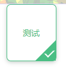
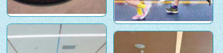

## CSS制作角标

```html
<!DOCTYPE html>
<html lang="en">
<head>
    <meta charset="UTF-8">
    <meta http-equiv="X-UA-Compatible" content="IE=edge">
    <meta name="viewport" content="width=device-width, initial-scale=1.0">
    <title>Document</title>
</head>

<body>
    <div class="select">测试</div>
</body>

</html>

<style>
    .select {
        position: relative;
        width: 81px;
        height: 93px;
        margin: 0 auto;
        text-align: center;
        line-height: 93px;
        color: #4ABE84;
        background-color: #fff;
        box-shadow: 0px 2px 7px 0px rgba(85, 110, 97, 0.35);
        border-radius: 7px;
        border: 1px solid rgba(74, 190, 132, 1);
    }

    .select:before {
        content: '';
        position: absolute;
        right: 0;
        bottom: 0;
        border: 17px solid #4ABE84;
        border-top-color: transparent;
        border-left-color: transparent;
        border-radius: 0 0 5px 0;
    }

    .select:after {
        content: '';
        width: 5px;
        height: 12px;
        position: absolute;
        right: 6px;
        bottom: 6px;
        border: 2px solid #fff;
        border-top-color: transparent;
        border-left-color: transparent;
        transform: rotate(45deg);
    }
</style>

```

效果：




## 瀑布流布局  

```js
/* 瀑布流布局 */
.consultCon .picture {
  column-gap: 5rpx;
  column-count: 2;
  margin: 20rpx 0;
}
```

> 使用CSS多列布局的方式
>
> [CSS 多列布局](https://developer.mozilla.org/zh-CN/docs/Web/CSS/CSS_Columns)


## 边框图片（`border-image`）

> 参考：http://c.biancheng.net/css3/border-image.html

- `border-image-source`：定义边框图像的路径；
- `border-image-slice`：定义边框图像从什么位置开始分割；
- `border-image-width`：定义边框图像的厚度（宽度）；
- `border-image-outset`：定义边框图像的外延尺寸（边框图像区域超出边框的量）；
- `border-image-repeat`：定义边框图像的平铺方式。


## `object-fit`属性

> [半深入理解CSS3 object-position/object-fit属性](https://link.zhihu.com/?target=https%3A//www.zhangxinxu.com/wordpress/2015/03/css3-object-position-object-fit/)


## 多列布局图片不铺满



给图片添加属性`vertical-align: middle;`

其他情况下同理，图片高度未固定为整个盒子高度时都会发生这种情况


## 文字溢出省略号

```css
font-size: 10pt !important;
overflow: hidden !important;
text-overflow: ellipsis !important;
display: -webkit-box !important;
-webkit-line-clamp: 2; //文字上限行
-webkit-box-orient: vertical;
```


## 立体旋转

参考文章

- [参考一 CSDN (推荐)](https://blog.csdn.net/a460550542/article/details/122111518)
- [参考二 CSDN](https://blog.csdn.net/qq_36604536/article/details/124612795)


## 滚动条（原生&el-table）

- 浏览器默认滚动条修改

  ```css
  /* 修改滚动条轨道 */
  ::-webkit-scrollbar {
    width: 10px; /* 滚动条宽度 */
  }
  
  /* 修改滚动条轨道背景 */
  ::-webkit-scrollbar-track {
    background: #f1f1f1; /* 轨道背景颜色 */
  }
  
  /* 修改滚动条滑块 */
  ::-webkit-scrollbar-thumb {
    background: #888; /* 滑块颜色 */
  }
  
  /* 设置滚动条边框 */
  ::-webkit-scrollbar-thumb {
    border-radius: 5px; /* 滑块圆角 */
  }
  ```

- el-table 滚动条修改

  ```scss
  <style lang="scss">
  .el-scrollbar {
  	
  	.el-scrollbar__bar.is-horizontal {
  		height: 14px; // 添加横向高度
  	}
  	.el-scrollbar__bar.is-vertical {
  		width: 14px; // 添加纵向宽度
  	}
    // 横向滚动条
    .el-scrollbar__bar.is-horizontal .el-scrollbar__thumb {
      opacity: 1; // 默认滚动条自带透明度
      height: 14px; // 横向滑块的宽度
      border-radius: 2px; // 圆角度数
      background-color: rgba(136, 219, 255, 1); // 滑块背景色
      box-shadow: 0 0 6px rgba(0, 0, 0, 0.15); // 滑块阴影
    }
    // 纵向滚动条
    .el-scrollbar__bar.is-vertical .el-scrollbar__thumb {
      opacity: 1;
      width: 14px; // 纵向滑块的宽度
      border-radius: 2px;
      background-color: rgba(136, 219, 255, 1);
      box-shadow: 0 0 6px rgba(0, 0, 0, 0.15);
    }
  </style>
  ```

  

  
