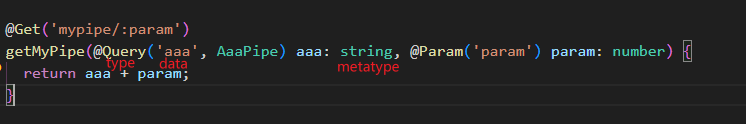
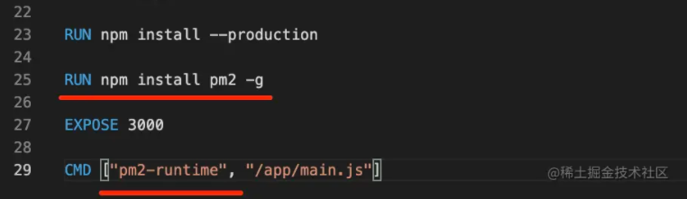
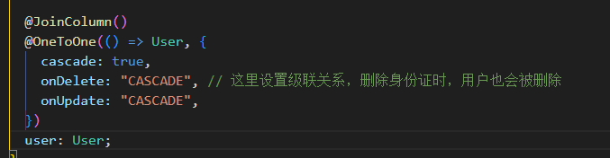
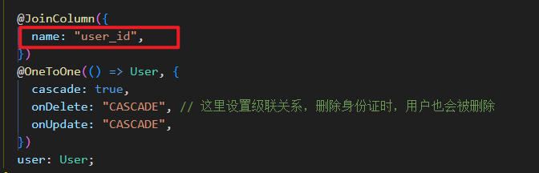
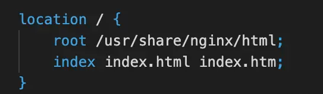

## 13、metadata 和 Reflector

- ```typescript
  import { CanActivate, ExecutionContext, Injectable } from '@nestjs/common';
  import { Observable } from 'rxjs';
  import { Reflector } from '@nestjs/core';
  
  @Injectable()
  export class AaaGuard implements CanActivate {
    constructor(private reflactor: Reflector) {}
  
    canActivate(
      context: ExecutionContext,
    ): boolean | Promise<boolean> | Observable<boolean> {
      console.log('guard');
      console.log(this.reflactor.get('roles', context.getHandler())); // 这里拿到的是方法上注入的 metadata
      console.log(this.reflactor.get('roles', context.getClass())); // 这里拿到的是 class 上注入的 metadata
  
      return true;
    }
  }
  ```

  这里`this.reflactor.get`相当于`Reflactor.getMetadata(metadataKey, target, propertyKey)`，第一个参数传入注入的key值，第二个参数取决于注入的位置，**方法**还是**class**


## 14、Module 和 Provide 循环依赖

使用 `forwordRef` 注入解决循环依赖报错的问题


## 15、创建动态模块

- 创建模块的时候定义一个静态方法，通过传入options和返回值进行动态创建模块，使用的时候调用模块的这个静态方法即可

  ```typescript
  @Module({})
  export class BbbModule {
    static register(options: Record<string, any>): DynamicModule {
      return {
        module: BbbModule,
        controllers: [BbbController],
        providers: [
          {
            provide: 'CONFIG_OPTIONS',
            useValue: options,
          },
          BbbService,
        ],
        exports: [],
      };
    }
  }
  ```

- 这个静态方法名字可以自定义，但是约定了3种方法名

  - **register**：用一次模块传一次配置，比如这次调用是 BbbModule.register({aaa:1})，下一次就是 BbbModule.register({aaa:2}) 了
  - **forRoot**：配置一次模块用多次，比如 XxxModule.forRoot({}) 一次，之后就一直用这个 Module，一般在 AppModule 里 import
  - **forFeature**：用了 forRoot 固定了整体模块，用于局部的时候，可能需要再传一些配置，比如用 forRoot 指定了数据库链接信息，再用 forFeature 指定某个模块访问哪个数据库和表。

- **方法二**

  - ```typescript
    // ccc.module-definition.ts
    import { ConfigurableModuleBuilder } from '@nestjs/common';
    
    export interface CccModuleOptions {
      aaa: number;
      bbb: string;
    }
    
    export const {
      ConfigurableModuleClass,
      MODULE_OPTIONS_TOKEN,
      OPTIONS_TYPE, // 此处的 OPTIONS_TYPE 就是 CccModuleOptions 和一些拓展属性类型
      ASYNC_OPTIONS_TYPE,
    } = new ConfigurableModuleBuilder<CccModuleOptions>()
      .setClassMethodName('forRoot') // 设置静态方法名 对应3种情况：forRoot、forRootAsync、register
      .setExtras({ isGlobal: true }, (definition, extras) => ({
        // 参数一给 options 拓展的属性，参数二回调函数是收到 extras 属性之后如何修改模块定义
        ...definition,
        global: extras.isGlobal,
      }))
      .build();
    
    ```

  - ```typescript
    // ccc.controller.ts
    import { Controller, Get, Inject } from '@nestjs/common';
    import {
      OPTIONS_TYPE,
      ASYNC_OPTIONS_TYPE,
      MODULE_OPTIONS_TOKEN,
    } from './ccc.module-definition';
    
    @Controller('ccc')
    export class CccController {
      // 使用构造函数进行注入
      constructor(
        @Inject(MODULE_OPTIONS_TOKEN) private readonly options: typeof OPTIONS_TYPE, // 此处通过 typeof 获取到 OPTIONS_TYPE 类型
      ) {}
      // 直接进行注入，不需要再进行构造函数的参数注入
      // @Inject(MODULE_OPTIONS_TOKEN) private readonly options: CccModuleOptions;
    
      @Get('')
      hrllo() {
        console.log(this.options.isGlobal); // 这里打印 undefined，因为 isGlobal 是额外的参数，用来处理模块定义的，options 里拿不到
        return this.options;
      }
    }
    
    ```

  - ```typescript
    // app.module.ts
    import { Module } from '@nestjs/common';
    import { AppController } from './app.controller';
    import { AppService } from './app.service';
    import { BbbModule } from './bbb/bbb.module';
    import { CccModule } from './ccc/ccc.module';
    
    @Module({
      imports: [
        BbbModule.register({ name: 'bbb', age: 20 }),
        // 使用 register
        // CccModule.register({ aaa: 10, bbb: 'bbb' }),
        // 使用 registerAsync 
        // CccModule.registerAsync({
        //   useFactory: async () => {
        //     await new Promise((resolve) => setTimeout(resolve, 1000));
        //     return { aaa: 10, bbb: 'ccc' };
        //   },
        // }),
        // 使用 forRoot 和 拓展属性
        CccModule.forRoot({ aaa: 13, bbb: 'ccc', isGlobal: true }),
      ],
      controllers: [AppController],
      providers: [AppService],
    })
    export class AppModule {}
    
    ```


## 16、切换 fastify

- ```typescript
  // 先安装 pnpm install fastify @nestjs/platform-fastify
  // main.ts 中引入
  import { NestFactory } from '@nestjs/core';
  import { AppModule } from './app.module';
  import {
    FastifyAdapter,
    NestFastifyApplication,
  } from '@nestjs/platform-fastify';
  
  async function bootstrap() {
    const app = await NestFactory.create<NestFastifyApplication>(
      AppModule,
      new FastifyAdapter(),
    );
    await app.listen(3000);
  }
  bootstrap();
  ```

- ```typescript
  // app.controller.ts 中使用
  import { Controller, Get, Request, Response } from '@nestjs/common';
  import { AppService } from './app.service';
  import { FastifyReply, FastifyRequest } from 'fastify';
  
  @Controller()
  export class AppController {
    constructor(private readonly appService: AppService) {}
  
    @Get()
    getHello(
      @Request() request: FastifyRequest,
      @Response() reply: FastifyReply,
    ): void {
      reply.header('url', request.url);
      reply.send('Hello!');
      // 这里使用 response 注入 reply 对象，就只能通过 send 方法返回数据了，不能使用 return 返回数据
      // 或者使用 @Response({passthrough: true}) 传入参数，表示不会在方法自己发送响应内容，就可以使用 return 返回数据了
      // return this.appService.getHello();
    }
  }
  
  ```

  

## 17、middleWare

> 类似 Express 中的 中间件

1. 创建中间件 `nest g middleware aaa --flat --no-spec`

2. `aaa.middleware.ts`

   ```typescript
   import { Injectable, NestMiddleware } from '@nestjs/common';
   import { Request, Response } from 'express';
   
   @Injectable()
   export class AaaMiddleware implements NestMiddleware {
     use(req: Request, res: Response, next: () => void) {
       console.log('Before');
       next();
       console.log('After');
     }
   }
   ```

3. 使用 `app.module.ts`

   ```typescript
   import {
     MiddlewareConsumer,
     Module,
     NestModule,
     RequestMethod,
   } from '@nestjs/common';
   import { AppController } from './app.controller';
   import { AppService } from './app.service';
   import { AaaMiddleware } from './aaa.middleware';
   
   @Module({
     imports: [],
     controllers: [AppController],
     providers: [AppService],
   })
   export class AppModule implements NestModule {
     configure(consumer: MiddlewareConsumer) {
       consumer
         .apply(AaaMiddleware)
         .forRoutes({ path: 'hello*', method: RequestMethod.GET }); // 这里可以通过传入参数对路由进行匹配
       consumer
         .apply(AaaMiddleware)
         .forRoutes({ path: 'world1', method: RequestMethod.GET });
     }
   }
   ```

4. 可以使用依赖注入的方式在中间件中注入

   ```typescript
   import { Inject, Injectable, NestMiddleware } from '@nestjs/common';
   import { Request, Response } from 'express';
   import { AppService } from './app.service';
   
   @Injectable()
   export class AaaMiddleware implements NestMiddleware {
     // constructor(private readonly appService: AppService) {} // 也可以使用构造器注入
   
     @Inject(AppService) private readonly appService: AppService;
   
     use(req: Request, res: Response, next: () => void) {
       console.log('Before');
       console.log(1111111, this.appService.getHello()); // 注入之后就可以使用 appService 里的方法了
       next();
       console.log('After');
     }
   }
   
   ```

5. **next()** 参数和 **@Next** 装饰器区别

   - next参数是调用下一个middleware的,类似于vue路由守卫中的next

   - @Next 是调用下一个 handler 的, 和 @Response的效果一样

     

6. 和 interceptor 的区别

   - interceptor 是能从 ExecutionContext 里拿到目标 class 和 handler，进而通过 reflector 拿到它的 metadata 等信息的，这些 middleware 就不可以
   - interceptor 里是可以用 rxjs 的操作符来组织响应处理流程的


## 18、RxJS 和 Interceptor 

### RxJS

- tap: 不修改响应数据，执行一些额外逻辑，比如记录日志、更新缓存等
- map：对响应数据做修改，一般都是改成 {code, data, message} 的格式
- catchError：在 exception filter 之前处理抛出的异常，可以记录或者抛出别的异常
- timeout：处理响应超时的情况，抛出一个 TimeoutError，配合 catchErrror 可以返回超时的响应

### Interceptor

- 全局注入：main.ts 中 `app.useGlobalInterceptors(new xxxInterceptor())`

  这种手动 new 的没法注入依赖

- 使用 Nest 提供的 token 实现全局注入

  


## 19、内置 Pipe 和 自定义 Pipe

### 内置Pipe

- 直接使用如： `@Query('aa', ParseIntPipe)`

- 通过 new 关键字创建（此方法可以传参进行一些自定义）

  ```typescript
  @Get()
    getHello(
      @Query(
        'aa',
        new ParseIntPipe({
          // errorHttpStatusCode: HttpStatus.NOT_FOUND, // 指定错误状态码
          exceptionFactory: (msg) => {
            // 自定义错误信息 抛出异常
            console.log(msg);
            throw new HttpException('xxx' + msg, HttpStatus.NOT_IMPLEMENTED);
          },
        }),
      )
      aa: string,
    ): string {
      console.log(aa);
      return aa + 1;
      // return this.appService.getHello();
    }
  ```

- **ParseArrayPipe**

  ```typescript
    @Get('cc')
    getCc(
      @Query(
        'cc',
        new ParseArrayPipe({
          items: Number, // 指定每一项数据类型
          separator: '.', // 指定分隔符
          optional: true, // 参数可选
        }),
      )
      cc: number[],
    ) {
      console.log(cc);
      return cc;
    }
  ```

- **ParseEnumPipe**
  
  ```typescript
  // 先定义 enum 
  enum Color {
    a = 'red',
    b = 'blue',
    c = 'green',
  }
  
  // 使用
  // 此方法可以根据定义的 enum 限制传递的参数
  @Get('color/:id')
    getColor(@Param('id', new ParseEnumPipe(Color)) id: Color) {
      return id;
    }
  ```

### 自定义 Pipe

- 使用命令生成文件 `nest g pipe aaa --flat --no-spec`

- 创建的 pipe 的返回值会传递到 handler 里面 

  ```typescript
  import { ArgumentMetadata, Injectable, PipeTransform } from '@nestjs/common';
  
  @Injectable()
  export class AaaPipe implements PipeTransform {
    transform(value: any, metadata: ArgumentMetadata) {
      console.log(value, metadata);
      return 'aaa';
    }
  }
  ```

  - **value**：handler里面接收到的值

  - **metadata**：元数据对象，包含有关传递给管道的值的其他信息，例如它的类型和所在的位置
    - metatype：参数的ts类型
    
    - type：装饰器
    
    - data：传给装饰器的参数
      


## 20、ValidationPipe

1. 安装依赖包 `npm install -D class-validator class-transformer`
2. @Body(new ValidationPipe()) 
3. 在 dto 这里，用 class-validator 包的 @IsInt(或其他) 装饰器标记一下

- 自定义 ValiditionPipe

  ```typescript
  import {
    ArgumentMetadata,
    Injectable,
    PipeTransform,
    BadRequestException,
  } from '@nestjs/common';
  import { plainToInstance } from 'class-transformer';
  import { validate } from 'class-validator';
  
  @Injectable()
  export class MyValidationPipe implements PipeTransform {
  
    async transform(value: any, metadata: ArgumentMetadata) {
      console.log('value:', value);
      console.log('metadata:', metadata);
  
      if (!metadata.metatype) return value;
      console.log(this.options);
      const object = plainToInstance(metadata.metatype, value);
      const errors = await validate(object);
      if (errors.length > 0) {
        throw new BadRequestException('参数验证失败!');
      }
      return value;
    }
  }
  
  ```
  - value：接收到的值
  - metadata：与get请求时的pipe类似
  - 注意 metadata.metatype 即 dto 里定义的 class， 通过 plainToInstance 将 value 转换为此类的实例对象，再通过 validate 进行验证
  

- 此外 pipe 中也可以进行依赖注入，方法同常规一样，但是需要去掉手动new`@Body(ValidationPipe）` 
- 若要创建全局 pipe，可以使用 nest 提供的 token ： **APP_PIPE**，方法同 Interceptor
- 如果不需要注入依赖（即在 pipe 里使用 @Inject），可以在 main.ts 中使用 App.useGlobalPipes(new xxxValidetionPipe())进行全局注入
- 此外，内置 ValidetionPipe 还包含以下验证方式  
  - @**Length**(10, 20)
  - @**Contains**('hello')
  - @**IsInt**()    @**Min**(0)    @**Max**(10)
  - @**IsEmail**()
  - @**IsFQDN**() // 是否是域名

- 自定义 message 信息：传入 message 函数

  ```typescript
  @Length(10, 20, {
      message({targetName, property, value, constraints}) {
          return `${targetName} 类的 ${property} 属性的值 ${value} 不满足约束: ${constraints}`
      }
  })
  title: string;
  ```

- [更多装饰器](https://www.npmjs.com/package/class-validator)


## 21、串一串Nest核心概念


## 22、Express 文件上传

> 通过 multer 包实现文件上传

1. 单文件上传

   ```typescript
   const upload = multer({ dest: 'uploads/' }) // 此处设置上传路径
   
   // 这里 single 参数为上传 formData 的 key，只有对应才能上传
   app.post('/aaa', upload.single('aaa'), function (req, res, next) {
     console.log('req.file', req.file);
     console.log('req.body', req.body);
   })
   ```

   - `req.file`为文件相关信息

   - `req.body`为非文件的字段

     

2. 多文件上传 - 通过 upload.array，可以指定最大上传数量

   ```typescript
   app.post('/bbb', upload.array('bbb', 2), function (req, res, next) {
   	console.log('req.files', req.files);
   	console.log('req.body', req.body);
   }, function (err, req, res, nest) { // 第二个回调为错误处理
   	if (err instanceof multer.MulterError && err.code === 'LIMIT_UNEXPECTED_FILE') {
   		res.status(400).end('Too many files uploaded')
   	}
   })
   ```

   - 可以通过添加第二个回调函数，对上传出现的错误进行捕获处理

     

3. 多个字段上传文件 - 可以对不同的字段做不同数量的限制

   ```typescript
   app.post('/ccc', upload.fields([
   	{ name: 'aaa', maxCount: 3 },
   	{ name: 'bbb', maxCount: 2 }
   ]), function (req, res, next) {
   	console.log('req.files:', req.files);
   	console.log('req.body:', req.body);
   })
   ```

4. 不设置上传字段

   ```typescript
   app.post('/ddd', upload.any(), function (req, res, next) {
   	console.log('req.files:', req.files);
   	console.log('req.body:', req.body);
   })
   ```

5. 自定义**上传路径**和**保存文件名**

   ```typescript
   // 设置保存路径和文件名 - 其他用法同上
   const storage = multer.diskStorage({
   	destination: function (req, file, cb) {
   		try {
   			fs.mkdirSync(path.join(process.cwd(), 'my-uploads'))
   		} catch (e) {
   			cb(null, path.join(process.cwd(), 'my-uploads'))
   		}
   	},
   	filename: function (req, file, cb) {
   		const uniqueSuffix = Date.now() + '-' + Math.round(Math.random() * 1E9) + '-' + file.originalname;
   		cb(null, file.fieldname + '-' + uniqueSuffix)
   	}
   })
   const upload = multer({ storage }) // 上传文件的目录
   ```


## 23、Nest 文件上传 

1. 安装 multer 类型包 `npm install -D @types/multer`

2. 添加 handler 

   - ```typescript
     @Post('aaa')
     @UseInterceptors(FileInterceptor('aaa', {
         dest: 'uploads'
     }))
     uploadFile(@UploadedFile() file: Express.Multer.File, @Body() body) {
         console.log('body', body);
         console.log('file', file);
     }
     ```

     - 使用 FileInterceptor 来提取 aaa 字段，然后通过 UploadedFile 装饰器把它作为参数传入。

   - 多文件上传

     ```typescript
     @Post('bbb')
     @UseInterceptors(FilesInterceptor('bbb', 3, {
         dest: 'uploads'
     }))
     uploadFiles(@UploadedFiles() files: Array<Express.Multer.File>, @Body() body) {
         console.log('body', body);
         console.log('files', files);
     }
     ```

   - 多个文件字段

     ```typescript
     @Post('ccc')
     @UseInterceptors(FileFieldsInterceptor([
         { name: 'aaa', maxCount: 2 },
         { name: 'bbb', maxCount: 3 },
     ], {
         dest: 'uploads'
     }))
     uploadFileFields(@UploadedFiles() files: { aaa?: Express.Multer.File[], bbb?: Express.Multer.File[] }, @Body() body) {
         console.log('body', body);
         console.log('files', files);
     }
     ```

   - 任何字段

     ```typescript
     @Post('ddd')
     @UseInterceptors(AnyFilesInterceptor({
         dest: 'uploads'
     }))
     uploadAnyFiles(@UploadedFiles() files: Array<Express.Multer.File>, @Body() body) {
         console.log('body', body);
         console.log('files', files);
     }
     ```

3. 指定 storage（存储路径和文件名）

     - ```typescript
       // 设置存储路径和文件名
       import * as multer from "multer";
       import * as fs from 'fs';
       import * as path from "path";
       
       const storage = multer.diskStorage({
           destination: function (req, file, cb) {
               try {
                   fs.mkdirSync(path.join(process.cwd(), 'my-uploads'));
               }catch(e) {}
       
               cb(null, path.join(process.cwd(), 'my-uploads'))
           },
           filename: function (req, file, cb) {
               const uniqueSuffix = Date.now() + '-' + Math.round(Math.random() * 1E9) + '-' + file.originalname
               cb(null, file.fieldname + '-' + uniqueSuffix)
           }
       });
       
       export { storage };
       ```

     - 使用

       ```typescript
       @Post('ddd')
       @UseInterceptors(AnyFilesInterceptor({
        	storage: storage   
       })
       uploadFiles(@UploadedFiles() files: Array<Express.Multer.File>, @Body() body) {
           console.log('body', body);
           console.log('files', files);
       }
       ```

4. 自定义文件校验

     - 使用 pipe 

       ```typescript
       import { PipeTransform, Injectable, ArgumentMetadata, HttpException, HttpStatus } from '@nestjs/common';
       
       @Injectable()
       export class FileSizeValidationPipe implements PipeTransform {
         transform(value: Express.Multer.File, metadata: ArgumentMetadata) {
           if(value.size > 10 * 1024) {
             throw new HttpException('文件大于 10k', HttpStatus.BAD_REQUEST);
           }
           return value;
         }
       }
       ```

     - 直接添加到 UploadedFile 里面

       ```typescript
       uploadFiles(@UploadedFiles(FileSizeValidationPipe) files: Array<Express.Multer.File>, @Body() body) {
           console.log('body', body);
           console.log('files', files);
       }
       ```

5. 内置文件校验

   ```typescript
   @Post('aaa')
     @UseInterceptors(FileInterceptor('aaa', { dest: 'uploads' }))
     uploadFile(
       @UploadedFile(
         new ParseFilePipe({
           exceptionFactory(error) { // 自定义文件校验失败信息
             console.log('error:', error);
             throw new HttpException('文件校验失败!', 404);
           },
           validators: [
             new MaxFileSizeValidator({ // 文件大小校验 - 可以传入 message 失败信息
               maxSize: 10 * 1024 * 1024,
               message: '文件大于 10K 了',
             }),
             new FileTypeValidator({ // 文件类型校验 - 没有 message 参数
               fileType: 'image/png',
             }),
           ],
         }),
       )
       files: { aaa?: Express.Multer.File },
       @Body() body,
     ) {
       console.log('body:', body);
       console.log('file:', files);
     }
   ```

6. 自定义 FileValidator

   ```typescript
   import { FileValidator } from "@nestjs/common";
   
   export class MyFileValidator extends FileValidator{
       constructor(options) {
           super(options);
       }
       isValid(file: Express.Multer.File): boolean | Promise<boolean> {
           if(file.size > 10000) {
               return false;
           }
           return true;
       }
       buildErrorMessage(file: Express.Multer.File): string {
           return `文件 ${file.originalname} 大小超出 10k`;
       }
   }
   ```


## 24、Nest 打印日志

> 暂时只做了解


## 25、Docker

- `docker pull`：拉取镜像
- `docker run --name nginx-test2 -p 80:80 -v /tmp/aaa:/usr/share/nginx/html -e KEY1=VALUE1 -d nginx:latest `
  - -p 是端口映射
  - -v 是指定数据卷挂载目录
  - -e 是指定环境变量
  - -d 是后台运行

- `docker exec`：相当于在容器内执行命令
  - -i 是 terminal 交互的方式运行
  - -t 是 tty 终端类型
  - 例如：`docker exec -i -t 68630e312c6ebf8b4ded7e9a583d6c5a4e75a1c95948415397a136b329ae5fb5 /bin/bash`
- `docker inspect`：查看容器详情
- `docker volume`：管理卷数据
- `docker start`：启动一个已经停止的容器
- `docker rm`：删除一个容器
- `docker stop`：停止一个容器


## 26、DockerFile

- ```typescript
  FROM node:latest
  
  WORKDIR /app
  
  COPY . .
  
  RUN npm config set registry https://registry.npmmirror.com/
  
  RUN npm install -g http-server
  
  EXPOSE 8080
  
  VOLUME /app
  
  CMD ["http-server", "-p", "8080"]
  ```

  - FROM：基于一个基础镜像来修改
  - WORKDIR：指定当前工作目录
  - COPY：把容器外的内容复制到容器内
  - EXPOSE：声明当前容器要访问的网络端口，比如这里起服务会用到 8080
  - RUN：在容器内执行命令
  - CMD：容器启动的时候执行的命令
  - VOLUME：设置挂载点

- `docker build -t aaa:ddd -f 2.Dockerfile .`

  - -t：指定 name:tag
  - -f：指定 dockerfile 文件名，默认为 dockerfile


## 27、Nest 编写 Dockerfile

- .dockerignore文件：忽略哪些文件 - 即构建的时候不会参与

  ```dockerfile
  *.md
  !README.md
  node_modules/
  [a-c].txt
  .git/
  .DS_Store
  .vscode/
  .dockerignore
  .eslintignore
  .eslintrc
  .prettierrc
  .prettierignore
  ```

  - ***.md**：忽略所有md结尾的文件
  - **!README.md**：不包含README.md文件
  - **node_modules/**：忽略 node_modules 下 的所有文件
  - **[a-c].txt**：忽略 a.txt、b.txt、c.txt 这三个文件
  
  
  
- 使用多阶段构建和 alpine 减小构建镜像体积

  ```dockerfile
  # 第一次构建 - nest 打包
  FROM node:lts-alpine as build-stage
  
  WORKDIR /app
  
  COPY package*.json ./
  
  # 替换 npm 镜像源，可以不用 
  # RUN npm config set registry https://registry.npmmirror.com 
  RUN npm install
  
  COPY . .
  
  RUN npm run build
  
  # 第二次构建 - 将第一次构建的 dist 复制出来
  FROM node:lts-alpine as production-stage
  
  COPY --from=build-stage /app/dist /app
  COPY --from=build-stage /app/package.json /app/package.json
  
  WORKDIR /app
  
  RUN npm install --production
  
  EXPOSE 3000
  
  CMD ["node", "/app/main.js"]
  ```


## 28、提升 Dockerfile

- 使用 alpine 基础镜像构建 - 减小构建镜像体积

- 使用多阶段构建 - 去掉不必要的文件

- package.json 单独安装，利用 Docker 缓存加快构建速度

- 使用 **ARG** 增加构建灵活性

  - ```dockerfile
    FROM node:18-alpine3.14
    
    # 通过 ARG 定义参数（此参数构建时传入）
    ARG aaa
    ARG bbb
    
    WORKDIR /app
    
    COPY ./test.js .
    
    # 通过 ${} 取到参数
    ENV aaa=${aaa} \
        bbb=${bbb}
    
    CMD ["node", "/app/test.js"]
    ```

  - `docker build --build-arg aaa=3 --build-arg bbb=4 -t arg-test -f 333.Dockerfile .` 构建的时候通过 `--build-arg` 传入对应的参数

  - 运行之后可以通过 `process.env.aaa`拿到对应的参数值
  
- **CMD** 和 **ENTRYPOINT**

  - 当 `docker run` 执行时，如果传入有命令，则会覆盖 CMD 的命令，而 ENTRYPOINT 则不会
  
  - 还可以将 ENTRYPOINT和CMD结合起来，CMD 会被覆盖，类似于默认值
  
    ```dockerfile
    FROM node:lts-apline
    
    ENTRYPOINT ["echo", "光光"]
    
    CMD ["到此一游"]
    ```
  
- **COPY** 和 **ADD**

  - tar 命令打包 `tar -zcvf a.tar.gz ./a `

  - ```dockerfile
    FROM node:18-alpine3.14
    
    ADD ./a.tar.gz /a
    
    COPY ./a.tar.gz /b
    ```

    - 这里 `ADD`会把 tar.gz 文件解压复制到 /a 文件夹
    - `COPY` 会把整个压缩文件复制过去


## 29、Docker是怎么实现的

- Namespace：实现各种资源的隔离
- Control Group：实现容器进程的资源访问限制
- UnionFS：实现容器文件系统的分层存储，镜像合并


## 30、PM2

- `pm2 start xxx --max-memory-restart 200M`：超过200M自动重启
- `pm2 start xxx --cron-restart "2/3 * * * * *"`：从2s开始每3s启动一次
- `pm2 start xxx --watch`：文件内容改变自动重启
- `pm2 start xxx --no-autorestart`：不自动重启
- `pm2 flush [进程名|ID]`：清空日志
- `pm2 logs main --lines 100 `：查看前 100 行日志
- `pm2 start app.js -i [max|number]`：启动 CPU 数量的进程
- `pm2 scale xxx [number|+number]`：调整进程数 [ 进程数 | 加几个进程数]
- `pm2 monit`：性能监控
- 通过配置文件启动
  - 生成配置文件：`pm2 ecosystem`
  - 执行：`pm2 start ecosystem.config.js`

- Nest 中使用

  
  - 注意：通过pm2 start在docker内启动进程会死掉，导致起不来,pm2 是默认后台启动的， docker 感知不到,CMD命令执行完成，docker 容器就结束了。**pm2-runtime** 是专门为容器设计的，保证在后台一直运行


## 31、MySQL

- 创建表

  ```mysql
  CREATE TABLE `student` (
    `id` int NOT NULL AUTO_INCREMENT COMMENT 'ID',
    `name` varchar(45) NOT NULL COMMENT '名字',
    `age` int DEFAULT NULL COMMENT '年龄',
    `sex` int DEFAULT NULL COMMENT '性别',
    `email` varchar(60) DEFAULT NULL COMMENT '邮箱',
    `create_time` datetime NOT NULL COMMENT '创建时间',
    `status` int DEFAULT '0' COMMENT '是否删除',
    PRIMARY KEY (`id`)
  ) CHARSET=utf8mb4
  ```

- 插入

  ```mysql
  INSERT INTO `student` (`name`, `age`, `sex`, `email`, `create_time`) VALUES ('bbb', '23', '1', 'bbb@qq.com', '2023-05-27 10:50:00');
  ```

- 更新

  ```mysql
  UPDATE `hello-mysql`.`student` SET `email` = 'xxx@qq.com' WHERE (`id` = '2');
  ```

- 删除

  ```mysql
  DELETE FROM `hello-mysql`.`student` WHERE (`id` = '2');
  ```

- 查询

  ```mysql
  SELECT * FROM `hello-mysql`.student;
  ```

- 清空表
  ```mysql
  TRUNCATE `hello_mysql`.`student`;
  ```

- 删除表

  ```mysql
  DROP TABLE `hello_mysql`.`student`;
  ```


## 32、SQL 查询语句的所有语法和函数

- 指定查询列、通过 **as** 修改返回列名：`SELECT name as "名字", score as "分数" FROM student;`

- 指定查询条件：`select name as "名字",class as "班级" from student where age >= 19;`

- 查询使用 **and** 连接多个：`select name as '名字',class as '班级' from student where gender='男' and score >= 90;`

- 使用 **like** 模糊查询：`select * from student where name like '王%';`

- 使用 **in** 指定合集：`select * from student where class in ('一班', '二班');`

- 使用 **not in** 排除合集：`select * from student where class not in ('一班', '二班');`

- 使用 **between and** 指定区间：`select * from student where age between 18 and 20;`

- 使用 **limit** 分页：`select * from student limit 0,5;` 
  - 第二页：`select * from student limit 5,5;`
  
- 使用 **order by** 指定排序的列：`select name,score,age from student order by score asc,age desc;`
  - **asc** 为升序，**desc** 为降序
  
- 使用 **group by** 分组：`SELECT class as '班级', AVG(score) AS '平均成绩' FROM student GROUP BY class ORDER BY 平均成绩 DESC;`

  - 内置的函数 `AVG()` 求平均值

  - 

  - 这里注意 ORDER BY 后面的值相当于变量，不能添加引号

- **count**：`select class, count(*) as count from student group by class;` 这里的 * 代表当前行

- 分组统计之后使用 **having** 进行过滤：`SELECT class, AVG(score) AS avg_score FROM student GROUP BY class HAVING avg_score > 90;`

- 使用 **distinct** 去重：`SELECT　DISTINCT class FROM　student`

- 内置函数分类

  - **聚合函数：**AVG、COUNT、SUM、MIN、MAX
  
    `select avg(score) as '平均成绩',count(*) as '人数',sum(score) as '总成绩',min(score) as '最低分', max(score) as '最高分' from student` 
  
  - **字符串函数：**CONCAT、SUBSTR、LENGTH、UPPER、LOWER
  
    `SELECT CONCAT('xx', name, 'yy'), SUBSTR(name,2,3), LENGTH(name), UPPER('aa'), LOWER('TT') FROM student;`
  
    其中**substr**第二个参数表示开始的下标（mysql 下标从1开始），例如：substr('一二三', 2, 3) 为 '二三'
  
  - **数值函数：**ROUND：四舍五入、CEIL：向上取整、FLOOR：向下取整、ABS：绝对值、MOD：取模
  
    `SELECT ROUND(1.234567, 2), CEIL(1.234567), FLOOR(1.234567), ABS(-1.234567), MOD(5, 2);`
  
    其中取模为两数相除的余数
  
  - **日期函数：**DATE、TIME、YEAR、MONTH、DAY
  
    `SELECT YEAR('2023-06-01 22:06:03'), MONTH('2023-06-01 22:06:03'),DAY('2023-06-01 22:06:03'),DATE('2023-06-01 22:06:03'), TIME('2023-06-01 22:06:03');`
  
  - **条件函数**：if、case
  
    - if：`select name, if(score >=60, '及格', '不及格') from student;`，类似于三元表达式，适用于单个条件
    - case：`SELECT name, score, CASE WHEN score >=90 THEN '优秀' WHEN score >=60 THEN '良好'ELSE '差' END AS '档次' FROM student;` 适用多个条件
  
  - **系统函数：**`select VERSION(), DATABASE(), USER()`
  
  - **其他函数：**
  
    - NULLIF：如果相等返回 null，不相等返回第一个值。
  
      `select NULLIF(1,1), NULLIF(1,2);`
  
    - COALESCE：返回第一个非 null 的值。
  
      `select COALESCE(null, 1), COALESCE(null, null, 2)`
  
    - GREATEST、LEAST：返回几个值中最大最小的
  
      `select GREATEST(1,2,3),LEAST(1,2,3,4);`
  
  - **类型转换函数：**CAST、CONVERT、DATE_FORMAT、STR_TO_DATE。
  
    - CONVERT：`select greatest(1, convert('123', signed),3);`
  
    - CAST：`select greatest(1, cast('123' as signed),3);`
  
      可以转换的类型 
  
      - signed：整型；
      - unsigned：无符号整型
      - decimal：浮点型；
      - char：字符类型；
      - date：日期类型；
      - time：时间类型；
      - datetime：日期时间类型；
      - binary：二进制类型
  
    - DATE_FORMAT：`SELECT DATE_FORMAT('2022-01-01', '%Y年%m月%d日');`
  
    - STR_TO_DATE：`SELECT STR_TO_DATE('2023-06-01', '%Y-%m-%d');`


## 33、一对一

从表里通过外键来关联主表的主键。

查询的时候需要使用 join on，默认是 inner join 也就是只返回有关联的记录，也可以用 left join、right join 来额外返回没有关联记录的左表或右表的记录。

from 后的是左表，join 后的是右表。

此外，外键还可以设置级联方式，也就是主表修改 id 或者删除的时候，从表怎么做。

有 3 种级联方式：CASCADE（关联删除或更新），SET NULL（关联外键设置为 null），RESTRICT 或者 NO ACTION（没有从表的关联记录才可以删除或更新

- 关联查询：

  ```mysql
  SELECT user.id, name, id_card.id as card_id, card_name 
      FROM user
      JOIN id_card ON user.id = id_card.user_id;
  ```
  
- 其中 JOIN 相当于 **INNER JOIN**：返回两表中相关联的数据

- **LEFT JOIN** 是额外返回左表中没有关联上的数据。

- **RIGHT JOIN** 是额外返回右表中没有关联上的数据。

  - FROM 后的是左表，JOIN 后的是右表
  

**Foreign Keys 的 四种可选值**

- CASCADE： 主表主键更新，从表关联记录的外键跟着更新，主表记录删除，从表关联记录删除
- SET NULL：主表主键更新或者主表记录删除，从表关联记录的外键设置为 null
- RESTRICT（默认）：只有没有从表的关联记录时，才允许删除主表记录或者更新主表记录的主键 id
- NO ACTION： 同 RESTRICT，只是 sql 标准里分了 4 种，但 mysql 里 NO ACTION 等同于 RESTRICT。


## 34、一对多、多对多
- 一对多与一对一逻辑相同，主要多个数据对应同一个父表id

- 多对对
  - 通过创建新表，设置两个主键，其中一个主键关联其中一张表的id，另一个主键关联另一张表的id，由此将两张表联系起来。
  
    ```mysql
    SELECT * FROM article a 
        JOIN article_tag at ON a.id = at.article_id
        JOIN tag t ON t.id = at.tag_id
        WHERE a.id = 1;
    ```
  
  - 注意 **中间表的级联方式要设置为 CASCADE**
  
  - `SELECT * FROM article a `相当于把查询的表重命名
  
  - GROUP_CONCAT 函数是用于 group by 分组后，把多个值连接成一个字符串的。
  
    如：`GROUP_CONCAT(oi.product_name SEPARATOR '-') **AS** product_names`


## 35、子查询 和 EXISTS
- `SELECT name, class FROM student WHERE score = (SELECT MAX(score) FROM student);
  `

- ```mysql
  SELECT name FROM department
      WHERE EXISTS (
          SELECT * FROM employee WHERE department.id = employee.department_id
      );
  -- EXISTS 的作用：子查询返回结果，条件成立，反之不成立
  -- 对应的还有 NOT EXISTS，作用相反
  ```

- 配合 update

  ```mysql
  UPDATE employee SET name = CONCAT('技术-', name) 
      WHERE department_id = (
          SELECT id FROM department WHERE name = '技术部'
      );
  ```

- 配合 delete

  ```mysql
  DELETE FROM employee WHERE department_id = (
      SELECT id FROM department WHERE name = '技术部'
  );
  ```


## 36、综合练习（略）


## 37、MySQL的事务和隔离级别

**事务**

- **START TRANSACTION：**开启事务，开启后所有sql语句都可以 **ROLLBACK**，除非执行 **COMMIT** 完成这段事务
- 设置 **SAVEPOINT**：可以 **ROLLBACK TO** 任何一个 **SAVEPOINT** 的位置 

**事务隔离级别**

- **READ UNCOMMITTED**：可以读到别的事务尚未提交的数据。
- **READ COMMITTED**：只读取别的事务已提交的数据。
- **REPEATABLE READ**：在同一事务内，多次读取数据将保证结果相同。
- **SERIALIZABLE**：在同一时间只允许一个事务修改数据。


## 38、MySQL 的视图、存储过程和函数（了解）

**视图：**

- ```mysql
  -- 创建视图
  CREATE VIEW customer_orders AS 
      SELECT 
          c.name AS customer_name, 
          o.id AS order_id, 
          o.order_date, 
          o.total_amount
      FROM customers c
      JOIN orders o ON c.id = o.customer_id;
  -- 查询 - 和普通表查询一致
  -- 视图一般只做查询，不做增删改
  ```

**存储过程：**


##  39、Node 操作 MySQL 的两种方式

**使用 mysql2 直接连接**

- 安装 mysql2 进行连接，或者 promise 版
- 连接时一般创建连接池，使用时取出，不使用时放回，不会断开连接

**使用 typeorm**

- 基于 class 和 class 上的装饰器来声明和表的映射关系，对表的增删改查就变成了对象的操作和save、find 方法的调用


## 40、掌握 TypeORM

- 新建 TypeORM项目：`npx typeorm@latest init --name typeorm-all-feature --database mysql`

- 修改配置：

  ```typescript
  // data-source.ts
  connectorPackage: 'mysql2',
      extra: {
          authPlugin: 'sha256_password',
      }
  ```
  
- 安装 mysql2：`npm install --save mysql2`

  - 参数说明：

    ```typescript
    import "reflect-metadata";
    import { DataSource } from "typeorm";
    import { Aaa } from "./entity/Aaa";
    import { User } from "./entity/User";
    
    export const AppDataSource = new DataSource({
      type: "mysql",
      host: "localhost",
      port: 3306,
      username: "root",
      password: "admin123",
      database: "practice",
      synchronize: true,
      logging: true, // 打印生成的 SQL 语句
      entities: [User, Aaa], // 指定和数据库的表对应的 Entity
      migrations: [], // 修改表结构的 SQL
      subscribers: [], // Entity 生命周期的订阅者
      poolSize: 10, // 指定数据库连接池中连接的最大数量
      connectorPackage: "mysql2", // 指定驱动包
      extra: { // 额外发给驱动包的一些选项
        authPlugin: "sha256_password",
      },
    });
    ```
  
- **新增：**

  - ```typescript
    import { AppDataSource } from "./data-source"
    import { User } from "./entity/User"
    
    AppDataSource.initialize().then(async () => {
        const user = new User()
        user.firstName = "aaa"
        user.lastName = "bbb"
        user.age = 25
        await AppDataSource.manager.save(user)
    }).catch(error => console.log(error))
    ```
    
    若指定id，则为修改
    
  - 批量操作
  
    ```typescript
    AppDataSource.initialize().then(async () => {
        await AppDataSource.manager.save(User, [
            { firstName: 'ccc', lastName: 'ccc', age: 21},
            { firstName: 'ddd', lastName: 'ddd', age: 22},
            { firstName: 'eee', lastName: 'eee', age: 23}
        ]);
    }).catch(error => console.log(error))
    ```
    
    批量修改即将 id 加入，另外还有 **update** 和 **insert** 方法，分别为**修改**和**插入**，区别为：**save** 方法会先查询数据库来确定是插入还是修改
  
- **删除和批量删除**
  
  - **delete：**直接传入 id 进行删除
  
    ```typescript
    ppDataSource.initialize().then(async () => {
        await AppDataSource.manager.delete(User, 1);
        await AppDataSource.manager.delete(User, [2,3]);
    }).catch(error => console.log(error))
    ```
    
  - **remove：**传入 entity 对象
  
    ```typescript
    AppDataSource.initialize().then(async () => {
        const user = new User();
        user.id = 1;
        await AppDataSource.manager.remove(User, user);
    }).catch(error => console.log(error))
    ```
  
- **查询**
  
  - **find：**传入 entity 查询所有
  
    ```typescript
    const users = await AppDataSource.manager.find(User);
    ```
  
  - **findBy：**根据条件查询
  
    ```typescript
    const users = await AppDataSource.manager.findBy(User, {
        age: 23
    });
    ```
  
  - **findAndCount：**拿到记录条数
  
    ```typescript
    const [users, count] = await AppDataSource.manager.findAndCount(User);
    ```
  
    指定条件：
  
    ```typescript
    const [users, count] = await AppDataSource.manager.findAndCountBy(User, {
    	age: 23
    })
    ```
  
  - **findOne：**查询一条，其实质为 find 查询后 limit：1
  
    ```typescript
    const user = await AppDataSource.manager.findOne(User, {
        select: { // 指定列
            firstName: true,
            age: true
        },
        where: {  // 查询条件
            id: 4
        },
        order: { // 排序
            age: 'ASC'
        }
    });
    ```
  
  - **findOneBy**
  
    ```typescript
    const user = await AppDataSource.manager.findOneBy(User, {
        age: 23
    });
    ```
  
  - **findOneOrFail**、**findOneByOrFail**：这两个方法同上，没找到会抛出一个 EntityNotFoundError 错误
  
  - **query** 方法直接执行 SQL 语句
  
    ```typescript
    const users = await AppDataSource.manager.query('select * from user where age in(?, ?)', [21, 22]);
    ```
  
  - **query builder：**执行复杂的 SQL 语句，如关联查询等
  
    ```typescript
    const user = await queryBuilder.select("user")
        .from(User, "user")
        .where("user.age = :age", { age: 21 })
        .getOne();
    ```
  
  - 开启事务：使用 transition 方法包裹
  
    ```typescript
    await AppDataSource.manager.transaction(async manager => {
        await manager.save(User, {
            id: 4,
            firstName: 'eee',
            lastName: 'eee',
            age: 20
        });
    });
    ```
  
    
  
## 41、TypeORM 一对一

- 关联：使用 `@JoinColum` 定义外键列， `@OneToTone`创建对应关系

  

  - onDelete、onUpdate 设置级联关系

  - cascade 设置为 true，表示按照级联关系进行增删

    ```typescript
    const user = new User();
        user.firstName = "Timber";
        user.lastName = "Saw";
        user.age = 25;
    
        const idCard = new IdCard();
        idCard.cardName = "123456789012345678";
        idCard.user = user;
    
       // await AppDataSource.manager.save(user); // 由于设置了级联关系，这里只需要保存身份证，用户也会被保存
        await AppDataSource.manager.save(idCard);
    ```

- 查询

  - 使用 relations 关联查询

    ```typescript
    const idcards = await AppDataSource.manager.find(IdCard, {
      relations: {
        user: true,
      },
    });
    console.log(idcards);
    ```

  - 使用 query builder 方式查询

    ```typescript
    const idcards = await AppDataSource.manager
      .getRepository(IdCard)
      .createQueryBuilder("idcard")
      .leftJoinAndSelect("idcard.user", "user")
      .getMany();
    console.log(idcards);
    ```

  - 使用 EntityManager 创建 QueryBuilder 来连接查询

    ```typescript
    const idcards2 = await AppDataSource.manager
      .createQueryBuilder(IdCard, "idcard")
      .leftJoinAndSelect("idcard.user", "user")
      .getMany();
    console.log(idcards2);
    ```

  - 没有外键列进行联表查询

    ```typescript
    // 设置 OneToOne
    @OneToOne(() => IdCard, (IdCard) => IdCard.user)
    idCard: IdCard;
    
    // 进行查询
    const user = await AppDataSource.manager.find(User, {
        relations: {
            idCard: true
        }
    });
    console.log(user);
    ```

    **注意：**如果没有显式地指定外键名，TypeORM 会将目标实体（被关联的实体）的表名和主键列名组合起来，作为键名。

    可以通过给 `@JoinColumn()` 装饰器传入 name 属性指定外键名

    


## 42、TypeORM一对多

- 与一对一类似，在多的一方使用 **@ManyToOne** 装饰器

- 这里因为一对多的外键肯定保存在多的一方，所以这里不需要设置外键，但是可以通过 @JoinColumn 指定外键的名称

  ```typescript
  @JoinColumn({
  	name: "department_id",
  })
  @ManyToOne(() => Department, {
  	cascade: true, // 只需要设置一个，不然两个都保存进入死循环
  })
  department: Department;
  ```

- 查询与一对一相似


## 43、TypeORM多对多

- 如一篇文章有多个标签

  ```typescript
  @JoinTable()
  @ManyToMany(() => Tag)
  tags: Tag[];
  ```

  此方式会自动创建中间表，并设置级联更新为 **CASCADE**

- 查询同上

- 如果删除标签或者删除文章，中间表对应都会删除

**标签包含文章：**

- 在标签里加映射属性

  ```typescript
  @ManyToMany(() => Article, (article) => article.tags)
  articles: Article[];
  ```

- 但文章里的映射属性也需要指定外键

  ```typescript
  @JoinTable()
  @ManyToMany(() => Tag, (tag) => tag.articles)
  tags: Tag[];
  ```

  其中 `@JoinTable()` 用于生成中间表


## 44、Nest 中集成 TypeORM

1. 引入 `npm install --save @nestjs/typeorm typeorm mysql2`

2. 在 model 里面注入

   ```typescript
   TypeOrmModule.forRoot({
     type: "mysql",
     host: "localhost",
     port: 3306,
     username: "root",
     password: "guang",
     database: "typeorm_test",
     synchronize: true,
     logging: true,
     entities: [User],
     poolSize: 10,
     connectorPackage: 'mysql2',
     extra: {
         authPlugin: 'sha256_password',
     }
   }),
   ```

3. 添加映射信息（表的相关信息）

   ```typescript
   // user.entity.ts
   import { Column, Entity, PrimaryGeneratedColumn } from 'typeorm';
   
   @Entity({
     name: 'aaa_user',
   })
   export class User {
     // 自增字段
     @PrimaryGeneratedColumn()
     id: number;
   
     // 普通字段
     @Column({
       name: 'aaa_name',
       length: 50,
     })
     name: string;
   }
   ```

4. 注入EntityManager（这里的注入就可以使用 typeorm 进行CRUD）

   ```typescript
   // app.service.ts
   @InjectEntityManager()
   private manager: EntityManager;
   ```

5. 使用

   ```typescript
   // app.service.ts
   import { Injectable } from '@nestjs/common';
   import { InjectEntityManager } from '@nestjs/typeorm';
   import { EntityManager } from 'typeorm';
   import { CreateUserDto } from './dto/create-user.dto';
   import { UpdateUserDto } from './dto/update-user.dto';
   import { User } from './entities/user.entity';
   
   @Injectable()
   export class UserService {
     @InjectEntityManager()
     private manager: EntityManager;
       
     create(createUserDto: CreateUserDto) {
       this.manager.save(User, createUserDto);
     }
     findAll() {
       return this.manager.find(User)
     }
     findOne(id: number) {
       return this.manager.findOne(User, {
         where: { id }
       })
     }
     update(id: number, updateUserDto: UpdateUserDto) {
       this.manager.save(User, {
         id: id,
         ...updateUserDto
       })
     }
     remove(id: number) {
       this.manager.delete(User, id);
     }
   }
   ```

   


## 45、Redis

1. 安装：docker里搜索 redis - run 填入数据
2. docker 里使用 `redis-cli`命令进行交互
3. 命令：
   - set、get：设置和取值
   - incr：递增，如 `incr key1`，每调用一次值就会增一
   - keys：查询所有 key：`keys "*"` `keys "key*"`
   - lpush：从左添加 list 数据：`lpush list1 111`
   - rpush：同上
   - lpop、rpop：删除
   - lrange：查看list数据，`lrange list1 0 -1`表示查看第0个到最后一个
   - sadd：添加 set 数据，类似列表，但是数据无序且不重复
   - sismember：判断是否为 set 中的数据，`sismember set1 111`
   - zadd：添加 zset 数据，`zadd zset1 5 guang ` 每个元素有一个分数，按照次数来进行排序 
   - zrange：获取 zset 数据，`zrange zset1 0 2`：获取前三个
   - hset：设置 hash 数据，类似 map，`hset hash1 key1 1`，存储格式类似于list，会有key和value
   - hget：取 hash 数据，`hget hash1 key1`
   - geoadd：添加经纬度数据，`geoadd loc 13.361389 38.115556 "guangguang" 15.087269 37.502669 "dongdong" `
   - geodist：计算两坐标点距离，`geodist loc guangguang dogndong`
   - georadius：搜索某个半径内其他点，`georadius loc 15 37 100 km`
   - expire：设置数据过期时间，`expire dogn1 30`
   - ttl：查询剩余时间，`ttl list1`


## 46、 Nest 里操作 Redis

1. 安装 Redis 包：`npm install redis`

2. 添加 provider：

   ```typescript
   {
     provide: 'REDIS_CLIENT',
     async useFactory() {
       const client = createClient({
           socket: {
               host: 'localhost',
               port: 6379
           }
       });
       await client.connect();
       return client;
     }
   }
   ```

3. service 里进行注入：

   ```typescript
   import { Inject, Injectable } from '@nestjs/common';
   import { RedisClientType } from 'redis';
   
   @Injectable()
   export class AppService {
   
     @Inject('REDIS_CLIENT')
     private redisClient: RedisClientType;
   
     async getHello() {
       const value = await this.redisClient.keys('*');
       console.log(value);
   
       return 'Hello World!';
     }
   }
   ```

   注意：这里使用了 async/await 在 controller 里面也需要添加


## 47、JWT 和 session（概念略）


## 48、Nest 实现 Session 和 JWT

- **Session + Cookie 方式**

  1. 安装 express-session 和 ts 类型定义：`npm install express-session @types/express-session`

  2. 入口模块启用

     ```typescript
     import { NestFactory } from '@nestjs/core';
     import { AppModule } from './app.module';
     import * as session from 'express-session';
     
     async function bootstrap() {
       const app = await NestFactory.create(AppModule);
     
       app.use(session({
         secret: 'guang',
         resave: false,
         saveUninitialized: false
       }));
       await app.listen(3000);
     }
     bootstrap();
     ```

     - **resave** 为 true 是每次访问都会更新 session，不管有没有修改 session 的内容，而 false 是只有 session 内容变了才会去更新 session。
     - **saveUninitalized** 设置为 true 是不管是否设置 session，都会初始化一个空的 session 对象。比如你没有登录的时候，也会初始化一个 session 对象，这个设置为 false 就好。

  3. controller 里注入 session

     ```typescript
     @Get('sss')
     sss(@Session() session) {
         console.log(session)
         session.count = session.count ? session.count + 1 : 1;
         return session.count;
     }
     ```

     - 这里在 session 里放置了 count 变量，每次请求都会将此变量加一

- **JWT 方式**

  1. 引入 jwt 包：`npm install @nestjs/jwt`

  2. 在 AppModel 里引入 JwtModel

     ```typescript
     import { Module } from '@nestjs/common';
     import { JwtModule } from '@nestjs/jwt';
     import { AppController } from './app.controller';
     import { AppService } from './app.service';
     
     @Module({
       imports: [
         JwtModule.register({
           secret: 'guang',
           signOptions: {
             expiresIn: '7d'
           }
         })
       ],
       controllers: [AppController],
       providers: [AppService],
     })
     export class AppModule {}
     ```

     注意：这里也可以使用 useFactory 异步传入配置，详细方式见**动态模块**部分

     - secret：JWT 的密钥
     - expiresIn：Token 过期时间

  3. controller 里面注入

  4. 使用

     ```typescript
     @Get('ttt')
     ttt(@Headers('authorization') authorization: string, @Res({ passthrough: true}) response: Response) {
         if(authorization) {
           try {
             const token = authorization.split(' ')[1];
             const data = this.jwtService.verify(token);
     
             const newToken = this.jwtService.sign({
               count: data.count + 1
             });
             response.setHeader('token', newToken);
             return data.count + 1
           } catch(e) {
             console.log(e);
             throw new UnauthorizedException();
           }
         } else {
           const newToken = this.jwtService.sign({
             count: 1
           });
     
           response.setHeader('token', newToken);
           return 1;
         }
     }
     ```

     **注意：**Authorization放在header里面，一般用 Bearer XXX的格式，注意中间的空格，所以取值的时候如上


## 49、登陆注册（案例练习）


## 50、基于 ACL 实现权限控制（练习）


## 51、基于 RBAC 实现权限控制（练习）

- 登录接口控制的两种思路：
  1. 通过设置全局 Guard 对所有接口拦截，但后通过 setMetaData 设置可以通过的标志，在Guard里进行获取判断
  2. 通过对需要拦截的 calss 设置 Guard，而不需要全局设置 

- 注意：设置全局 Guard、pipe 等有两种方式：
  1. 通过 `app.useGlobalXXX(new XXX())` 方式设置，此方式无法使用 useFactory 等方法
  2. 通过在 appModule 里面 providers 设置，注意参数中 provide 字段使用nest提供的对应字段

## 52、基于 access_token 和 refresh_token 无感刷新

- 登陆的时候将 access_token 和 refresh_token 都返回，当 access_token 过期的时候调用 refresh 接口进行刷新
- access_token 要带上 用户名 和 id，用户名用于数据库查找及账号对应密码验证
- refresh_token 只用带上 id 即可，直接在数据库中通过查找，再返回新的 access_token 和 refresh_token 


## 53、动态读取不同环境的配置

- node 里面通过 dotenv 包进行加载

  ```js
  require('dotenv').config({
      path: './.env',
  })
  console.log(process.env) 
  ```

  - 通过 NODE_ENVIRONMENT 环境变量来切换

    ```js
    require('dotenv').config({
        path: process.env.NODE_ENVIRONMENT === 'production' ? '.production.env' : '.env',
    })
    
    console.log('aaa', process.env.aaa);
    console.log('bbb', process.env.bbb)
    ```

- 读取 yaml 格式的配置文件：js-yaml 包 

  - 使用

    ```js
    const yaml = require('js-yaml');
    const fs = require('fs');
    
    const config = fs.readFileSync('./hello.yaml');
    console.log(yaml.load(config));
    ```

- Nest 里使用 @nestjs/config 包

  - AppModule 里面引入：`imports: [ConfigModule.forRoot()]`，这里通过 forRoot 方法进行注册，如果不是全局模式则在其他Module 里不可用

  - 使用

    ```typescript
    import { Controller, Get, Inject } from '@nestjs/common';
    import { ConfigService } from '@nestjs/config';
    import { AppService } from './app.service';
    
    @Controller()
    export class AppController {
      constructor(private readonly appService: AppService) {}
    
      @Inject(ConfigService)
      private configService: ConfigService;
    
      @Get()
      getHello() {
        return {
          aaa: this.configService.get('aaa'),
          bbb: this.configService.get('bbb')
        }
      }
    }
    ```

  - 加载多个配置文件（**前面的配置文件会覆盖后面**）

    ```typescript
    imports: [
        ConfigModule.forRoot({
          envFilePath: [path.join(process.cwd(), '.aaa.env'), path.join(process.cwd(), '.env')]
        })
    ],
    ```

  - 放在配置文件单独返回（config.ts）

    ```typescript
    // config.ts
    export default async () => {
        const dbPort = await 3306;
    
        return {
            port: parseInt(process.env.PORT, 10) || 3000,
            db: {
              host: 'localhost',
              port: dbPort
            }
        }
    }
    ```

    ```typescript
    // 引入
    import config from "./config"
    
    ConfigModule({
        load: [config]
    })
    // 使用方法同上
    ```

  - 加载 yaml 文件

    ```yaml
    # aaa.yaml
    application:
      host: 'localhost'
      port: 8080
    
    aaa:
      bbb:
        ccc: 'ccc'
        port: 3306
    ```

    ```typescript
    // config.ts
    import { readFile } from 'fs/promises';
    import * as yaml from 'js-yaml';
    import { join } from 'path';
    
    export default async () => {
        const configFilePath = join(process.cwd(), 'aaa.yaml');
        const config = await readFile(configFilePath);
        return yaml.load(config);
    };
    
    // 使用方法同上
    ```

- **注意：** 

  1. ConfigModule.forRoot 注册为全局模块才能在其他 Module 中使用
  2. 动态模块的 **forRoot** 用于 AppModule 里注册，一般指定为全局模块`(isGlobal: true)`
  3. **forFeature** 用于局部配置，在不同模块里 **imports**
  4. **register** 用于一次性的配置


## 54、Docker Compose

```yaml
services:
  nest-app:
    build:
      context: ./
      dockerfile: ./Dockerfile
    depends_on:
      - mysql-container
      - redis-container
    ports:
      - '3000:3000'
  mysql-container:
    image: mysql
    ports:
      - '3306:3306'
    volumes:
      - /Users/guang/mysql-data:/var/lib/mysql
  redis-container:
    image: redis
    ports:
      - '6379:6379'
    volumes:
      - /Users/guang/aaa:/data
```

- 每个 services 都是一个 Docker 容器，名字可以自定义
- depends_on 用于设置其他依赖的 services，会先启动这里设置的
- 其他命令参考 Docker 章节


## 55、Docker — 桥接网络

- docker-compose 配置

  ```yaml
  version: '3.8'
  services:
    nest-app:
      build:
        context: ./
        dockerfile: ./Dockerfile
      depends_on:
        - mysql-container
        - redis-container
      ports:
        - '3000:3000'
      networks:
        - common-network
    mysql-container:
      image: mysql
      volumes:
        - /Users/guang/mysql-data:/var/lib/mysql
      networks:
        - common-network
    redis-container:
      image: redis
      volumes:
        - /Users/guang/aaa:/data
      networks:
        - common-network
  networks:
    common-network:
      driver: bridge
  ```

  - version 是指定 docker-compose.yml 的版本，因为不同版本配置不同。
  - mysql-container、redis-container 的 ports 映射去掉，指定桥接网络为 common-network。
  - `docker-compose down --rmi all` 删除所有容器和镜像
  - `docker-compose up` 启动
  - 注意：这里不手动指定 networks 时，会创建默认的 network，同样可以使用桥接网络

- docker 

  - 通过 docker network create 创建一个桥接网络，然后 docker run 的时候指定 --network，这样 3 个容器就可以通过容器名互相访问了。


## 56、重启策略

- Docker：使用 --restart XXX，Docker Compose里也支持 restart 配置，重启策略有四种

  - no: 容器退出不自动重启（默认值）
  - always：容器退出总是自动重启，除非 docker stop（即使是Docker Deamon 重启）。
  - on-failure：容器非正常退出才自动重启，还可以指定重启次数，如 on-failure:5
  - unless-stopped：容器退出总是自动重启，除非 docker stop（Docker Deamon 重启之后不会启动）

- PM2：使用 `pm2-runtime`

  ```dockerfile
  FROM node:18-alpine3.14
  
  WORKDIR /app
  
  COPY ./index.js .
  
  RUN npm install -g pm2
  
  CMD ["pm2-runtime", "/app/index.js"]
  ```

  


## 57、快速掌握 Nginx

- 4个 location 语法

  - location = /aaa 是精确匹配 /aaa 的路由。

  - location /bbb 是前缀匹配 /bbb 的路由。

  - location ~ /ccc.*.html 是正则匹配。可以再加个 * 表示不区分大小写 location ~* /ccc.*.html

  - location ^~ /ddd 是前缀匹配，但是优先级更高。

    ```nginx
    location = /111/ {
        default_type text/plain;
        return 200 "111 success";
    }
    
    # $uri 表示当前路径
    location /222 {
        default_type text/plain;
        return 200 $uri;
    }
    
    location ~ ^/333/bbb.*\.html$ {
        default_type text/plain;
        return 200 $uri;
    }
    
    location ~* ^/444/AAA.*\.html$ {
        default_type text/plain;
        return 200 $uri;
    }
    ```

  - 优先级：**精确匹配（=） > 高优先级前缀匹配（^~） > 正则匹配（～ ~\*） > 普通前缀匹配**

  - nginx.conf 为主配置文件，一般放全局配置 如：错误日志的目录等

  - 具体的路由配置一般放在 conf.d 里面

- root 和 alias 区别：**拼接路径时是否包含匹配条件的路径**

  

- 默认文件位置

  - 主配置文件：`/etc/nginx/nginx.conf`
  - 子配置文件：`/etc/nginx/conf.d`
  - 默认 html 路径：`/usr/share/nginx/html`

- 正向代理 & 反向代理

  - 修改 header ： `proxy_set_header name zhangsan`

- 负载均衡

  - 在 upstream 里配置它代理的目标服务器的所有实例，**默认为轮询**

    ```nginx
    upstream nest-server {
    	server 192.168.2.1:3001;
    	server 192.168.2.1:3002;	
    }
    ```

  - 4种负载均衡策略

    - 轮询：默认方式。

    - weight：在轮询基础上增加权重，也就是轮询到的几率不同。

      ```nginx
      # 这样相当于两个服务器轮询到的几率为 2:1
      upstream nest-server {
      	server 192.168.2.1:3001;
      	server 192.168.2.1:3002 weight=2; # 默认为 1	
      }
      ```

    - ip_hash：按照 ip 的 hash 分配，保证每个访客的请求固定访问一个服务器，解决 session 问题。

      ```nginx
      upstream nest-server {
          ip_hash;
      	server 192.168.2.1:3001;
      	server 192.168.2.1:3002;	
      }
      ```

    - fair：按照响应时间来分配，这个需要安装 nginx-upstream-fair 插件。


## 58、基于 Redis 实现分布式 session  

- 思路：将用户数据保存在同一个 Redis 里面，当通过不同的服务器进行登陆时，都使用这一个 Redis 进行数据查询


## 59、Swagger 自动生成 API 文档

需要先安装 @nestjs/swagger 的包。

然后在 main.ts 里用 DocumentBuilder + SwaggerModule.createDocuemnt 创建 swagger 文档配置，然后 setup 跑起来就好了。

还需要手动加一些装饰器来标注：

- ApiOperation：声明接口信息
- ApiResponse：声明响应信息，一个接口可以多种响应
- ApiQuery：声明 query 参数信息
- ApiParam：声明 param 参数信息
- ApiBody：声明 body 参数信息，可以省略
- ApiProperty：声明 dto、vo 的属性信息
- ApiPropertyOptional：声明 dto、vo 的属性信息，相当于 required: false 的 ApiProperty
- ApiTags：对接口进行分组
- ApiBearerAuth：通过 jwt 的方式认证，也就是 Authorization: Bearer xxx
- ApiCookieAuth：通过 cookie 的方式认证
- ApiBasicAuth：通过用户名、密码认证，在 header 添加 Authorization: Basic xxx

swagger 是 openapi 标准的实现，可以在 url 后加个 -json 拿到对应的 json，然后导入别的接口文档平台来用。


## 60、Node 发送邮件


