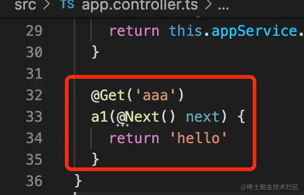

## 13、metadata 和 Reflector

- ```typescript
  import { CanActivate, ExecutionContext, Injectable } from '@nestjs/common';
  import { Observable } from 'rxjs';
  import { Reflector } from '@nestjs/core';
  
  @Injectable()
  export class AaaGuard implements CanActivate {
    constructor(private reflactor: Reflector) {}
  
    canActivate(
      context: ExecutionContext,
    ): boolean | Promise<boolean> | Observable<boolean> {
      console.log('guard');
      console.log(this.reflactor.get('roles', context.getHandler())); // 这里拿到的是方法上注入的 metadata
      console.log(this.reflactor.get('roles', context.getClass())); // 这里拿到的是 class 上注入的 metadata
  
      return true;
    }
  }
  ```

  这里`this.reflactor.get`相当于`Reflactor.getMetadata(metadataKey, target, propertyKey)`，第一个参数传入注入的key值，第二个参数取决于注入的位置，**方法**还是**class**


## 14、Module 和 Provide 循环依赖

使用 `forwordRef` 注入解决循环依赖报错的问题


## 15、创建动态模块

- 创建模块的时候定义一个静态方法，通过传入options和返回值进行动态创建模块，使用的时候调用模块的这个静态方法即可

  ```typescript
  @Module({})
  export class BbbModule {
    static register(options: Record<string, any>): DynamicModule {
      return {
        module: BbbModule,
        controllers: [BbbController],
        providers: [
          {
            provide: 'CONFIG_OPTIONS',
            useValue: options,
          },
          BbbService,
        ],
        exports: [],
      };
    }
  }
  ```

- 这个静态方法名字可以自定义，但是约定了3种方法名

  - **register**：用一次模块传一次配置，比如这次调用是 BbbModule.register({aaa:1})，下一次就是 BbbModule.register({aaa:2}) 了
  - **forRoot**：配置一次模块用多次，比如 XxxModule.forRoot({}) 一次，之后就一直用这个 Module，一般在 AppModule 里 import
  - **forFeature**：用了 forRoot 固定了整体模块，用于局部的时候，可能需要再传一些配置，比如用 forRoot 指定了数据库链接信息，再用 forFeature 指定某个模块访问哪个数据库和表。

- **方法二**

  - ```typescript
    // ccc.module-definition.ts
    import { ConfigurableModuleBuilder } from '@nestjs/common';
    
    export interface CccModuleOptions {
      aaa: number;
      bbb: string;
    }
    
    export const {
      ConfigurableModuleClass,
      MODULE_OPTIONS_TOKEN,
      OPTIONS_TYPE, // 此处的 OPTIONS_TYPE 就是 CccModuleOptions 和一些拓展属性类型
      ASYNC_OPTIONS_TYPE,
    } = new ConfigurableModuleBuilder<CccModuleOptions>()
      .setClassMethodName('forRoot') // 设置静态方法名 对应3种情况：forRoot、forRootAsync、register
      .setExtras({ isGlobal: true }, (definition, extras) => ({
        // 参数一给 options 拓展的属性，参数二回调函数是收到 extras 属性之后如何修改模块定义
        ...definition,
        global: extras.isGlobal,
      }))
      .build();
    
    ```

  - ```typescript
    // ccc.controller.ts
    import { Controller, Get, Inject } from '@nestjs/common';
    import {
      OPTIONS_TYPE,
      ASYNC_OPTIONS_TYPE,
      MODULE_OPTIONS_TOKEN,
    } from './ccc.module-definition';
    
    @Controller('ccc')
    export class CccController {
      // 使用构造函数进行注入
      constructor(
        @Inject(MODULE_OPTIONS_TOKEN) private readonly options: typeof OPTIONS_TYPE, // 此处通过 typeof 获取到 OPTIONS_TYPE 类型
      ) {}
      // 直接进行注入，不需要再进行构造函数的参数注入
      // @Inject(MODULE_OPTIONS_TOKEN) private readonly options: CccModuleOptions;
    
      @Get('')
      hrllo() {
        console.log(this.options.isGlobal); // 这里打印 undefined，因为 isGlobal 是额外的参数，用来处理模块定义的，options 里拿不到
        return this.options;
      }
    }
    
    ```

  - ```typescript
    // app.module.ts
    import { Module } from '@nestjs/common';
    import { AppController } from './app.controller';
    import { AppService } from './app.service';
    import { BbbModule } from './bbb/bbb.module';
    import { CccModule } from './ccc/ccc.module';
    
    @Module({
      imports: [
        BbbModule.register({ name: 'bbb', age: 20 }),
        // 使用 register
        // CccModule.register({ aaa: 10, bbb: 'bbb' }),
        // 使用 registerAsync 
        // CccModule.registerAsync({
        //   useFactory: async () => {
        //     await new Promise((resolve) => setTimeout(resolve, 1000));
        //     return { aaa: 10, bbb: 'ccc' };
        //   },
        // }),
        // 使用 forRoot 和 拓展属性
        CccModule.forRoot({ aaa: 13, bbb: 'ccc', isGlobal: true }),
      ],
      controllers: [AppController],
      providers: [AppService],
    })
    export class AppModule {}
    
    ```


## 16、切换 fastify

- ```typescript
  // 先安装 pnpm install fastify @nestjs/platform-fastify
  // main.ts 中引入
  import { NestFactory } from '@nestjs/core';
  import { AppModule } from './app.module';
  import {
    FastifyAdapter,
    NestFastifyApplication,
  } from '@nestjs/platform-fastify';
  
  async function bootstrap() {
    const app = await NestFactory.create<NestFastifyApplication>(
      AppModule,
      new FastifyAdapter(),
    );
    await app.listen(3000);
  }
  bootstrap();
  ```

- ```typescript
  // app.controller.ts 中使用
  import { Controller, Get, Request, Response } from '@nestjs/common';
  import { AppService } from './app.service';
  import { FastifyReply, FastifyRequest } from 'fastify';
  
  @Controller()
  export class AppController {
    constructor(private readonly appService: AppService) {}
  
    @Get()
    getHello(
      @Request() request: FastifyRequest,
      @Response() reply: FastifyReply,
    ): void {
      reply.header('url', request.url);
      reply.send('Hello!');
      // 这里使用 response 注入 reply 对象，就只能通过 send 方法返回数据了，不能使用 return 返回数据
      // 或者使用 @Response({passthrough: true}) 传入参数，表示不会在方法自己发送响应内容，就可以使用 return 返回数据了
      // return this.appService.getHello();
    }
  }
  
  ```

  

## 17、middleWare

> 类似 Express 中的 中间件

1. 创建中间件 `nest g middleware aaa --flat --no-spec`

2. `aaa.middleware.ts`

   ```typescript
   import { Injectable, NestMiddleware } from '@nestjs/common';
   import { Request, Response } from 'express';
   
   @Injectable()
   export class AaaMiddleware implements NestMiddleware {
     use(req: Request, res: Response, next: () => void) {
       console.log('Before');
       next();
       console.log('After');
     }
   }
   ```

3. 使用 `app.module.ts`

   ```typescript
   import {
     MiddlewareConsumer,
     Module,
     NestModule,
     RequestMethod,
   } from '@nestjs/common';
   import { AppController } from './app.controller';
   import { AppService } from './app.service';
   import { AaaMiddleware } from './aaa.middleware';
   
   @Module({
     imports: [],
     controllers: [AppController],
     providers: [AppService],
   })
   export class AppModule implements NestModule {
     configure(consumer: MiddlewareConsumer) {
       consumer
         .apply(AaaMiddleware)
         .forRoutes({ path: 'hello*', method: RequestMethod.GET }); // 这里可以通过传入参数对路由进行匹配
       consumer
         .apply(AaaMiddleware)
         .forRoutes({ path: 'world1', method: RequestMethod.GET });
     }
   }
   ```

4. 可以使用依赖注入的方式在中间件中注入

   ```typescript
   import { Inject, Injectable, NestMiddleware } from '@nestjs/common';
   import { Request, Response } from 'express';
   import { AppService } from './app.service';
   
   @Injectable()
   export class AaaMiddleware implements NestMiddleware {
     // constructor(private readonly appService: AppService) {} // 也可以使用构造器注入
   
     @Inject(AppService) private readonly appService: AppService;
   
     use(req: Request, res: Response, next: () => void) {
       console.log('Before');
       console.log(1111111, this.appService.getHello()); // 注入之后就可以使用 appService 里的方法了
       next();
       console.log('After');
     }
   }
   
   ```

5. **next()** 参数和 **@Next** 装饰器区别

   - next参数是调用下一个middleware的,类似于vue路由守卫中的next

   - @Next 是调用下一个 handler 的, 和 @Response的效果一样

     

6. 和 interceptor 的区别

   - interceptor 是能从 ExecutionContext 里拿到目标 class 和 handler，进而通过 reflector 拿到它的 metadata 等信息的，这些 middleware 就不可以
   - interceptor 里是可以用 rxjs 的操作符来组织响应处理流程的


## RxJS 和 Interceptor 

