## Nest相关概念

**controller**：控制器，用于处理路由，解析请求参数

**handler**：控制器里处理路由的方法

**service**：实现业务逻辑的地方，比如操作数据库等

**dto**：data transfer object，数据传输对象，用于封装请求体里数据的对象

**module**：模块，包含 controller、service 等，比如用户模块、书籍模块

**entity**：对应数据库表的实体

**ioc**：Inverse of Controller，反转控制或者叫依赖注入，只要声明依赖，运行时 Nest 会自动注入依赖的实例

**aop**：Aspect Oriented Programming 面向切面编程，在多个请求响应流程中可以复用的逻辑，比如日志记录等，具体包含 middleware、interceotor、guard、exception filter、pipe

**nest cli**：创建项目、创建模块、创建 controller、创建 service 等都可以用这个 cli 工具来做  


## Nest Cli 使用

- `nest new` 

  - --skip-git：跳过git初始化
  - --skip-install：跳过 npm install
  - --package-manager：指定包管理器
  - --language：指点 ts/js
  - --strict：是否开启严格模式（默认false）

- `nest generate`

  - nest generate **module**：自动生成module代码，并在AppModule引入  
  - nest generate controller：同上  
  - nest generate service：同上  
  - nest generate resource：生成完整的模块代码  
  - --flat 和 --no-flat 是指定是否生成对应目录的  
  - --spec 和 --no-spec 是指定是否生成测试文件 
  -  --skip-import 是指定不在 AppModule 里引入  
  - --project，这是指定生成代码在哪个子项目的，用于 monorepo 项目  

- `nest build`  

  - --wepback 和 --tsc 是指定用什么编译，默认是 tsc 编译，也可以切换成 webpack  

    > tsc 不做打包、webpack 会做打包，两种方式都可以。
    >
    > node 模块本来就不需要打包，但是打包成单模块能提升加载的性能。

  - --watch 是监听文件变动，自动 build 的  

    > 但是 --watch 默认只是监听 ts、js 文件，加上 --watchAssets 会连别的文件一同监听变化，并输出到 dist 目录，比如 md、yml 等文件

  - --path 是指定 tsc 配置文件的路径的  

  - --config 是指定 nest cli 的配置文件

- `nest-cli.json`

  - 上面选项都可在此文件配置  

- `nest start`  

  - --watch：改动之后自动重新build
  - --debug：启动调试的 websocket 服务，用来 debug  
  - --exec： 可以指定用什么来跑，默认是用 node 跑，你也可以切换别的 runtime  

- `nest info`  

  - 查看项目信息的，包括系统信息、 node、npm 和依赖版本


## 5种HTTP数据传输方式  

- url param  

  直接写在路径中：`http://guang.zxg/person/1111`

- query  

  - 通过 `url` 中 `?` 后面的 `&` 分隔字符传递数据：`http://guang.zxg/person?name=guang&age=20`   

  - 非英文、特殊字符 要经过编码

    ```js
    const query = "?name=" + encodeURIComponent('光') + "&age=20"
    // ?name=%E5%85%89&age=20
    ```

  - 或者使用 `query-string` 库处理

    ```js
    const queryString = require('query-string');
    queryString.stringify({
      name: '光',
      age: 20
    });
    // ?name=%E5%85%89&age=20
    ```

- form-urlencoded  

  - 直接用 form 表单提交数据就是这种，它和 query 字符串的方式的区别只是放在了 body 里，然后指定下 content-type 是 `application/x-www-form-urlencoded`  
  - 因为内容也是 query 字符串，所以也要用 encodeURIComponent 的 api 或者 query-string 库处理下。

- form-data  

  - form data 使用 --------- + 一串数字做为 boundary 分隔符。因为不是 url 的方式了，自然也不用再做 url encode。

  - content type 为 `multipart/form-data`   

  - > 接收文件时，` @UploadedFiles() files: Array<Express.Multer.File>` 文件类型：pnpm i -D @types/multer

- json  

  - content type 为 `application/json`  


## 使用多种 `provider` 注入对象  

- `Model` 中注入方式

  - 通过 `provide` 指定 token，使用 `useClass` 指定对象类，Nest 会自动对它做实例化后用来注入  

    ```ts
    @Module({
      imports: [PersonModule],
      controllers: [AppController],
      providers: [ // 简写 AppService
        {
          provide: AppService, // 此处作为 token 使用，也可以使用字符串 "app_service" 
          useClass: AppService,
        },
      ],
    })
    export class AppModule {}
    ```

  - 直接指定值，让 IoC 容器来注入

    - 静态值使用 `useValue` 注入 

      ```ts
      {
          provide: 'person',
          useValue: {
              name: 'aaa',
              age: 20
          }
      }
      // Controller 中注入使用 
      @Inject('person') private readonly person:{name: string, age: number}
      ```

    - 动态值使用 `useFactory` 注入

      ```ts
      // useFactory 同样可以使用静态值
      {
          provide: 'person2',
          useFactory() {
              return {
                  name: 'bbb',
                  desc: 'cccc'
              }
          }
      }
      // Controller 中使用方式同上
      ```

      ```ts
      // useFactory 通过参数注入别的 provider
      {
        provide: 'person3',
        useFactory(person: { name: string }, appService: AppService) {
          return {
            name: person.name,
            desc: appService.getHello()
          }
        },
        inject: ['person', AppService]
      }
      // 通过 inject 声明了两个 token，一个是字符串 token 的 person，一个是 class token 的 AppService。
      ```

      ```ts
      // useFactory 支持异步 此处阻塞的是应用启动注入的过程
      {
        provide: 'person5',
        async useFactory() {
          await new Promise((resolve) => {
            setTimeout(resolve, 3000);
          });
          return {
            name: 'bbb',
            desc: 'cccc'
          }
        },
      },
      ```

    - 可以通过 useExisting 指定别名
    
      ```ts
      {
        provide: 'person4',
        useExisting: 'person2'
      }
      ```
    
      

- `Controller` 中两种注入方式

  - 构造器注入

  - 属性注入

    ```ts
    @Controller()
    export class AppController {
    	// 构造器注入
      constructor(private readonly appService: AppService) {}
        
      // @Inject('app_service') private readonly appService: AppService // 如果上面使用 string 作为 token，则此处使用     @Inject 手动指定 token
    
      // 属性注入
      // @Inject(AppService)
      // private readonly appService: AppService;
    
      @Get()
      getHello(): string {
        return this.appService.getHello();
      }
    }
    ```

  

## 全局模块和生命周期  

- 应用加载的时候

  首先，递归初始化模块，依次调用模块内的 `controller`、`provider` 的 `onModuleInit` 方法，然后再调用 `module` 的 `onModuleInit` 方法。
  全部初始化完之后，再依次调用模块内的 `controller`、`provider` 的 `onApplicationBootstrap` 方法，然后调用 `module` 的 `onApplicationBootstrap` 方法

- 应用销毁的时候

  1. 调用每个模块的 controller、provider 的 `onModuleDestroy` 方法
  2. 调用 Module 的 `onModuleDestroy` 方法
  3. 调用每个模块的 controller、provider 的 `beforeApplicationShutdown` 方法
  4. 调用 Module 的 `beforeApplicationShutdown` 方法
  5. 停止监听网络端口
  6. 调用每个模块的 controller、provider 的 `onApplicationShutdown` 方法
  7. 调用 Module 的 onApplicationShutdown 方法
  8. 停止进程

- 通过 moduleRef 取出一些 provider，执行关闭连接等销毁逻辑

  用法见小册


## AOP （面向切面编程）

> **AOP 的好处是可以把一些通用逻辑分离到切面中，保持业务逻辑的纯粹性，这样切面逻辑可以复用，还可以动态的增删。**
>
> Express 的中间件的洋葱模型就是一种 AOP 的实现

Nest 实现 AOP 的方式：`Middleware`、`Guard`、`Pipe`、`Interceptor`、`ExceptionFilter`  

- Middleware

  - 全局中间件
  - 路由中间件

- Guard

  Guard 是路由守卫的意思，可以用于在调用某个 Controller 之前判断权限，返回 true 或者 false 来决定是否放行：

  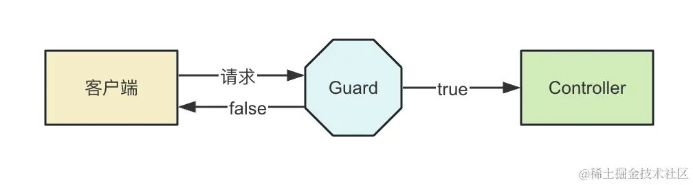

- Interceptor

  Interceptor 是拦截器的意思，可以在目标 Controller 方法前后加入一些逻辑：

  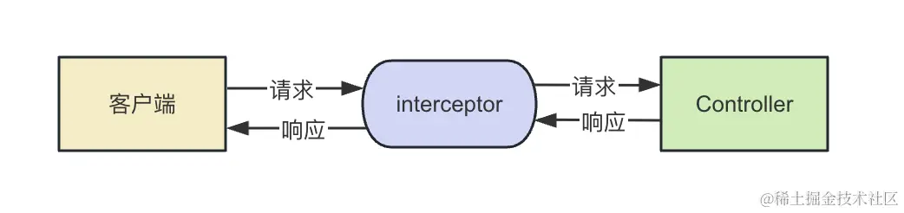

- Pipe

  `nest g pipe validate --no-spec --flat`

  对参数做一些校验和转换

  一些内置 Pipe

  - ValidationPipe
  - ParseIntPipe
  - ParseBoolPipe
  - ParseArrayPipe
  - ParseUUIDPipe
  - DefaultValuePipe
  - ParseEnumPipe
  - ParseFloatPipe
  - ParseFilePipe

- ExceptionFilter  

  `nest g filter test --no-spec --flat`

  对抛出的异常做处理，返回对应的响应

  内置的相关异常，都是 HttpException 的子类

  - BadRequestException
  - UnauthorizedException
  - NotFoundException
  - ForbiddenException
  - NotAcceptableException
  - RequestTimeoutException
  - ConflictException
  - GoneException
  - PayloadTooLargeException
  - UnsupportedMediaTypeException
  - UnprocessableException
  - InternalServerErrorException
  - NotImplementedException
  - BadGatewayException
  - ServiceUnavailableException
  - GatewayTimeoutException


## 几种 AOP 机制的顺序

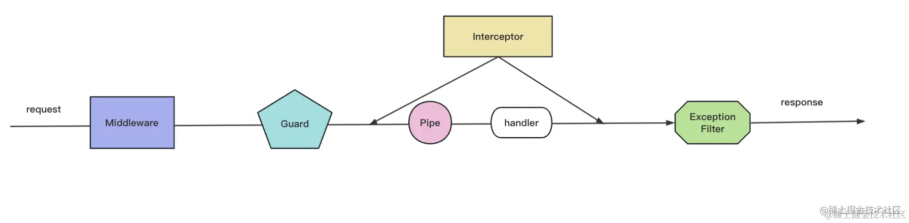


## Nest 装饰器

- @Module：声明模块
- @Controller：声明 controller  
- @Injectable：声明 provider，这里provider可以是任意 class，注入方式见上。用`@Optional()`声明可选
- @Catch/@UseFilters：filter 处理抛出的未捕获异常，通过 @Catch 来指定处理的异常，然后通过 @UseFilters  用到 handler 上

​	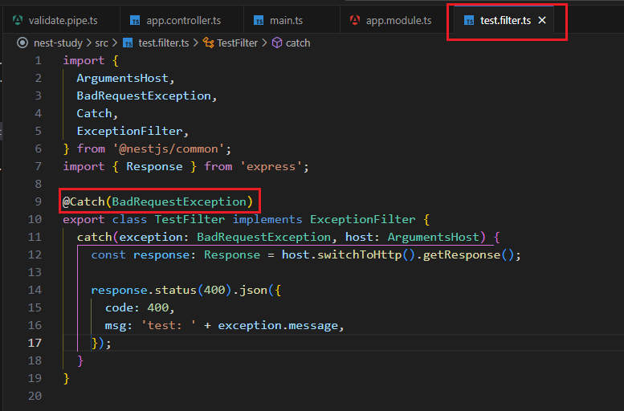

​	**四种注入方式：（interceptor、guard、pipe使用方式与之相同）**

​	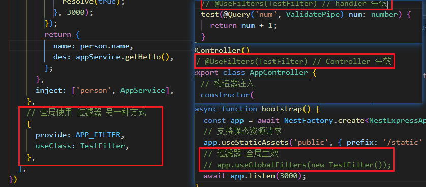

​	Pipe 单独在参数位置应用	

- 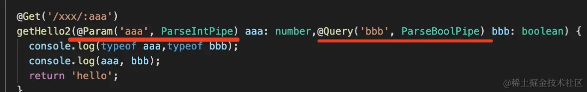

- 请求：@Get、@Post 、@Put、@Delete、@Patch、@Options、@Head

- @SetMetadata：指定 handler 和 class 的 metadata  

  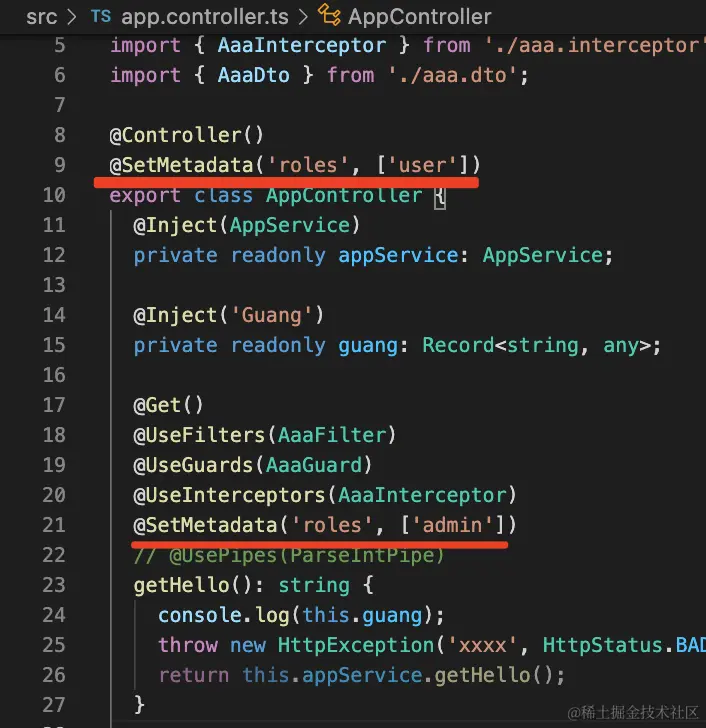  

  然后在 guard 或者 interceptor 里取出来  

  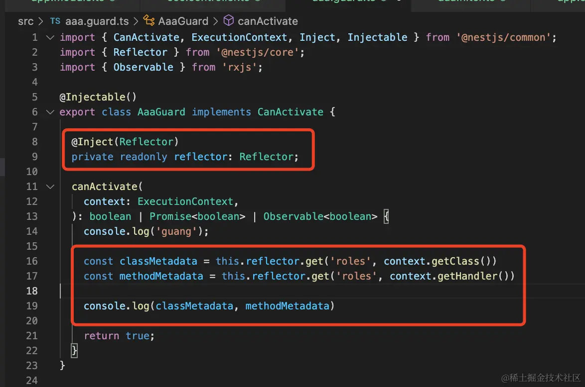  

- @Headers：取**某个请求头**或者**全部请求头**  

  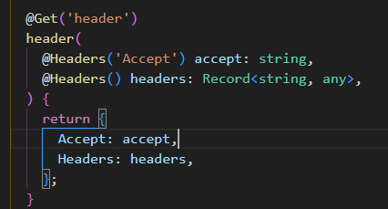  

- @Ip：拿到请求的 IP  

- @Session：拿到 session 对象（需要安装一个 express 中间件： `pnpm i express-session`）

  具体使用方式见小册：[session 使用](https://juejin.cn/book/7226988578700525605/section/7234726536342372412?enter_from=course_center&utm_source=course_center)

- @HostParam：用于取域名部分的参数  

- @Req / @Request：request 对象  

- @Res / @Response：response 对象  

  注入 response 对象之后Nest就不会把 handler 返回值作为响应内容了，需要手动使用 `res.end()`返回响应

  或者通过 `passthrough` 参数告诉 Nest 返回响应  

  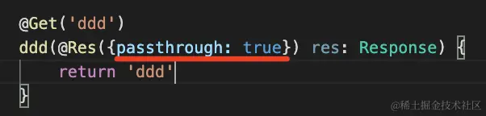  

- @Next：注入 next 也不会返回相应

  当你有两个 handler 来处理同一个路由的时候，可以在第一个 handler 里注入 next，调用它来把请求转发到第二个 handler，Nest 不会处理注入 @Next 的 handler 的返回值。  

  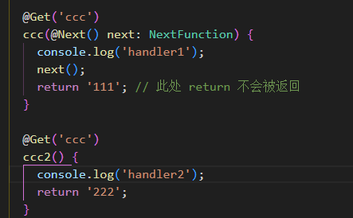  


- @HttpCode：修改响应状态码  

  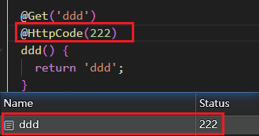  

- @Header：修改 response header  

  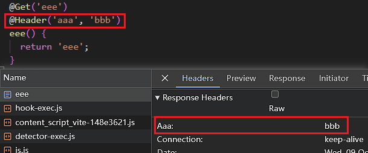  

-  @Redirect：指定路由重定向的url  

  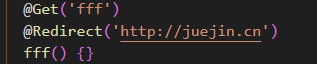  

  另一种设置方式  

  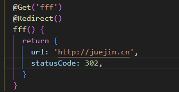  

- @Render：给返回的响应内容指定渲染引擎  

  1. 安装模板引擎包 hbs：
  
     `npm install --save hbs`
  
  2. 指定静态资源的路径和模板的路径，并指定模版引擎为 handlerbars
  
     ```js
     // main.ts
       app.useStaticAssets(join(__dirname, '..', 'public'));
       app.setBaseViewsDir(join(__dirname, '..', 'views'));
       app.setViewEngine('hbs');
     ```
  
  3. 准备图片和模板文件  
  
     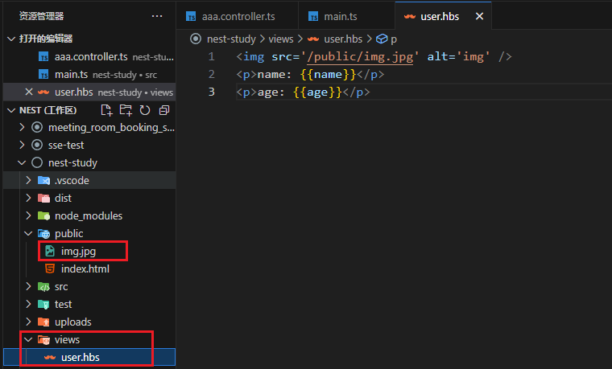  
  
  4. 在 handler 里指定模版和数据  
  
     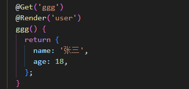  
  


## 自定义装饰器

#### 自定义方法装饰器

- 创建个 decorator：`nest g decorator aaa --flat`

- 使用  

  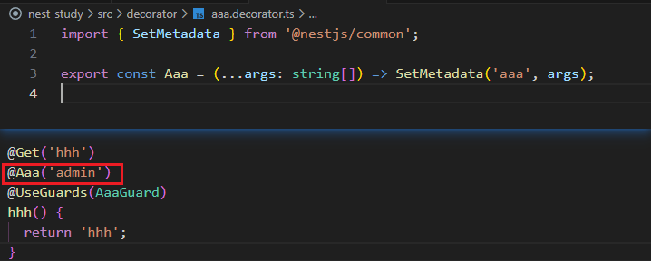  

- 合并使用装饰器  

  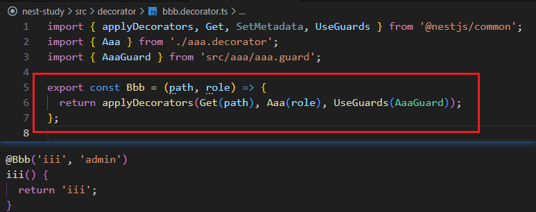  

#### 自定义参数装饰器

- ```js
  import { createParamDecorator, ExecutionContext } from '@nestjs/common';
  
  export const Ccc = createParamDecorator(
    (data: string, ctx: ExecutionContext) => {
      return 'ccc';
    },
  );
  ```

  其中 `data` 是传入的参数，`ExecutionContext` 可以取出 request、response 对象

#### 自定义 Class 装饰器

- 与自定义方法装饰器相同

  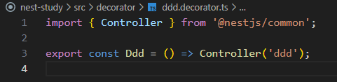  

  

## metadata 和 Reflector

#### Nest 实现原理

**通过装饰器给 class 或者对象添加 metadata，并且开启 ts 的 emitDecoratorMetadata 来自动添加类型相关的 metadata，然后运行的时候通过这些元数据来实现依赖的扫描，对象的创建等等功能。**

Reflect.defineMetadata 和 Reflect.getMetadata 分别用于设置和获取某个类的元数据，如果最后传入了属性名，还可以单独为某个属性设置元数据。

#### @SetMetadata 使用

- guard 中使用

  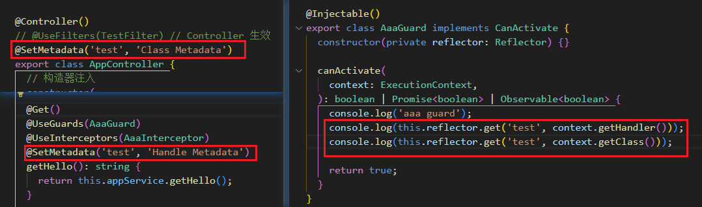  

  此处使用 构造函数 注入使用  

- interceptor 中使用

  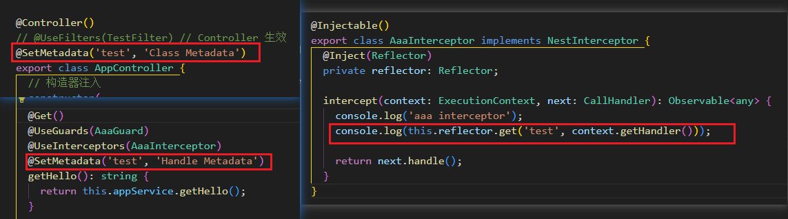  

  此处使用 装饰器 注入使用

  `@SetMetadata` 可以在 handler 和 class 中使用，取值时方式不同

- `reflector` 的其他方法

  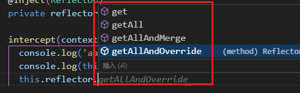  

  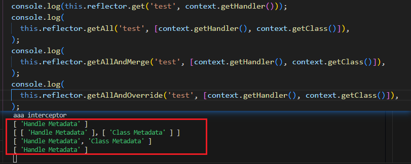  

  - **get**：get 的实现就是 Reflect.getMetadata

  - **getAll**：返回一个 metadata 的数组  

  - **getAllAndMerge**：会把它们合并为一个对象或者数组

  - **getAllAndOverride**：返回第一个非空的 metadata

    

## ExecutionContext：切换不同上下文

>**ArgumentHost 是用于切换 http、websocket、rpc 等上下文类型的，可以根据上下文类型取到对应的 argument，让 Exception Filter 等在不同的上下文中复用**。

- **filter** 中使用

  ```ts
  import { ArgumentsHost, Catch, ExceptionFilter } from '@nestjs/common';
  import { Response } from 'express';
  import { AaaException } from 'src/aaa/AaaException';
  
  @Catch(AaaException)
  export class AaaFilter implements ExceptionFilter {
    catch(exception: AaaException, host: ArgumentsHost) {
      if(host.getType() === 'http') {
        const ctx = host.switchToHttp();
        const response = ctx.getResponse<Response>();
        const request = ctx.getRequest<Request>();
  
        response
          .status(500)
          .json({
            aaa: exception.aaa,
            bbb: exception.bbb
          });
      } else if(host.getType() === 'ws') {
  
      } else if(host.getType() === 'rpc') {
  
      }
    }
  }
  ```

- **guard** 中使用

  ExecutionContext 是 ArgumentHost 的子类，扩展了 getClass、getHandler 方法

  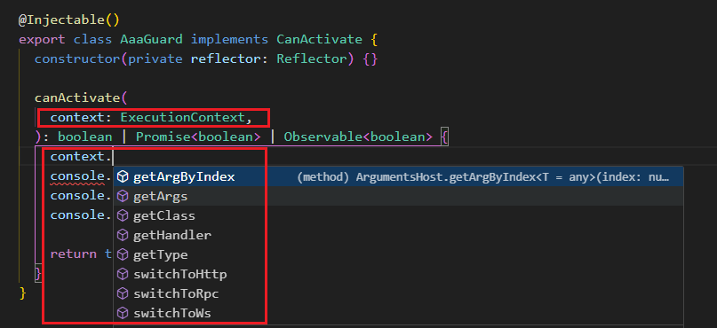  

  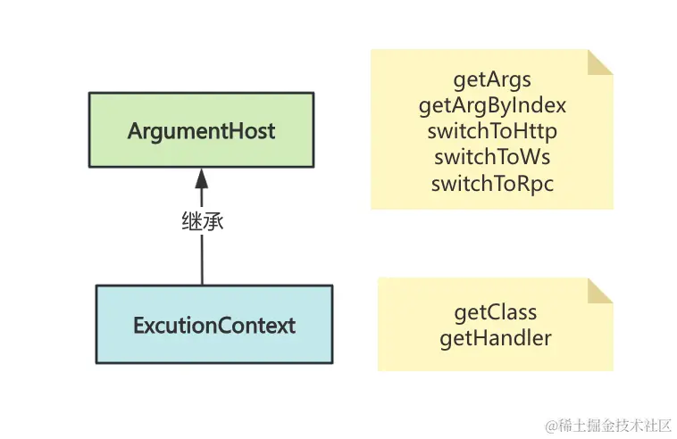  

- **interceptor** 中同上


## 处理 Module 和 Provider 的循环依赖

- 使用 `forwardRef`：Nest 会单独创建两个 Module，之后再把 Module 的引用转发过去

  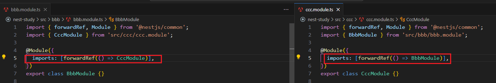  

- Service 相互引用产生循环依赖同样使用 `forwardRef` 解决

  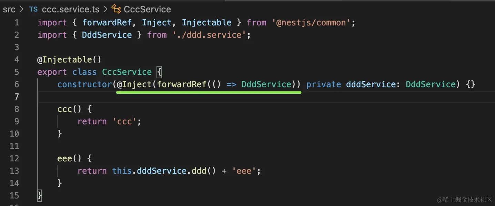  


## 创建动态模块 Dynamic Module

- 创建模块的时候定义一个静态方法，通过传入options和返回值进行动态创建模块，使用的时候调用模块的这个静态方法即可

  ```typescript
  @Module({})
  export class BbbModule {
    static register(options: Record<string, any>): DynamicModule {
      return {
        // 这里和在装饰器里定义有所区别，多了一个 module 属性
        module: BbbModule,
        controllers: [BbbController],
        providers: [
          {
            provide: 'CONFIG_OPTIONS',
            useValue: options,
          },
          BbbService,
        ],
        exports: [],
      };
    }
  }
  ```

  使用的时候调用上面定义的静态方法

  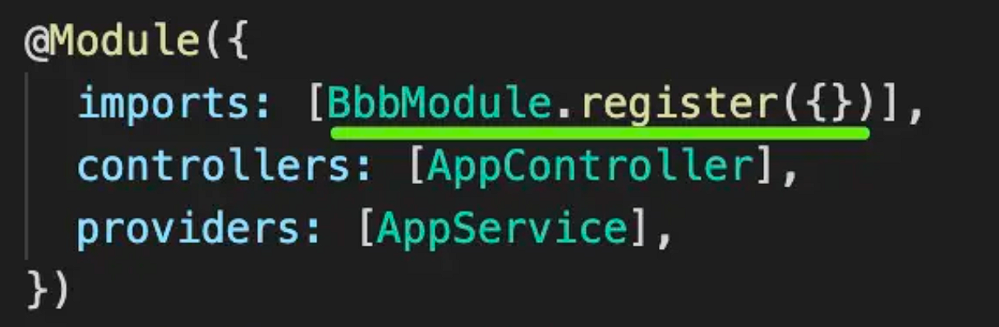  

- 这个静态方法名字可以自定义，但是约定了3种方法名  

  - **register**：用一次模块传一次配置，比如这次调用是 BbbModule.register({aaa:1})，下一次就是 BbbModule.register({aaa:2}) 了  
  - **forRoot**：配置一次模块用多次，比如 XxxModule.forRoot({}) 一次，之后就一直用这个 Module，一般在 AppModule 里 import  
  - **forFeature**：用了 forRoot 固定了整体模块，用于局部的时候，可能需要再传一些配置，比如用 forRoot 指定了数据库链接信息，再用 forFeature 指定某个模块访问哪个数据库和表。  

- **方法二创建动态模块**  

  1. 使用 `ConfigurableModuleBuilder` 创建Module，抛出 `ConfigurableModuleClass`，`MODULE_OPTIONS_TOKEN`
  
     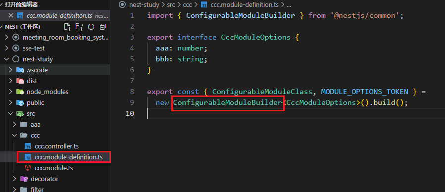  
  
  2. 使用
  
     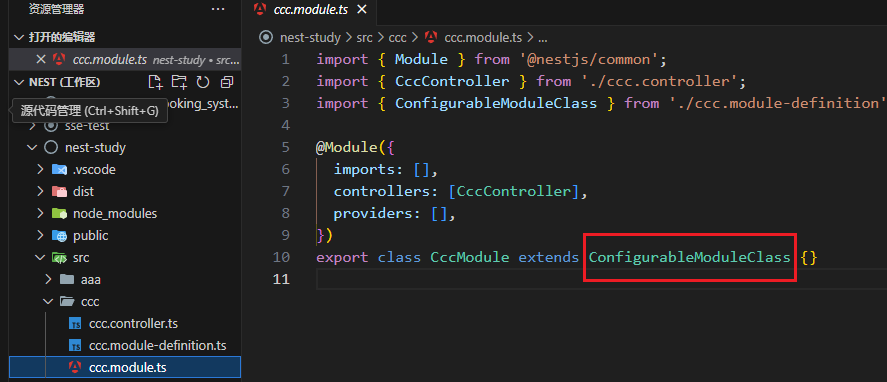  
  
  3. 使用抛出的 token 注入 controller，及使用 options
  
     options 对象一般不这么用，而是用来做配置
  
     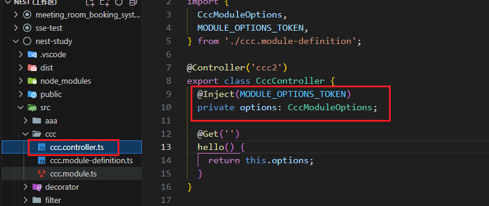  
  
  4. 注册的时候传入参数
  
     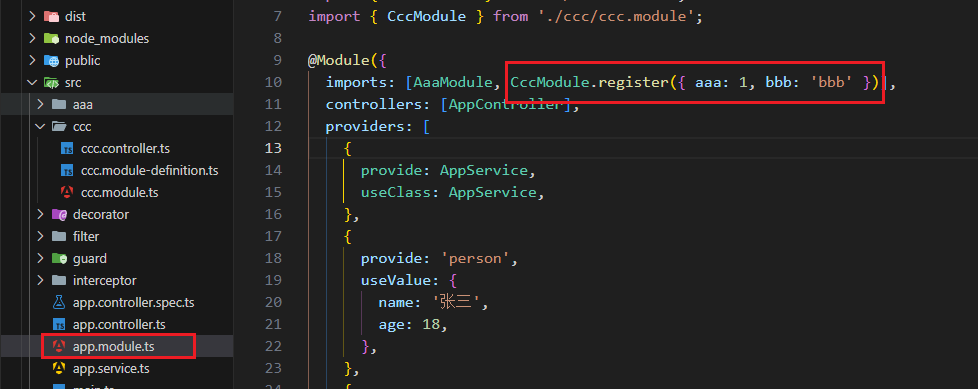  
  
  - 还可以用 useFactory 动态创建 options 对象
  
    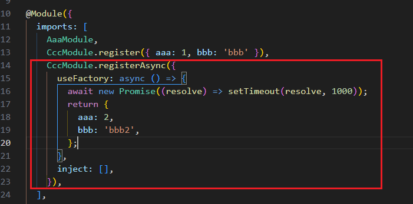  
  
- forRoot、forFeature 使用此方法创建

  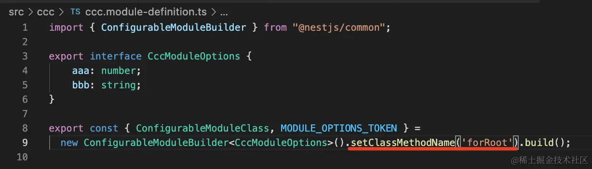  

- 是否设置为全局模块

  ```ts
  import { ConfigurableModuleBuilder } from "@nestjs/common";
  
  export interface CccModuleOptions {
      aaa: number;
      bbb: string;
  }
  
  export const { ConfigurableModuleClass, MODULE_OPTIONS_TOKEN } =
    new ConfigurableModuleBuilder<CccModuleOptions>().setClassMethodName('register').setExtras({
      isGlobal: true
    }, (definition, extras) => ({
      ...definition,
      global: extras.isGlobal,
    })).build();
  ```

  - setExtras 第一个参数是给 options 扩展啥 extras 属性，第二个参数是收到 extras 属性之后如何修改模块定义。


## 切换 fastify

- ```typescript
  // 先安装 pnpm install fastify @nestjs/platform-fastify
  // main.ts 中引入
  import { NestFactory } from '@nestjs/core';
  import { AppModule } from './app.module';
  import {
    FastifyAdapter,
    NestFastifyApplication,
  } from '@nestjs/platform-fastify';
  
  async function bootstrap() {
    const app = await NestFactory.create<NestFastifyApplication>(
      AppModule,
      new FastifyAdapter(),
    );
    await app.listen(3000);
  }
  bootstrap();
  ```

- ```typescript
  // app.controller.ts 中使用
  import { Controller, Get, Request, Response } from '@nestjs/common';
  import { AppService } from './app.service';
  import { FastifyReply, FastifyRequest } from 'fastify';
  
  @Controller()
  export class AppController {
    constructor(private readonly appService: AppService) {}
  
    @Get()
    getHello(
      @Request() request: FastifyRequest,
      @Response() reply: FastifyReply,
    ): void {
      reply.header('url', request.url);
      reply.send('Hello!');
      // 这里使用 response 注入 reply 对象，就只能通过 send 方法返回数据了，不能使用 return 返回数据
      // 或者使用 @Response({passthrough: true}) 传入参数，表示不会在方法自己发送响应内容，就可以使用 return 返回数据了
      // return this.appService.getHello();
    }
  }
  
  ```

  

## Nest 中的 middleWare

> 类似 Express 中的 中间件

1. 创建中间件 `nest g middleware aaa --flat --no-spec`

2. `aaa.middleware.ts`

   ```typescript
   import { Injectable, NestMiddleware } from '@nestjs/common';
   import { Request, Response } from 'express';
   
   @Injectable()
   export class AaaMiddleware implements NestMiddleware {
     use(req: Request, res: Response, next: () => void) {
       console.log('Before');
       next();
       console.log('After');
     }
   }
   ```

3. 使用 `app.module.ts`

   ```typescript
   import {
     MiddlewareConsumer,
     Module,
     NestModule,
     RequestMethod,
   } from '@nestjs/common';
   import { AppController } from './app.controller';
   import { AppService } from './app.service';
   import { AaaMiddleware } from './aaa.middleware';
   
   @Module({
     imports: [],
     controllers: [AppController],
     providers: [AppService],
   })
   export class AppModule implements NestModule {
     configure(consumer: MiddlewareConsumer) {
       consumer
         .apply(AaaMiddleware)
         .forRoutes({ path: 'hello*', method: RequestMethod.GET }); // 这里可以通过传入参数对路由进行匹配
       consumer
         .apply(AaaMiddleware)
         .forRoutes({ path: 'world1', method: RequestMethod.GET });
     }
   }
   ```

4. 可以使用依赖注入的方式在中间件中注入

   ```typescript
   import { Inject, Injectable, NestMiddleware } from '@nestjs/common';
   import { Request, Response } from 'express';
   import { AppService } from './app.service';
   
   @Injectable()
   export class AaaMiddleware implements NestMiddleware {
     // constructor(private readonly appService: AppService) {} // 也可以使用构造器注入
   
     @Inject(AppService) private readonly appService: AppService;
   
     use(req: Request, res: Response, next: () => void) {
       console.log('Before');
       console.log(1111111, this.appService.getHello()); // 注入之后就可以使用 appService 里的方法了
       next();
       console.log('After');
     }
   }
   ```

   > 可以使用 class 的形式（方便使用 Inject），也可以使用 function（和 Express 中的 middleware 相似）

5. **next()** 参数和 **@Next** 装饰器区别

   - next参数是调用下一个middleware的,类似于vue路由守卫中的next

   - @Next 是调用下一个 handler 的, 和 @Response的效果一样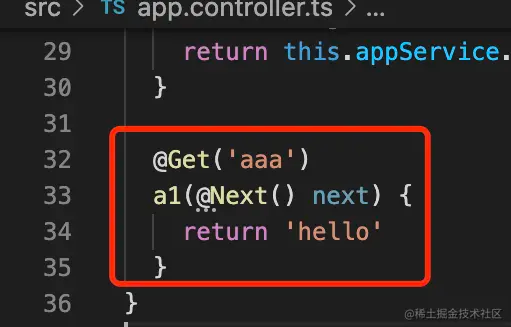

6. 和 interceptor 的区别

   - interceptor 是能从 ExecutionContext 里拿到目标 class 和 handler，进而通过 reflector 拿到它的 metadata 等信息的，这些 middleware 就不可以
   - interceptor 里是可以用 rxjs 的操作符来组织响应处理流程的
   - interceptor 更适合处理与**具体业务相关的逻辑**，而 middleware 适合更**通用的处理逻辑**


## RxJS 和 Interceptor 

### RxJS

- tap: 不修改响应数据，执行一些额外逻辑，比如记录日志、更新缓存等

  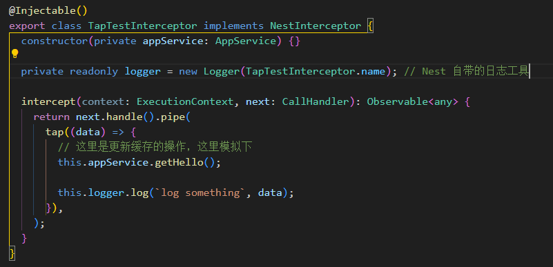  

- map：对响应数据做修改，一般都是改成 {code, data, message} 的格式

  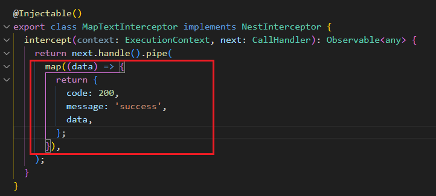  

- catchError：在 exception filter 之前处理抛出的异常，可以记录或者抛出别的异常

  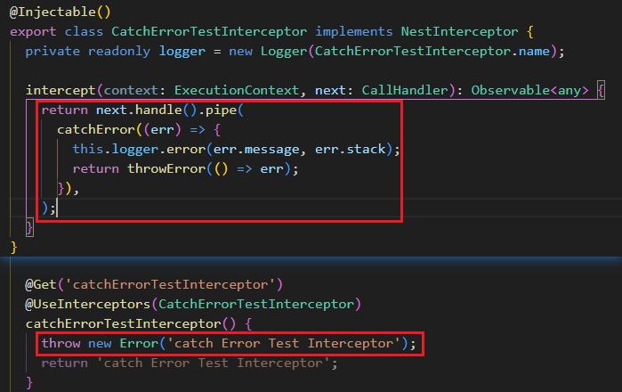  

- timeout：处理响应超时的情况，抛出一个 TimeoutError，配合 catchErrror 可以返回超时的响应

### Interceptor

- 全局注入：main.ts 中 `app.useGlobalInterceptors(new xxxInterceptor())`  

  这种手动 new 的没法注入依赖  

- 路由级别注入：可以注入依赖  

- 使用 Nest 提供的 token 实现全局注入（解决手动 new 全局注入没法注入依赖的问题）  

    


## 内置 Pipe 和 自定义 Pipe

> Pipe 是在参数传给 handler 之前对参数做一些验证和转换的 class

### 内置Pipe

- 内置 Pipe 有：
  - ValidationPipe
  - ParseIntPipe：整型
  - ParseBoolPipe：Boolean
  - ParseArrayPipe：转换为数组    
  - ParseUUIDPipe：是随机生成的几乎不可能重复的字符串，一般用过做ID
  - DefaultValuePipe：设置参数默认值
  - ParseEnumPipe  
  - ParseFloatPipe
  - ParseFilePip

- 直接使用如： `@Query('aa', ParseIntPipe)`

- 通过 new 关键字创建（此方法可以传参进行一些自定义）

  ```typescript
  @Get()
    getHello(
      @Query(
        'aa',
        new ParseIntPipe({
          // errorHttpStatusCode: HttpStatus.NOT_FOUND, // 指定错误状态码
          exceptionFactory: (msg) => {
            // 自定义错误信息 抛出异常
            console.log(msg);
            throw new HttpException('xxx' + msg, HttpStatus.NOT_IMPLEMENTED);
          },
        }),
      )
      aa: string,
    ): string {
      console.log(aa);
      return aa + 1;
      // return this.appService.getHello();
    }
  ```

- **ParseArrayPipe**

  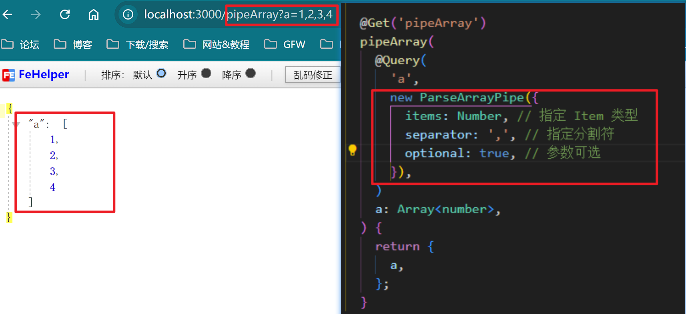

  ```typescript
    @Get('cc')
    getCc(
      @Query(
        'cc',
        new ParseArrayPipe({
          items: Number, // 指定每一项数据类型
          separator: '.', // 指定分隔符
          optional: true, // 参数可选
        }),
      )
      cc: number[],
    ) {
      console.log(cc);
      return cc;
    }
  ```

- **ParseEnumPipe**
  
  ```typescript
  // 先定义 enum 
  enum Color {
    a = 'red',
    b = 'blue',
    c = 'green',
  }
  
  // 使用
  // 此方法可以根据定义的 enum 限制传递的参数
  @Get('color/:id')
    getColor(@Param('id', new ParseEnumPipe(Color)) id: Color) {
      return id;
    }
  ```

### 自定义 Pipe

- 使用命令生成文件 `nest g pipe aaa --flat --no-spec`

- 创建的 pipe 的返回值会传递到 handler 里面 

  ```typescript
  import { ArgumentMetadata, Injectable, PipeTransform } from '@nestjs/common';
  
  @Injectable()
  export class AaaPipe implements PipeTransform {
    transform(value: any, metadata: ArgumentMetadata) {
      console.log(value, metadata);
      return 'aaa';
    }
  }
  ```

  - **value**：handler里面接收到的值

  - **metadata**：元数据对象，包含有关传递给管道的值的其他信息，例如它的类型和所在的位置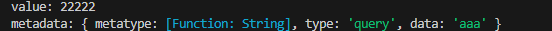
    - metatype：参数的ts类型
    
    - type：装饰器
    
    - data：传给装饰器的参数
      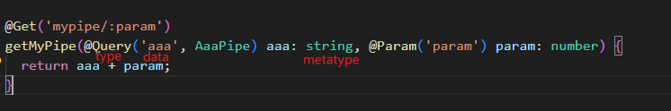


## ValidationPipe 验证 post 请求

1. 安装依赖包 `npm install -D class-validator class-transformer`
2. @Body(new ValidationPipe()) 
3. 在 dto 这里，用 class-validator 包的 @IsInt(或其他) 装饰器标记一下

- 自定义 ValiditionPipe

  ```typescript
  import {
    ArgumentMetadata,
    Injectable,
    PipeTransform,
    BadRequestException,
  } from '@nestjs/common';
  import { plainToInstance } from 'class-transformer';
  import { validate } from 'class-validator';
  
  @Injectable()
  export class MyValidationPipe implements PipeTransform {
  
    async transform(value: any, metadata: ArgumentMetadata) {
      console.log('value:', value);
      console.log('metadata:', metadata);
  
      if (!metadata.metatype) return value;
      console.log(this.options);
      const object = plainToInstance(metadata.metatype, value);
      const errors = await validate(object);
      if (errors.length > 0) {
        throw new BadRequestException('参数验证失败!');
      }
      return value;
    }
  }
  
  ```
  - value：接收到的值
  - metadata：与get请求时的pipe类似
  - 注意 metadata.metatype 即 dto 里定义的 class， 通过 plainToInstance 将 value 转换为此类的实例对象，再通过 validate 进行验证
  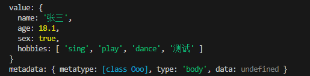

- 此外 pipe 中也可以进行依赖注入，方法同常规一样，但是需要去掉手动new`@Body(ValidationPipe）` 
- 若要创建全局 pipe，可以使用 nest 提供的 token ： **APP_PIPE**，方法同 Interceptor
- 如果不需要注入依赖（即在 pipe 里使用 @Inject），可以在 main.ts 中使用 App.useGlobalPipes(new xxxValidetionPipe())进行全局注入
- 此外，内置 ValidetionPipe 还包含以下验证方式  
  - @**Length**(10, 20)
  - @**Contains**('hello')
  - @**IsInt**()    @**Min**(0)    @**Max**(10)
  - @**IsEmail**()
  - @**IsFQDN**() // 是否是域名

- 自定义 message 信息：传入 message 函数

  ```typescript
  @Length(10, 20, {
      message({targetName, property, value, constraints}) {
          return `${targetName} 类的 ${property} 属性的值 ${value} 不满足约束: ${constraints}`
      }
  })
  title: string;
  ```

- [更多装饰器](https://www.npmjs.com/package/class-validator)


## 自定义 Exception Filter 

> 


## 串一串Nest核心概念


## 文件上传

###  Express 文件上传

> 通过 multer 包实现文件上传

1. 单文件上传

   ```typescript
   const upload = multer({ dest: 'uploads/' }) // 此处设置上传路径
   
   // 这里 single 参数为上传 formData 的 key，只有对应才能上传
   app.post('/aaa', upload.single('aaa'), function (req, res, next) {
     console.log('req.file', req.file);
     console.log('req.body', req.body);
   })
   ```

   - `req.file`为文件相关信息

   - `req.body`为非文件的字段

     

2. 多文件上传 - 通过 upload.array，可以指定最大上传数量

   ```typescript
   app.post('/bbb', upload.array('bbb', 2), function (req, res, next) {
   	console.log('req.files', req.files);
   	console.log('req.body', req.body);
   }, function (err, req, res, nest) { // 第二个回调为错误处理
   	if (err instanceof multer.MulterError && err.code === 'LIMIT_UNEXPECTED_FILE') {
   		res.status(400).end('Too many files uploaded')
   	}
   })
   ```

   - 可以通过添加第二个回调函数，对上传出现的错误进行捕获处理

     

3. 多个字段上传文件 - 可以对不同的字段做不同数量的限制

   ```typescript
   app.post('/ccc', upload.fields([
   	{ name: 'aaa', maxCount: 3 },
   	{ name: 'bbb', maxCount: 2 }
   ]), function (req, res, next) {
   	console.log('req.files:', req.files);
   	console.log('req.body:', req.body);
   })
   ```

4. 不设置上传字段

   ```typescript
   app.post('/ddd', upload.any(), function (req, res, next) {
   	console.log('req.files:', req.files);
   	console.log('req.body:', req.body);
   })
   ```

5. 自定义**上传路径**和**保存文件名**

   ```typescript
   // 设置保存路径和文件名 - 其他用法同上
   const storage = multer.diskStorage({
   	destination: function (req, file, cb) {
   		try {
   			fs.mkdirSync(path.join(process.cwd(), 'my-uploads'))
   		} catch (e) {
   			cb(null, path.join(process.cwd(), 'my-uploads'))
   		}
   	},
   	filename: function (req, file, cb) {
   		const uniqueSuffix = Date.now() + '-' + Math.round(Math.random() * 1E9) + '-' + file.originalname;
   		cb(null, file.fieldname + '-' + uniqueSuffix)
   	}
   })
   const upload = multer({ storage }) // 上传文件的目录
   ```


###  Nest 文件上传 

1. 安装 multer 类型包 `npm install -D @types/multer`

2. 添加 handler 

   - ```typescript
     @Post('aaa')
     @UseInterceptors(FileInterceptor('aaa', {
         dest: 'uploads'
     }))
     uploadFile(@UploadedFile() file: Express.Multer.File, @Body() body) {
         console.log('body', body);
         console.log('file', file);
     }
     ```

     - 使用 FileInterceptor 来提取 aaa 字段，然后通过 UploadedFile 装饰器把它作为参数传入。

   - 多文件上传

     ```typescript
     @Post('bbb')
     @UseInterceptors(FilesInterceptor('bbb', 3, {
         dest: 'uploads'
     }))
     uploadFiles(@UploadedFiles() files: Array<Express.Multer.File>, @Body() body) {
         console.log('body', body);
         console.log('files', files);
     }
     ```

   - 多个文件字段

     ```typescript
     @Post('ccc')
     @UseInterceptors(FileFieldsInterceptor([
         { name: 'aaa', maxCount: 2 },
         { name: 'bbb', maxCount: 3 },
     ], {
         dest: 'uploads'
     }))
     uploadFileFields(@UploadedFiles() files: { aaa?: Express.Multer.File[], bbb?: Express.Multer.File[] }, @Body() body) {
         console.log('body', body);
         console.log('files', files);
     }
     ```

   - 任何字段

     ```typescript
     @Post('ddd')
     @UseInterceptors(AnyFilesInterceptor({
         dest: 'uploads'
     }))
     uploadAnyFiles(@UploadedFiles() files: Array<Express.Multer.File>, @Body() body) {
         console.log('body', body);
         console.log('files', files);
     }
     ```

3. 指定 storage（存储路径和文件名）

     - ```typescript
       // 设置存储路径和文件名
       import * as multer from "multer";
       import * as fs from 'fs';
       import * as path from "path";
       
       const storage = multer.diskStorage({
           destination: function (req, file, cb) {
               try {
                   fs.mkdirSync(path.join(process.cwd(), 'my-uploads'));
               }catch(e) {}
       
               cb(null, path.join(process.cwd(), 'my-uploads'))
           },
           filename: function (req, file, cb) {
               const uniqueSuffix = Date.now() + '-' + Math.round(Math.random() * 1E9) + '-' + file.originalname
               cb(null, file.fieldname + '-' + uniqueSuffix)
           }
       });
       
       export { storage };
       ```

     - 使用

       ```typescript
       @Post('ddd')
       @UseInterceptors(AnyFilesInterceptor({
        	storage: storage   
       })
       uploadFiles(@UploadedFiles() files: Array<Express.Multer.File>, @Body() body) {
           console.log('body', body);
           console.log('files', files);
       }
       ```

4. 自定义文件校验

     - 使用 pipe 

       ```typescript
       import { PipeTransform, Injectable, ArgumentMetadata, HttpException, HttpStatus } from '@nestjs/common';
       
       @Injectable()
       export class FileSizeValidationPipe implements PipeTransform {
         transform(value: Express.Multer.File, metadata: ArgumentMetadata) {
           if(value.size > 10 * 1024) {
             throw new HttpException('文件大于 10k', HttpStatus.BAD_REQUEST);
           }
           return value;
         }
       }
       ```

     - 直接添加到 UploadedFile 里面

       ```typescript
       uploadFiles(@UploadedFiles(FileSizeValidationPipe) files: Array<Express.Multer.File>, @Body() body) {
           console.log('body', body);
           console.log('files', files);
       }
       ```

5. 内置文件校验

   ```typescript
   @Post('aaa')
     @UseInterceptors(FileInterceptor('aaa', { dest: 'uploads' }))
     uploadFile(
       @UploadedFile(
         new ParseFilePipe({
           exceptionFactory(error) { // 自定义文件校验失败信息
             console.log('error:', error);
             throw new HttpException('文件校验失败!', 404);
           },
           validators: [
             new MaxFileSizeValidator({ // 文件大小校验 - 可以传入 message 失败信息
               maxSize: 10 * 1024 * 1024,
               message: '文件大于 10K 了',
             }),
             new FileTypeValidator({ // 文件类型校验 - 没有 message 参数
               fileType: 'image/png',
             }),
           ],
         }),
       )
       files: { aaa?: Express.Multer.File },
       @Body() body,
     ) {
       console.log('body:', body);
       console.log('file:', files);
     }
   ```

6. 自定义 FileValidator：继承 `FileValidator`

   ```ts
   import { FileValidator } from "@nestjs/common";
   
   export class MyFileValidator extends FileValidator{
       constructor(options) {
           super(options);
       }
       isValid(file: Express.Multer.File): boolean | Promise<boolean> {
           if(file.size > 10000) {
               return false;
           }
           return true;
       }
       buildErrorMessage(file: Express.Multer.File): string {
           return `文件 ${file.originalname} 大小超出 10k`;
       }
   }
   ```


###  大文件分片上传（待学习）


###  OSS上传方案

> [掘金小册](https://juejin.cn/book/7226988578700525605/section/7324620995183968293?enter_from=course_center&utm_source=course_center)


## 日志

###  Nest 打印日志

- 使用Nest API 进行日志打印

  ```ts
  import { ConsoleLogger, Controller, Get, Logger } from '@nestjs/common';
  import { AppService } from './app.service';
  
  @Controller()
  export class AppController {
    private logger = new Logger(); // 初始化 Logger
  
    constructor(private readonly appService: AppService) {}
  
    @Get()
    getHello(): string {
      this.logger.debug('aaa', AppController.name);
      this.logger.error('bbb', AppController.name);
      this.logger.log('ccc', AppController.name);
      this.logger.verbose('ddd', AppController.name);
      this.logger.warn('eee', AppController.name);
      
      return this.appService.getHello();
    }
  }
  ```

  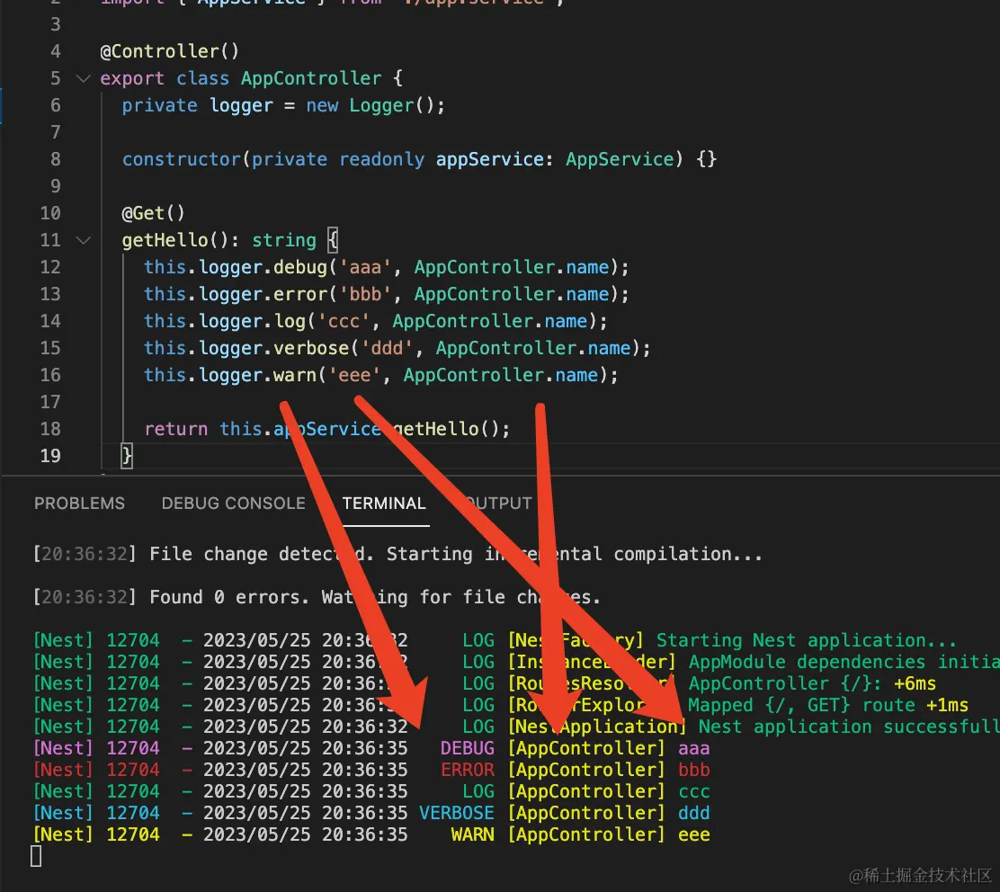  

- 控制 Nest 打印日志**是否开启**或者打印**日志级别**

  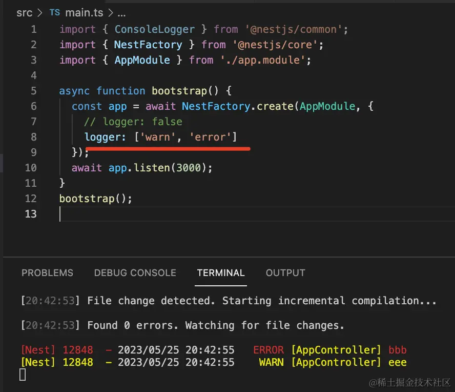  

- 自定义日志打印方式

  - 只用实现log、warn、error 3 个方法（定义实现 LoggerService 接口的类）

    ```ts
    import { LoggerService, LogLevel } from '@nestjs/common';
    
    export class MyLogger implements LoggerService {
        log(message: string, context: string) {
            console.log(`---log---[${context}]---`, message)
        }
    
        error(message: string, context: string) {
            console.log(`---error---[${context}]---`, message)
        }
    
        warn(message: string, context: string) {
            console.log(`---warn---[${context}]---`, message)
        }
    }
    ```

  - 在创建应用时指定这个 logger

    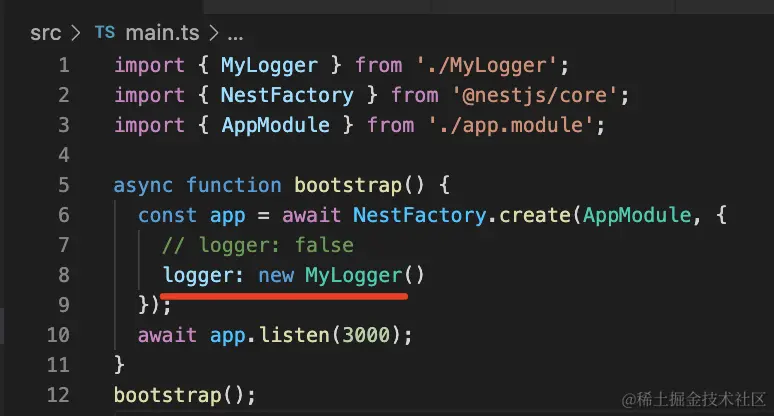  
  
- 重写部分Logger 方法

  ```ts
  import { ConsoleLogger } from '@nestjs/common';
  
  // 这里 ConsoleLogger 也是实现了LoggerService接口的类
  export class MyLogger2 extends ConsoleLogger{
      log(message: string, context: string) {
          console.log(`[${context}]`,message)
      }
  }
  ```

  未重写的方法还会使用原来的

- 如果想在 Logger 注入一些 provider，就需要创建应用时设置 bufferLogs 为 true，然后用 app.useLogger(app.get(xxxLogger)) 来指定 Logger。
- 可以把这个自定义 Logger 封装到全局模块，或者动态模块里


###  Node日志框架：winston

#### winston 使用

[使用文档](https://github.com/winstonjs/winston/blob/HEAD/docs/transports.md#winston-core)

```ts
import winston from 'winston';
import 'winston-daily-rotate-file'; // 通过安装此社区库，可以将日志按日期存储

const logger = winston.createLogger({
    level: 'debug', // 日志级别有六种，当前级别以上日志都会输出
    format: winston.format.simple(), // 指定日志格式，simple/json/prettyPrint（比 json 的格式多了一些空格）
    transports: [
        // 这里会在控制台打印日志
        new winston.transports.Console(),
        // 这里会保存日志文件, 通过maxSize 控制每个日志文件大小，还能控制日志文件数量
        new winston.transports.File({ 
            dirname: 'log', filename: 'test.log', maxSize: 1024 
        }),
        // 按照日期存储日志文件
        new winston.transports.DailyRotateFile({
            level: 'info',
            dirname: 'log2',
            filename: 'test-%DATE%.log',
            datePattern: 'YYYY-MM-DD-HH-mm',
            maxSize: '1k'
        })
        
        // 将日志发送到别的服务器（POST）
        new winston.transports.Http({
			host: 'localhost',
			port: '3000',
			path: '/winston-log-server/log'
		})
    ]
});

logger.info('光光光光光光光光光');
logger.error('东东东东东东东东');
logger.debug(66666666);
```

#### Nest 使用 winston

1. src 创建文件 MyLogger.ts，安装 `npm install --save  winston`

2. main.ts 引入文件

   ```js
   app.useLogger(new MyLogger());
   ```

3. 使用

   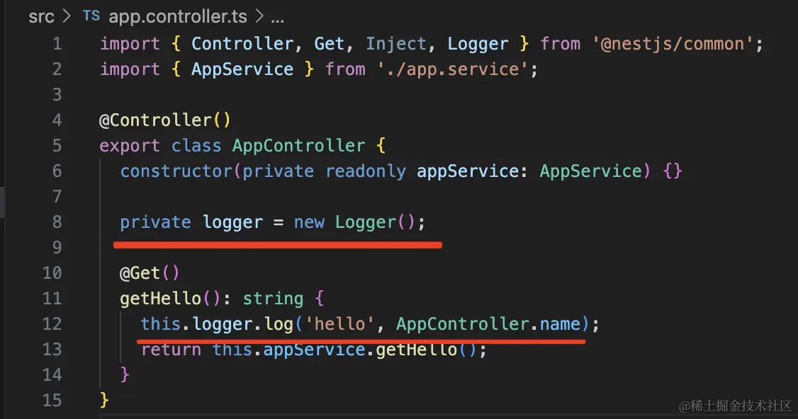  

```js
import { LoggerService } from '@nestjs/common';
import * as chalk from 'chalk';
import * as dayjs from 'dayjs';
import { Logger, createLogger, format, transports } from 'winston';

export class MyLogger implements LoggerService {
  private logger: Logger;

  constructor() {
    this.logger = createLogger({
      level: 'debug',
      transports: [
        new transports.Console({
          format: format.combine(
            format.colorize(),
            format.printf(({ context, level, message, time }) => {
              const apppStr = chalk.green(`[NEST]`);
              const contextStr = chalk.yellow(`[${context}]`);

              return `${apppStr} ${time} ${level} ${contextStr} ${message}`;
            }),
          ),
        }),
        new transports.File({
          format: format.combine(format.timestamp(), format.json()),
          filename: 'logs/error.log',
          dirname: 'logs',
        }),
      ],
    });
  }

  log(message: string, context: string) {
    const time = dayjs().format('YYYY-MM-DD HH:mm:ss');
    this.logger.log('info', message, { context, time });
  }

  error(message: string, context: string) {
    const time = dayjs().format('YYYY-MM-DD HH:mm:ss');
    this.logger.log('error', message, { context, time });
  }

  warn(message: string, context: string) {
    const time = dayjs().format('YYYY-MM-DD HH:mm:ss');
    this.logger.log('warn', message, { context, time });
  }
}
```

#### 封装动态模块

1. `nest g module winston`

2. ```js
   import { DynamicModule, Global, Module } from '@nestjs/common';
   import { LoggerOptions, createLogger } from 'winston';
   import { MyLogger } from './MyLogger';
   
   export const WINSTON_LOGGER_TOKEN = 'WINSTON_LOGGER';
   
   @Global()
   @Module({})
   export class WinstonModule {
   	// 创建动态模块，将 options 传入
       public static forRoot(options: LoggerOptions): DynamicModule {    
           return {
               module: WinstonModule,
               providers: [
                   {
                       provide: WINSTON_LOGGER_TOKEN,
                       useValue: new MyLogger(options)
                   }
               ],
               exports: [
                   WINSTON_LOGGER_TOKEN
               ]
           };
         }
   }
   ```

3. 将 MyLogger.ts 改为 options 传入方式

   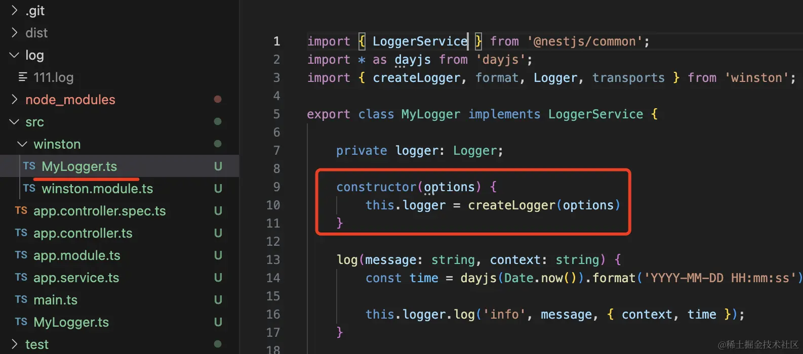

4. 在 AppModule 中引入下，引入的时候将 options 传入

   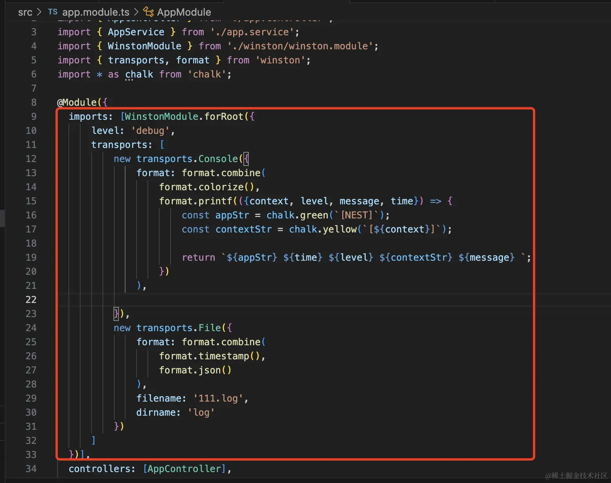  

5. 在 main.ts 中使用

   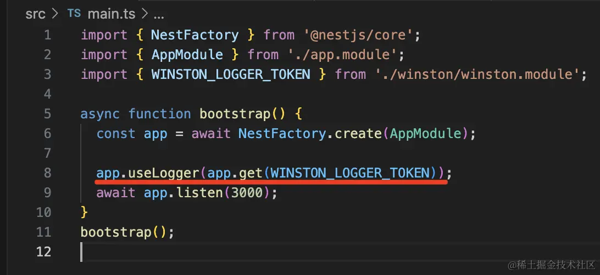  

6. 使用改用 Inject 的方式，始终使用同一个实例，性能更好

   ```js
   @Inject(WINSTON_LOGGER_TOKEN)
   private logger;
   ```

> 或者使用封装好的模块：[nest-winston](https://link.juejin.cn/?target=https%3A%2F%2Fwww.npmjs.com%2Fpackage%2Fnest-winston)

## Docker
###  Docker 命令

- `docker pull`：拉取镜像
- `docker run --name nginx-test2 -p 80:80 -v /tmp/aaa:/usr/share/nginx/html -e KEY1=VALUE1 -d nginx:latest `
  - -p 是端口映射（-p 可以衔接多个 -p 80:80 -p 6666:6666 在nginx中，配置对应6666的端口监听，那么一个nginx容器，就可以监听多个端口了）
  - -v 是指定数据卷挂载目录
  - -e 是指定环境变量
  - -d 是后台运行

- `docker exec`：相当于在容器内执行命令
  - -i 是 terminal 交互的方式运行
  - -t 是 tty 终端类型
  - 例如：`docker exec -i -t 68630e312c6ebf8b4ded7e9a583d6c5a4e75a1c95948415397a136b329ae5fb5 /bin/bash`
- `docker inspect <id>`：查看容器详情
- `docker volume`：管理卷数据
  - `create`      Create a volume
  - `inspect`     Display detailed information on one or more volumes
  - `ls`          List volumes
  - `prune`       Remove unused local volumes
  - `rm`          Remove one or more volumes
  - `update`      Update a volume (cluster volumes only)

- `docker start`：启动一个已经停止的容器
- `docker rm`：删除一个容器
- `docker stop`：停止一个容器
- `docker ps`：显示运行中的容器列表（`-a` 全部容器列表）
- `docker images`：镜像列表


###  DockerFile

- ```typescript
  FROM node:latest
  
  WORKDIR /app
  
  COPY . .
  
  RUN npm config set registry https://registry.npmmirror.com/
  
  RUN npm install -g http-server
  
  EXPOSE 8080
  
  VOLUME /app
  
  CMD ["http-server", "-p", "8080"]
  ```

  - FROM：基于一个基础镜像来修改
  - WORKDIR：指定当前工作目录
  - COPY：把容器外的内容复制到容器内
  - EXPOSE：声明当前容器要访问的网络端口，比如这里起服务会用到 8080
  - RUN：在容器内执行命令
  - CMD：容器启动的时候执行的命令
  - VOLUME：设置挂载点

- `docker build -t aaa:ddd -f 2.Dockerfile .`

  - -t：指定 name:tag
  - -f：指定 dockerfile 文件名，默认为 dockerfile


###  Nest 编写 Dockerfile

- .dockerignore文件：忽略哪些文件 - 即构建的时候不会参与

  ```dockerfile
  *.md
  !README.md
  node_modules/
  [a-c].txt
  .git/
  .DS_Store
  .vscode/
  .dockerignore
  .eslintignore
  .eslintrc
  .prettierrc
  .prettierignore
  ```

  - ***.md**：忽略所有md结尾的文件
  - **!README.md**：其中不包含README.md文件（即不忽略此文件）
  - **node_modules/**：忽略 node_modules 下 的所有文件
  - **[a-c].txt**：忽略 a.txt、b.txt、c.txt 这三个文件
  - **.DS_Store**：是 mac 的用于指定目录的图标、背景、字体大小的配置文件，这个一般都要忽略
  
- 使用多阶段构建和 alpine 减小构建镜像体积

  ```dockerfile
  # 第一次构建 - nest 打包 as 提供名字（注意此处为大写 AS）
  FROM node:lts-alpine AS build-stage
  
  WORKDIR /app
  
  COPY package*.json ./
  
  # 替换 npm 镜像源，可以不用 
  # RUN npm config set registry https://registry.npmmirror.com 
  RUN npm install
  
  # 这里因为 dockerignore 忽略node_mosules 文件夹，只会将代码拷贝过来，使用上层构建的node_modules，如果 package文件没有变化，则会直接使用缓存减小构建时间
  COPY . .
  
  RUN npm run build
  
  # 第二次构建 - 将第一次构建的 dist 复制出来
  FROM node:lts-alpine AS production-stage
  
  COPY --from=build-stage /app/dist /app
  COPY --from=build-stage /app/package.json /app/package.json
  
  WORKDIR /app
  
  RUN npm install --production
  
  EXPOSE 3000
  
  CMD ["node", "/app/main.js"]
  ```

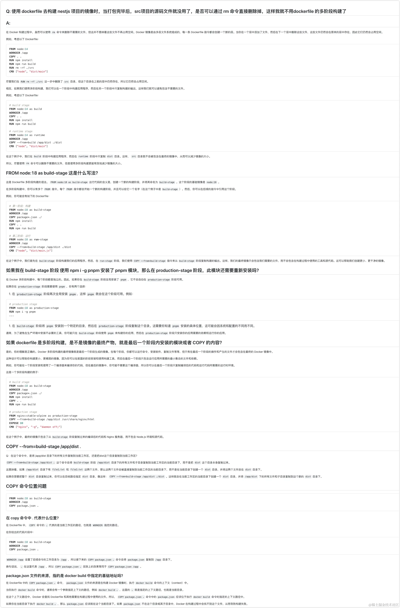  

###  提升 Dockerfile 水平

- 使用 alpine 基础镜像构建 - 减小构建镜像体积

- 使用多阶段构建 - 去掉不必要的文件

- package.json 单独安装，利用 Docker 缓存加快构建速度

  - **docker 是分层存储的，dockerfile 里的每一行指令是一层，会做缓存。**

    **每次 docker build 的时候，只会从变化的层开始重新构建，没变的层会直接复用**

- 使用 **ARG** 增加构建灵活性

  - ```dockerfile
    FROM node:18-alpine3.14
    
    # 通过 ARG 定义参数（此参数构建时传入）
    ARG aaa
    ARG bbb
    
    WORKDIR /app
    
    COPY ./test.js .
    
    # 通过 ${} 取到参数
    ENV aaa=${aaa} \
        bbb=${bbb}
    
    CMD ["node", "/app/test.js"]
    ```

  - `docker build --build-arg aaa=3 --build-arg bbb=4 -t arg-test -f 333.Dockerfile .` 构建的时候通过 `--build-arg` 传入对应的参数

  - 运行之后可以通过 `process.env.aaa`拿到对应的参数值

- **CMD** 和 **ENTRYPOINT**

  - 当 `docker run` 执行时，如果传入有命令，则会覆盖 CMD 的命令，而 ENTRYPOINT 则不会

  - 还可以将 ENTRYPOINT和CMD结合起来，CMD 会被覆盖，类似于默认值

    ```dockerfile
    FROM node:lts-apline
    
    ENTRYPOINT ["echo", "光光"]
    
    CMD ["到此一游"]
    ```

- **COPY** 和 **ADD**

  - tar 命令打包 `tar -zcvf a.tar.gz ./a `

  - ```dockerfile
    FROM node:18-alpine3.14
    
    ADD ./a.tar.gz /a
    
    COPY ./a.tar.gz /b
    ```

    - 这里 `ADD`会把 tar.gz 文件解压复制到 /a 文件夹
    - `COPY` 会把整个压缩文件复制过去


### 使用 PNPM

```

```


###  Docker是怎么实现的

- Namespace：实现各种资源的隔离
- Control Group：实现容器进程的资源访问限制
- UnionFS：实现容器文件系统的分层存储，镜像合并
- 我们通过 dockerfile 描述镜像构建的过程，每一条指令都是一个镜像层。

  镜像通过 docker run 就可以跑起来，对外提供服务，这时会添加一个可写层（容器层）。

  挂载一个 volume 数据卷到 Docker 容器，就可以实现数据的持久化。


## PM2

- `pm2 start xxx --max-memory-restart 200M`：超过200M自动重启
- `pm2 start xxx --cron-restart "2/3 * * * * *"`：从2s开始每3s启动一次
- `pm2 start xxx --watch`：文件内容改变自动重启
- `pm2 start xxx --no-autorestart`：不自动重启
- `pm2 flush [进程名|ID]`：清空日志
- `pm2 logs main --lines 100 `：查看前 100 行日志
- `pm2 start app.js -i [max|number]`：启动 CPU 数量的进程
- `pm2 scale xxx [number|+number]`：调整进程数 [ 进程数 | 加几个进程数]
- `pm2 monit`：性能监控
- 通过配置文件启动
  - 生成配置文件：`pm2 ecosystem`
  - 执行：`pm2 start ecosystem.config.js`

- Nest 中使用

  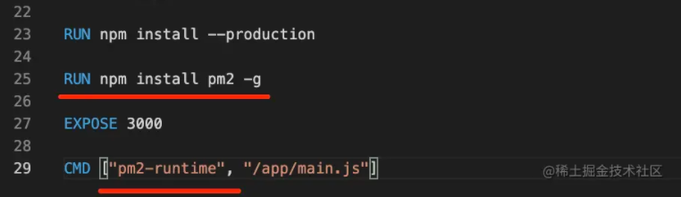
  - 注意：通过pm2 start在docker内启动进程会死掉，导致起不来,pm2 是默认后台启动的， docker 感知不到,CMD命令执行完成，docker 容器就结束了。**pm2-runtime** 是专门为容器设计的，保证在后台一直运行

## MySQL

###  MySQL

- 创建表

  ```mysql
  CREATE TABLE `student` (
    `id` int NOT NULL AUTO_INCREMENT COMMENT 'ID',
    `name` varchar(45) NOT NULL COMMENT '名字',
    `age` int DEFAULT NULL COMMENT '年龄',
    `sex` int DEFAULT NULL COMMENT '性别',
    `email` varchar(60) DEFAULT NULL COMMENT '邮箱',
    `create_time` datetime NOT NULL COMMENT '创建时间',
    `status` int DEFAULT '0' COMMENT '是否删除',
    PRIMARY KEY (`id`)
  ) CHARSET=utf8mb4
  ```

- 插入

  ```mysql
  INSERT INTO `student` (`name`, `age`, `sex`, `email`, `create_time`) VALUES ('bbb', '23', '1', 'bbb@qq.com', '2023-05-27 10:50:00');
  ```

- 更新

  ```mysql
  UPDATE `hello-mysql`.`student` SET `email` = 'xxx@qq.com' WHERE (`id` = '2');
  ```

- 删除

  ```mysql
  DELETE FROM `hello-mysql`.`student` WHERE (`id` = '2');
  ```

- 查询

  ```mysql
  SELECT * FROM `hello-mysql`.student;
  ```

- 清空表
  ```mysql
  TRUNCATE `hello_mysql`.`student`;
  ```

- 删除表

  ```mysql
  DROP TABLE `hello_mysql`.`student`;
  ```


###  SQL 查询语句的所有语法和函数

- 指定查询列、通过 **as** 修改返回列名：`SELECT name as "名字", score as "分数" FROM student;`

- 指定查询条件：`select name as "名字",class as "班级" from student where age >= 19;`

- 查询使用 **and** 连接多个：`select name as '名字',class as '班级' from student where gender='男' and score >= 90;`

- 使用 **like** 模糊查询：`select * from student where name like '王%';`

- 使用 **in** 指定合集：`select * from student where class in ('一班', '二班');`

- 使用 **not in** 排除合集：`select * from student where class not in ('一班', '二班');`

- 使用 **between and** 指定区间：`select * from student where age between 18 and 20;`

- 使用 **limit** 分页：`select * from student limit 0,5;` 
  - 第二页：`select * from student limit 5,5;`
  
- 使用 **order by** 指定排序的列：`select name,score,age from student order by score asc,age desc;`
  - **asc** 为升序，**desc** 为降序
  
- 使用 **group by** 分组：`SELECT class as '班级', AVG(score) AS '平均成绩' FROM student GROUP BY class ORDER BY 平均成绩 DESC;`

  - 内置的函数 `AVG()` 求平均值

  - 

  - 这里注意 ORDER BY 后面的值相当于变量，不能添加引号

- **count**：`select class, count(*) as count from student group by class;` 这里的 * 代表当前行

- 分组统计之后使用 **having** 进行过滤：`SELECT class, AVG(score) AS avg_score FROM student GROUP BY class HAVING avg_score > 90;`

- 使用 **distinct** 去重：`SELECT　DISTINCT class FROM　student`

- 内置函数分类

  - **聚合函数：**AVG、COUNT、SUM、MIN、MAX
  
    `select avg(score) as '平均成绩',count(*) as '人数',sum(score) as '总成绩',min(score) as '最低分', max(score) as '最高分' from student` 
  
    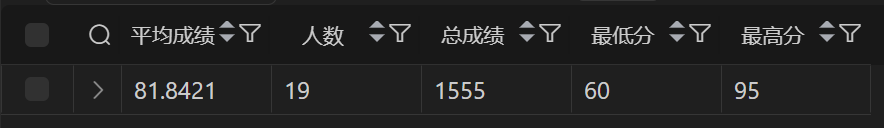  
  
  - **字符串函数：**CONCAT、SUBSTR、LENGTH、UPPER、LOWER
  
    `SELECT CONCAT('xx', name, 'yy'), SUBSTR(name,2,3), LENGTH(name), UPPER('aa'), LOWER('TT') FROM student;`
  
    其中**substr**第二个参数表示开始的下标（mysql 下标从1开始），例如：substr('一二三', 2, 3) 为 '二三'
  
  - **数值函数：**ROUND：四舍五入、CEIL：向上取整、FLOOR：向下取整、ABS：绝对值、MOD：取模（即取余数）
  
    `SELECT ROUND(1.234567, 2), CEIL(1.234567), FLOOR(1.234567), ABS(-1.234567), MOD(5, 2);`
  
    其中取模为两数相除的余数
  
  - **日期函数：**DATE、TIME、YEAR、MONTH、DAY
  
    `SELECT YEAR('2023-06-01 22:06:03'), MONTH('2023-06-01 22:06:03'),DAY('2023-06-01 22:06:03'),DATE('2023-06-01 22:06:03'), TIME('2023-06-01 22:06:03');`
  
  - **条件函数**：if、case
  
    - if：`select name, if(score >=60, '及格', '不及格') from student;`，类似于三元表达式，适用于单个条件
    - case：`SELECT name, score, CASE WHEN score >=90 THEN '优秀' WHEN score >=60 THEN '良好'ELSE '差' END AS '档次' FROM student;` 适用多个条件
  
  - **系统函数：**`select VERSION(), DATABASE(), USER()`
  
    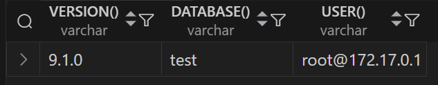  
  
  - **其他函数：**
  
    - NULLIF：如果相等返回 null，不相等返回第一个值。
  
      `select NULLIF(1,1), NULLIF(1,2);`
  
    - COALESCE：返回第一个非 null 的值。
  
      `select COALESCE(null, 1), COALESCE(null, null, 2)`
  
    - GREATEST、LEAST：返回几个值中最大最小的
  
      `select GREATEST(1,2,3),LEAST(1,2,3,4);`
  
  - **类型转换函数：**CAST、CONVERT、DATE_FORMAT、STR_TO_DATE。
  
    - CONVERT：`select greatest(1, convert('123', signed),3);`
  
    - CAST：`select greatest(1, cast('123' as signed),3);`
  
      可以转换的类型 
  
      - signed：整型；
      - unsigned：无符号整型
      - decimal：浮点型；
      - char：字符类型；
      - date：日期类型；
      - time：时间类型；
      - datetime：日期时间类型；
      - binary：二进制类型
  
    - DATE_FORMAT：`SELECT DATE_FORMAT('2022-01-01', '%Y年%m月%d日');`
  
    - STR_TO_DATE：`SELECT STR_TO_DATE('2023-06-01', '%Y-%m-%d');`

> 这里要注意下，当作字符串值用的时候，需要加单引号或者双引号。当作表名、列名用的时候，用反引号或者不加引号。

###  一对一、join、级联

从表里通过外键来关联主表的主键。

查询的时候需要使用 join on，默认是 inner join 也就是只返回有关联的记录，也可以用 left join、right join 来额外返回没有关联记录的左表或右表的记录。

from 后的是左表，join 后的是右表。

此外，外键还可以设置级联方式，也就是主表修改 id 或者删除的时候，从表怎么做。

有 3 种级联方式：CASCADE（关联删除或更新），SET NULL（关联外键设置为 null），RESTRICT 或者 NO ACTION（没有从表的关联记录才可以删除或更新

- 关联查询：

  ```mysql
  SELECT user.id, name, id_card.id as card_id, card_name 
      FROM user
      JOIN id_card ON user.id = id_card.user_id;
  ```
  
- 其中 JOIN 相当于 **INNER JOIN**：返回两表中相关联的数据

- **LEFT JOIN** 是额外返回左表中没有关联上的数据。

- **RIGHT JOIN** 是额外返回右表中没有关联上的数据。

  - FROM 后的是左表，JOIN 后的是右表
  

**Foreign Keys 的 四种可选值**

- CASCADE： 主表主键更新，从表关联记录的外键跟着更新，主表记录删除，从表关联记录删除
- SET NULL：主表主键更新或者主表记录删除，从表关联记录的外键设置为 null
- RESTRICT（默认）：只有没有从表的关联记录时，才允许删除主表记录或者更新主表记录的主键 id
- NO ACTION： 同 RESTRICT，只是 sql 标准里分了 4 种，但 mysql 里 NO ACTION 等同于 RESTRICT。


###  一对多、多对多
- 一对多与一对一逻辑相同，主要多个数据对应同一个父表id

- 多对对
  - 通过创建新表，设置两个主键，其中一个主键关联其中一张表的id，另一个主键关联另一张表的id，由此将两张表联系起来。
  
    ```mysql
    SELECT * FROM article a 
        JOIN article_tag at ON a.id = at.article_id
        JOIN tag t ON t.id = at.tag_id
        WHERE a.id = 1;
    ```
  
  - 注意 **中间表的级联方式要设置为 CASCADE**
  
  - `SELECT * FROM article a `相当于把查询的表重命名
  
  - GROUP_CONCAT 函数是用于 group by 分组后，把多个值连接成一个字符串的。
  
    如：`GROUP_CONCAT(oi.product_name SEPARATOR '-') **AS** product_names`


###  子查询 和 EXISTS
- `SELECT name, class FROM student WHERE score = (SELECT MAX(score) FROM student);
  `

- ```mysql
  SELECT name FROM department
      WHERE EXISTS (
          SELECT * FROM employee WHERE department.id = employee.department_id
      );
  -- EXISTS 的作用：子查询返回结果，条件成立，反之不成立
  -- 对应的还有 NOT EXISTS，作用相反
  ```

- 配合 update

  ```mysql
  UPDATE employee SET name = CONCAT('技术-', name) 
      WHERE department_id = (
          SELECT id FROM department WHERE name = '技术部'
      );
  ```

- 配合 delete

  ```mysql
  DELETE FROM employee WHERE department_id = (
      SELECT id FROM department WHERE name = '技术部'
  );
  ```


###  MySQL的事务和隔离级别

**事务**

- **START TRANSACTION：**开启事务，开启后所有sql语句都可以 **ROLLBACK**，除非执行 **COMMIT** 完成这段事务
- 设置 **SAVEPOINT**：可以 **ROLLBACK TO** 任何一个 **SAVEPOINT** 的位置 

**事务隔离级别**

- **READ UNCOMMITTED**：可以读到别的事务尚未提交的数据。
- **READ COMMITTED**：只读取别的事务已提交的数据。
- **REPEATABLE READ**：在同一事务内，多次读取数据将保证结果相同。
- **SERIALIZABLE**：在同一时间只允许一个事务修改数据。

> ROLLBACK TO SAVEPOINT使用时需要检查autocommit是否关闭，select @@autocommit;查看，如果是1，代表对于每条statement来说，都会自动形成一个commit，也就是会即时对开始和结束一个事务。执行set autocommit = 0;关闭


###  MySQL 的视图、存储过程和函数（了解）

**视图：**

- ```mysql
  -- 创建视图
  CREATE VIEW customer_orders AS 
      SELECT 
          c.name AS customer_name, 
          o.id AS order_id, 
          o.order_date, 
          o.total_amount
      FROM customers c
      JOIN orders o ON c.id = o.customer_id;
  -- 查询 - 和普通表查询一致
  -- 视图一般只做查询，不做增删改
  ```

**存储过程：**


###  Node 操作 MySQL 的两种方式

**使用 mysql2 直接连接**

- 安装 mysql2 进行连接，或者 promise 版
- 连接时一般创建连接池，使用时取出，不使用时放回，不会断开连接

**使用 typeorm**

- 基于 class 和 class 上的装饰器来声明和表的映射关系，对表的增删改查就变成了对象的操作和save、find 方法的调用


## TyoeORM


### 掌握 TypeORM

- 新建 TypeORM项目：`npx typeorm@latest init --name typeorm-all-feature --database mysql`

- 修改配置：

  ```typescript
  // data-source.ts
  connectorPackage: 'mysql2',
      extra: {
          authPlugin: 'sha256_password',
      }
  ```
  
- 安装 mysql2：`npm install --save mysql2`

  - 参数说明：

    ```typescript
    import "reflect-metadata";
    import { DataSource } from "typeorm";
    import { Aaa } from "./entity/Aaa";
    import { User } from "./entity/User";
    
    export const AppDataSource = new DataSource({
      type: "mysql",
      host: "localhost",
      port: 3306,
      username: "root",
      password: "admin123",
      database: "practice",
      synchronize: true,
      logging: true, // 打印生成的 SQL 语句
      entities: [User, Aaa], // 指定和数据库的表对应的 Entity
      migrations: [], // 修改表结构的 SQL
      subscribers: [], // Entity 生命周期的订阅者
      poolSize: 10, // 指定数据库连接池中连接的最大数量
      connectorPackage: "mysql2", // 指定驱动包
      extra: { // 额外发给驱动包的一些选项
        authPlugin: "sha256_password",
      },
    });
    ```
  
- **新增：**

  - ```typescript
    import { AppDataSource } from "./data-source"
    import { User } from "./entity/User"
    
    AppDataSource.initialize().then(async () => {
        const user = new User()
        user.firstName = "aaa"
        user.lastName = "bbb"
        user.age = 25
        await AppDataSource.manager.save(user)
    }).catch(error => console.log(error))
    ```
    
    若指定id，则为修改
    
  - 批量操作
  
    ```typescript
    AppDataSource.initialize().then(async () => {
        await AppDataSource.manager.save(User, [
            { firstName: 'ccc', lastName: 'ccc', age: 21},
            { firstName: 'ddd', lastName: 'ddd', age: 22},
            { firstName: 'eee', lastName: 'eee', age: 23}
        ]);
    }).catch(error => console.log(error))
    ```
    
    批量修改即将 id 加入，另外还有 **update** 和 **insert** 方法，分别为**修改**和**插入**，区别为：**save** 方法会先查询数据库来确定是插入还是修改
  
- **删除和批量删除**
  
  - **delete：**直接传入 id 进行删除
  
    ```typescript
    ppDataSource.initialize().then(async () => {
        await AppDataSource.manager.delete(User, 1);
        await AppDataSource.manager.delete(User, [2,3]);
    }).catch(error => console.log(error))
    ```
    
  - **remove：**传入 entity 对象
  
    ```typescript
    AppDataSource.initialize().then(async () => {
        const user = new User();
        user.id = 1;
        await AppDataSource.manager.remove(User, user);
    }).catch(error => console.log(error))
    ```
  
- **查询**
  
  - **find：**传入 entity 查询所有
  
    ```typescript
    const users = await AppDataSource.manager.find(User);
    ```
  
  - **findBy：**根据条件查询
  
    ```typescript
    const users = await AppDataSource.manager.findBy(User, {
        age: 23
    });
    ```
  
  - **findAndCount：**拿到记录条数
  
    ```typescript
    const [users, count] = await AppDataSource.manager.findAndCount(User);
    ```
  
    指定条件：
  
    ```typescript
    const [users, count] = await AppDataSource.manager.findAndCountBy(User, {
    	age: 23
    })
    ```
  
  - **findOne：**查询一条，其实质为 find 查询后 LIMIT 1
  
    ```typescript
    const user = await AppDataSource.manager.findOne(User, {
        select: { // 指定列，查询时返回哪些字段
            firstName: true,
            age: true
        },
        where: {  // 查询条件
            id: 4
        },
        order: { // 排序
            age: 'ASC'
        }
    });
    ```
  
  - **findOneBy**：查找单条记录，第二个参数直接指定 where 条件，更简便一点
  
    ```typescript
    const user = await AppDataSource.manager.findOneBy(User, {
        age: 23
    });
    ```
  
  - **findOneOrFail**、**findOneByOrFail**：这两个方法同上，没找到会抛出一个 EntityNotFoundError 错误
  
  - **query** 方法直接执行 SQL 语句
  
    ```typescript
    const users = await AppDataSource.manager.query('select * from user where age in(?, ?)', [21, 22]);
    ```
  
  - **query builder：**执行复杂的 SQL 语句，如关联查询等
  
    ```typescript
    const user = await queryBuilder.select("user")
        .from(User, "user")
        .where("user.age = :age", { age: 21 })
        .getOne();
    ```
  
  - **开启事务**：使用 transition 方法包裹
  
    ```typescript
    await AppDataSource.manager.transaction(async manager => {
        await manager.save(User, {
            id: 4,
            firstName: 'eee',
            lastName: 'eee',
            age: 20
        });
    });
    ```
  
  > 可以先调用 `getRepository` 传入 Entity，拿到专门处理这个 Entity 的增删改查的类，再调用这些方法
  >
  > ```js
  > await AppDataSource.manager.getRepository(User).findOneBy({
  >   firstName: "Timber",
  >   lastName: "Saw",
  > });
  > ```

- 总结

  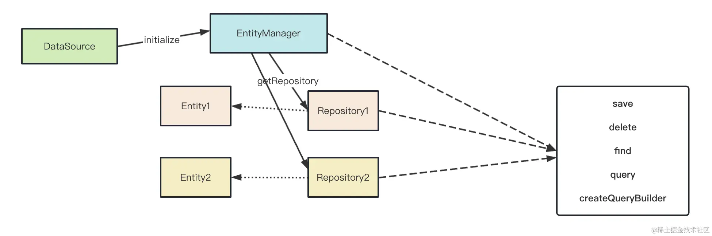  


### TypeORM 一对一

- **关联**：使用 `@JoinColum` 定义外键列， `@OneToTone`创建对应关系

  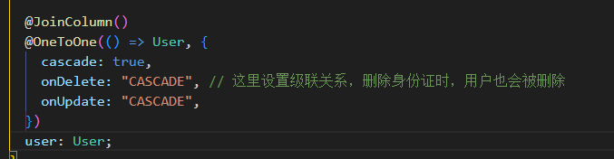

  - onDelete、onUpdate 设置级联关系

  - cascade 设置为 true，并不是数据库的级联，而是告诉 typeorm 当你增删改一个 Entity 的时候，是否级联增删改它关联的 Entity

    ```typescript
    const user = new User();
        user.firstName = "Timber";
        user.lastName = "Saw";
        user.age = 25;
    
        const idCard = new IdCard();
        idCard.cardName = "123456789012345678";
        idCard.user = user;
    
       // await AppDataSource.manager.save(user); // 由于设置了级联关系，这里只需要保存身份证，用户也会被保存
        await AppDataSource.manager.save(idCard);
    ```

- **查询**

  - 使用 relations 关联查询

    ```typescript
    const idcards = await AppDataSource.manager.find(IdCard, {
      relations: {
        user: true, // 传入此属性即可关联查询
      },
    });
    console.log(idcards);
    ```

  - 使用 query builder 方式查询

    ```typescript
    const idcards = await AppDataSource.manager
      .getRepository(IdCard) // 拿到操作 IdCard 的 Repository 对象
      .createQueryBuilder("idcard") // 连接查询，并起别名为 idcard
      .leftJoinAndSelect("idcard.user", "user") // 连接到 idcard.user, 起别名 user
      .getMany();
    console.log(idcards);
    ```

  - 使用 EntityManager 创建 QueryBuilder 来连接查询

    ```typescript
    const idcards2 = await AppDataSource.manager
      .createQueryBuilder(IdCard, "idcard")
      .leftJoinAndSelect("idcard.user", "user")
      .getMany();
    console.log(idcards2);
    ```

- **修改**：设置 cascade 为 true 之后就可以直接联动修改了
  
  - ```js
    const user = new User();
    user.id = 1;
    user.firstName = 'guang1111';
    user.lastName = 'guang1111';
    user.age = 20;
    
    const idCard = new IdCard();
    idCard.id = 1;
    idCard.cardName = '22222';
    idCard.user = user;
    
    await AppDataSource.manager.save(idCard);
    ```

- **删除**：和修改相似，会进行级联删除，删除user，idCard 会同时删除，反过来则不
  
  - 没有外键列进行联表查询
  
    ```typescript
    // 设置 OneToOne
    @OneToOne(() => IdCard, (IdCard) => IdCard.user)
    idCard: IdCard;
    
    // 进行查询
    const user = await AppDataSource.manager.find(User, {
        relations: {
            idCard: true
        }
    });
    console.log(user);
    ```
  
- user 里访问 idCard
  
  - user Entity 里添加@OneToOne 的装饰器
    
    ```ts
    @Entity()
    export class User {
      @PrimaryGeneratedColumn()
      id: number;
    
      @Column()
      firstName: string;
    
      @Column()
      lastName: string;
    
      @Column()
      age: number;
      // 这里通过第二个参数告诉 typeorm，外键是另一个 Entity 的哪个属性
      @OneToOne(() => IdCard, (idCard) => idCard.user)
      idCard: IdCard;
    }
    ```
    
  - 使用
  
    ```ts
    const user = await AppDataSource.manager.find(User, {
        relations: {
            idCard: true
        }
    });
    console.log(user)
    ```

**注意：**如果没有显式地指定外键名，TypeORM 会将目标实体（被关联的实体）的表名和主键列名组合起来，作为键名。
可以通过给 `@JoinColumn()` 装饰器传入 name 属性指定外键名
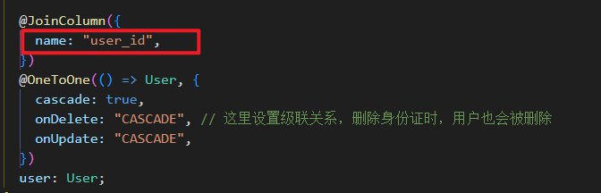


### TypeORM一对多

- 与一对一类似，在多的一方使用 **@ManyToOne** 装饰器

- 这里因为一对多的外键肯定保存在多的一方，所以这里不需要设置外键，但是可以通过 @JoinColumn 指定外键的名称

  ```typescript
  @JoinColumn({
  	name: "department_id",
  })
  @ManyToOne(() => Department, {
  	cascade: true, // 只需要设置一个，不然两个都保存进入死循环
  })
  department: Department;
  ```

- 插入时

  - 如果没有设置 cascade，则需要手动插入

    ```ts
    const d1 = new Department();
    d1.name = '技术部';
    
    const e1 = new Employee();
    e1.name = '张三';
    e1.department = d1; // 这里需要指定关联键，即由@OneToMany装饰的字段
    // @ManyToOne(() => Department)
    //   department: Department;
    
    const e2 = new Employee();
    e2.name = '李四';
    e2.department = d1;
    
    const e3 = new Employee();
    e3.name = '王五';
    e3.department = d1;
    
    await AppDataSource.manager.save(Department, d1);
    await AppDataSource.manager.save(Employee,[e1, e2, e3]);
    ```

  - 如果设置了 cascade，则可以通过下面方法插入

    ```ts
    const e1 = new Employee();
    e1.name = "张三";
    
    const e2 = new Employee();
    e2.name = "李四";
    
    const e3 = new Employee();
    e3.name = "王五";
    
    const d1 = new Department();
    d1.name = "技术部";
    d1.employees = [e1, e2, e3]; // 这里因为设置了 cascade ，直接指定@OneToMany装饰的字段
    // @OneToMany(() => Employee, (employee) => employee.department, {
    //    cascade: true,
    //  })
    //  employees: Employee[];
    
    await AppDataSource.manager.save(Department, d1);
    ```

  - **注意：**

    一对一的时候我们还通过 @JoinColumn 来指定外键列，为什么一对多就不需要了呢？

    因为一对多的关系只可能是在多的那一方保存外键呀，所以并不需要 @JoinColumn。

    不过你也可以通过 @JoinColumn 来修改外键列的名字

- 查询与一对一相似

- 删除可以通过手动删除，先删除 employee数据，再删除 department 数据；或者设置 onDelete 为 SET NULL 或者 CASCADE

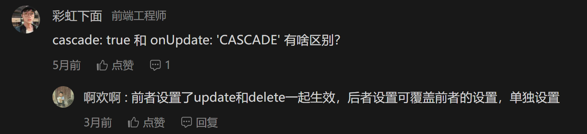  


### TypeORM多对多

- 如一篇文章有多个标签

  ```typescript
  @JoinTable()
  @ManyToMany(() => Tag)
  tags: Tag[];
  ```

  此方式会自动创建中间表，并设置级联更新为 **CASCADE**

- 查询同上

- 修改

  ```ts
  const article = await AppDataSource.manager.findOne(Article, {
    where: {
      id: 2,
    },
    relations: {
      tags: true,
    },
  });
  
  article.title = "ccccc";
  article.tags = article.tags.filter(item => item.name.includes("ttt1111")); // 这里修改文章标签多个为一个，会自动将多余中间表关系删除
  
  await AppDataSource.manager.save(article);
  ```

- 删除：中间表默认为 CASCADE，如果删除标签或者删除文章，中间表对应都会删除

**标签包含文章：**

- 在标签里加映射属性

  ```typescript
  @ManyToMany(() => Article, (article) => article.tags) // 这里第二个参数指定外键列在哪里，同时 Article 中也需要做修改
  articles: Article[];
  ```

- 但文章里的映射属性也需要指定外键

  ```typescript
  @JoinTable()
  @ManyToMany(() => Tag, (tag) => tag.articles)
  tags: Tag[];
  ```

  其中 `@JoinTable()` 用于生成中间表

- **注意：**

  因为如果当前 Entity 对应的表是包含外键的，那它自然就知道怎么找到关联的 Entity。

  但如果当前 Entity 是不包含外键的那一方，怎么找到对方呢？

  这时候就需要手动指定通过哪个外键列来找当前 Entity 了。

  之前 OneToOne、OnToMany 都是这样：

  比如一对一的 user 那方，不维护外键，所以需要第二个参数来指定通过哪个外键找到 user。

  

### Nest 中集成 TypeORM

1. 引入 `npm install --save @nestjs/typeorm typeorm mysql2`

2. 在 model 里面注入

   ```typescript
   TypeOrmModule.forRoot({
     type: "mysql",
     host: "localhost",
     port: 3306,
     username: "root",
     password: "guang",
     database: "typeorm_test",
     synchronize: true,
     logging: true,
     entities: [User],
     poolSize: 10,
     connectorPackage: 'mysql2',
     extra: {
         authPlugin: 'sha256_password',
     }
   }),
   ```

3. 添加映射信息（表的相关信息）

   ```typescript
   // user.entity.ts
   import { Column, Entity, PrimaryGeneratedColumn } from 'typeorm';
   
   @Entity({
     name: 'aaa_user', // 设置数据库中的表名，可不设置
   })
   export class User {
     // 自增字段
     @PrimaryGeneratedColumn()
     id: number;
   
     // 普通字段
     @Column({
       name: 'aaa_name', // 数据库中的列名，可不设置
       length: 50,
     })
     name: string;
   }
   ```

4. 注入EntityManager（这里的注入就可以使用 typeorm 进行CRUD）

   ```typescript
   // app.service.ts
   @InjectEntityManager()
   private manager: EntityManager;
   ```

5. 使用

   ```typescript
   // app.service.ts
   import { Injectable } from '@nestjs/common';
   import { InjectEntityManager } from '@nestjs/typeorm';
   import { EntityManager } from 'typeorm';
   import { CreateUserDto } from './dto/create-user.dto';
   import { UpdateUserDto } from './dto/update-user.dto';
   import { User } from './entities/user.entity';
   
   @Injectable()
   export class UserService {
     @InjectEntityManager()
     private manager: EntityManager;
       
     create(createUserDto: CreateUserDto) {
       this.manager.save(User, createUserDto);
     }
     findAll() {
       return this.manager.find(User)
     }
     findOne(id: number) {
       return this.manager.findOne(User, {
         where: { id }
       })
     }
     update(id: number, updateUserDto: UpdateUserDto) {
       this.manager.save(User, {
         id: id,
         ...updateUserDto
       })
     }
     remove(id: number) {
       this.manager.delete(User, id);
     }
   }
   ```

   - 另一种使用方法，使用 forFeature 注入模块，每次使用就无需注入，**但是只能用来操作当前的 Entity**
   
     - User模块中imports
   
       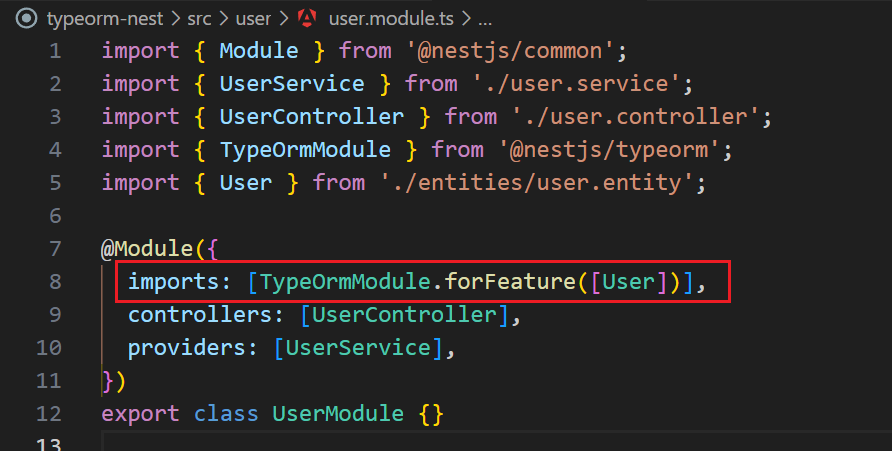  
   
     - 使用
   
       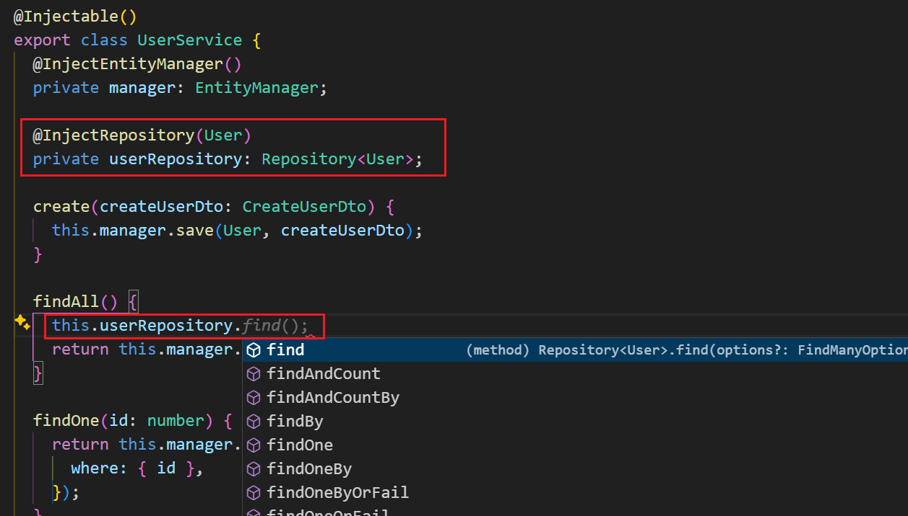  


### TypeORM 保存任意层级关系

1. 创建 Entity

   ```ts
   import { Column, CreateDateColumn, Entity, PrimaryGeneratedColumn, Tree, TreeChildren, TreeParent, UpdateDateColumn } from "typeorm";
   
   @Entity()
   @Tree('closure-table')
   export class City {
       @PrimaryGeneratedColumn()
       id: number;
   
       @Column({ default: 0 })
       status: number;
   
       @CreateDateColumn()
       createDate: Date;
   
       @UpdateDateColumn()
       updateDate: Date;
       
       @Column()
       name: string;
   
       @TreeChildren()
       children: City[];
   
       @TreeParent()
       parent: City;
   }
   ```

   - @TreeChildren：存储 children 节点

   - @TreeParent：存储 parent 节点

   - @Tree：必须使用此装饰器声明 Entity，其中参数可以指定4种存储模式，一般用 **closure-table**，或者 **materialized-path**

     - closure-table 会生成两个表来存储对应关系
     - materialized-path 会加一个 mpath 字段存储
     - 其余两种有缺陷，不推荐使用

     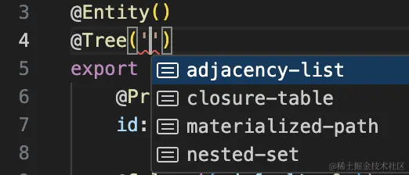  

     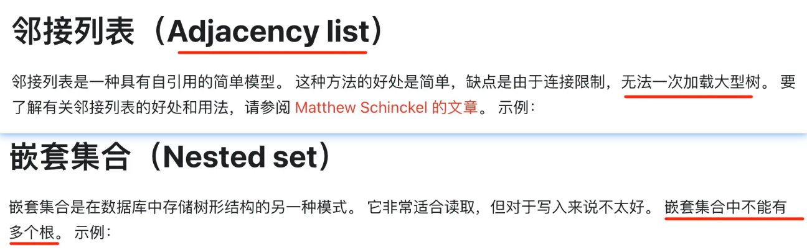  

2. 使用

   - **插入数据**

     ```ts
     @InjectEntityManager()
     entityManager: EntityManager;
     
     async findAll() {
         const city = new City();
         city.name = '华北';
         await this.entityManager.save(city);
     
         const cityChild = new City()
         cityChild.name = '山东'
         const parent = await this.entityManager.findOne(City, {
           where: {
             name: '华北'
           }
         });
         if(parent){
           cityChild.parent = parent
         }
         await this.entityManager.save(City, cityChild)
     
         return this.entityManager.getTreeRepository(City).findTrees(); // 这里使用 findTrees 查询出树形结构
     }
     ```

   - **findTrees** 查询所有属性结构（使用 **find** 会返回扁平结构）

     ```ts
     this.entityManager.getTreeRepository(City).findTrees();
     ```
   
   - **findRoots** 查询所有根节点
   
     ```ts
     return this.entityManager.getTreeRepository(City).findRoots()
     ```
   
   - **findDescendantsTree** 查询某个节点的所有后代节点
   
     ```ts
     const parent = await this.entityManager.findOne(City, {
       where: {
         name: '云南'
       }
     });
     this.entityManager.getTreeRepository(City).findDescendantsTree(parent)
     ```
   
   - **findAncestorsTree** 是查询某个节点的所有祖先节点
   
     ```ts
     const parent = await this.entityManager.findOne(City, {
       where: {
         name: '云南'
       }
     });
     this.entityManager.getTreeRepository(City).findAncestorsTree(parent)
     ```
   
   - **findAncestors**、**findDescendants** 就是用扁平结构返回
   
   - **countAncestors**、**countDescendants**：计数
   
     ```ts
     findAll() {
       const parent = await this.entityManager.findOne(City, {
       where: {
         name: '云南'
       }
     });
     this.entityManager.getTreeRepository(City).countAncestors(parent)
     ```
   
     

### TypeORM的 migration 迁移功能

> 设置 data-source 的 synchronize： true 之后每次修改  Entity 都会修改数据库表，所以生产环境容易造成数据丢失等问题，一般使用  TypeORM 的 migration 功能

**手动操作（了解）**

1. 执行 migration:create 命令，生成 `时间戳-Aaa.ts` 文件

   ```shell
   npx ts-node ./node_modules/typeorm/cli migration:create ./src/migration/Aaa
   ```

2. 将数据库导出，并将建表语句添加至 migration 文件夹下文件中

   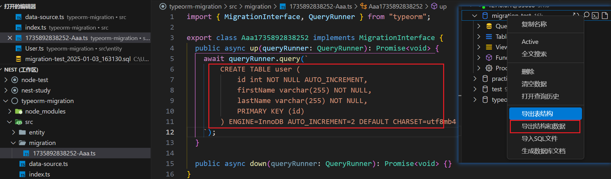  

3. 配置 data-source 文件

   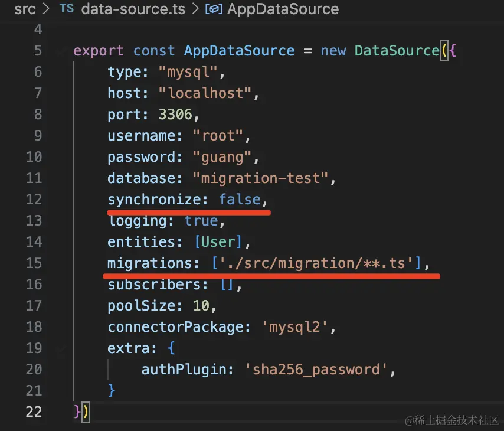  

4. 使用 migration:run 手动建表

   ```shell
   npx ts-node ./node_modules/typeorm/cli migration:run -d ./src/data-source.ts
   ```

5. 此时会建立两张表，其中 migrations 会记录时间及迁移

   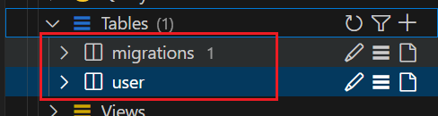  


**简便方法（常用）**：

1. 使用 migration:generate 生成

   ```shell
   npx ts-node ./node_modules/typeorm/cli migration:generate ./src/migration/Aaa -d ./src/data-source.ts
   ```

2. 用 migration:run 执行下

   ```ts
   npx ts-node ./node_modules/typeorm/cli migration:run -d ./src/data-source.ts
   ```

3. 注意：修改表结构也需要重新执行以上步骤

4. 撤销操作

   ```ts
   npx ts-node ./node_modules/typeorm/cli migration:revert -d ./src/data-source.ts
   ```

   执行 migration:revert 会执行上次的 migration 的 down 方法，并且从 migrations 表里删掉执行记录。**可以进行多次 revert**

5. 将命令封装进 script

   ```js
   "migration:create": "npm run typeorm -- migration:create",
   "migration:generate": "npm run typeorm -- migration:generate -d ./src/data-source.ts",
   "migration:run": "npm run typeorm -- migration:run -d ./src/data-source.ts",
   "migration:revert": "npm run typeorm -- migration:revert -d ./src/data-source.ts"
   ```

6. 总结

   - migration:create：生成空白 migration 文件
   - migration:generate：连接数据库，根据 Entity 和数据库表的差异，生成 migration 文件
   - migration:run：执行 migration，会根据数据库 migrations 表的记录来确定执行哪个
   - migration:revert：撤销上次 migration，删掉数据库 migrations 里的上次执行记录


### Nest 项目使用 TypeORM 迁移

1. 创建 `src/data-source.ts`，将 AppModule 中的 synchronize 关闭

   ```ts
   import { DataSource } from "typeorm";
   import { Article } from "./article/entities/article.entity";
   
   export default new DataSource({
       type: "mysql",
       host: "localhost",
       port: 3306,
       username: "root",
       password: "guang",
       database: "nest-migration-test",
       synchronize: false, // 这里关闭，不自动创建表结构，同时关闭 AppModule 中的配置
       logging: true,
       entities: [Article],
       poolSize: 10,
       migrations: ['src/migrations/**.ts'],
       connectorPackage: 'mysql2',
       extra: {
           authPlugin: 'sha256_password',
       }
   });
   ```

2. 添加几个 Scripts 

   ```shell
   "typeorm": "ts-node ./node_modules/typeorm/cli",
   "migration:create": "npm run typeorm -- migration:create",
   "migration:generate": "npm run typeorm -- migration:generate -d ./src/data-source.ts",
   "migration:run": "npm run typeorm -- migration:run -d ./src/data-source.ts",
   "migration:revert": "npm run typeorm -- migration:revert -d ./src/data-source.ts"
   ```

3. 执行 migration:generate 命令

   ```shell
   npm run migration:generate src/migrations/init
   ```

   - 这里会创建 migrations 文件夹 及 时间戳+init.ts 的文件

   - 并会对比 entity 和数据表的差异，生成迁移 sql

4. 执行 npm run migration:run 命令，即会执行之前创建的迁移 sql 

   - **这里migrations 表里记录了执行过的 migration，已经执行过的不会再执行。**

5. 再创建一个 migration 来初始化数据

   ```shell
   npm run migration:create src/migrations/data
   ```

   - **migration:generate 只会根据表结构变动生成迁移 sql，而数据的插入的 sql 需要我们自己添加。**

   ```ts
   export class Data1735898276429 implements MigrationInterface {
     public async up(queryRunner: QueryRunner): Promise<void> {
       await queryRunner.query(
         // 这里使用数据插入语句可以使用 MySql 点击备份数据生成的语句
       );
     }
   
     public async down(queryRunner: QueryRunner): Promise<void> {
        // 如果要支持 revert，那 down 方法里应该补上 delete 语句
     }
   }
   ```

6. npm run migration:run，此时之前执行过的语句不会再次执行

> Entity 中新增字段同样可以使用以上步骤生成表结构，而不是使用 synchronize: true 配置自动生成


**将数据库配置提取为 env**

1. src 创建 .env 文件

   ```js
   # mysql 相关配置
   mysql_server_host=localhost
   mysql_server_port=3306
   mysql_server_username=root
   mysql_server_password=guang
   mysql_server_database=nest-migration-test
   ```

2. AppModule 里读取见下节

3. data-source 里读取

   1. 安装 dotenv `npm install --save-dev dotenv`

   2. 使用

      ```ts
      import { DataSource } from 'typeorm';
      import { Article } from './ariticle/entities/ariticle.entity';
      import { config } from 'dotenv';
      
      config({
        path: 'src/.env',
      });
      
      console.log(process.env);
      
      export default new DataSource({
        type: 'mysql',
        host: `${process.env.mysql_server_host}`,
        port: +`${process.env.mysql_server_port}`,
        username: `${process.env.mysql_server_username}`,
        password: `${process.env.mysql_server_password}`,
        database: `${process.env.mysql_server_database}`,
        synchronize: false,
        logging: true,
        entities: [Article],
        poolSize: 10,
        migrations: ['src/migrations/**.ts'],
        connectorPackage: 'mysql2',
      });
      ```

      

## 动态读取不同环境配置

- powershell 设置临时环境变量

  ```shell
  $env:变量名 = "值"
  
  # 获取
  echo $env:变量名
  ```

### nodejs 中使用 dotenv

  1. 安装：`npm install dotenv`

  2. 添加env配置文件

     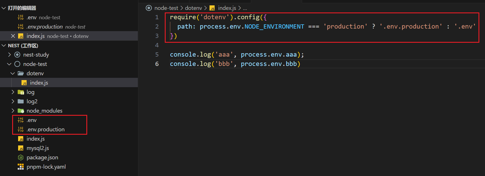  

- nodejs 使用 yaml 格式的配置文件

  1. 安装包：`npm install js-yaml`

  2. 使用

     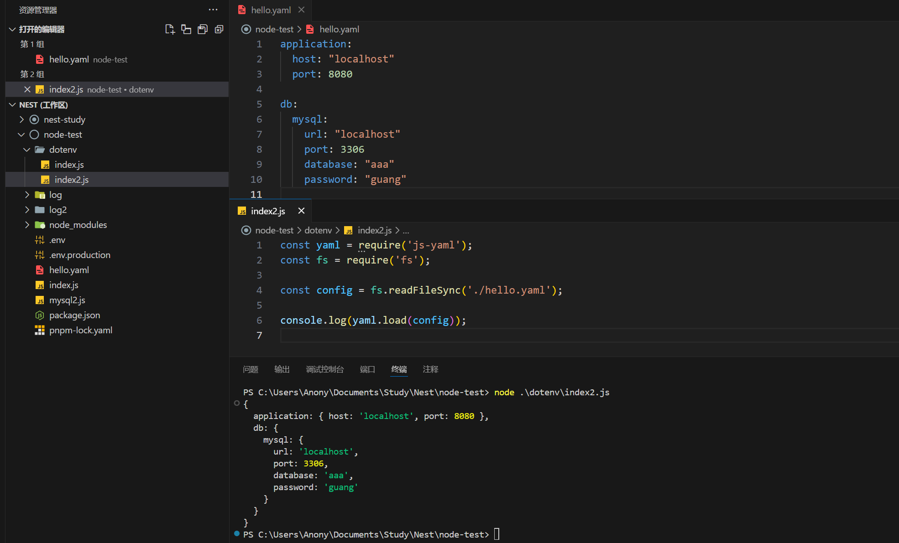  

> **yaml 的格式更适合有层次关系的配置，而 .env 更适合简单的配置。**

### Nest 中使用
#### env
  1. 安装：`npm install --save @nestjs/config`
  
  2. 使用：module 里面可以引入多个文件，**前面的配置会覆盖后面的配置**
  
     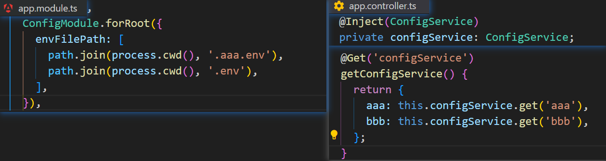  
#### 使用ts配置

支持异步

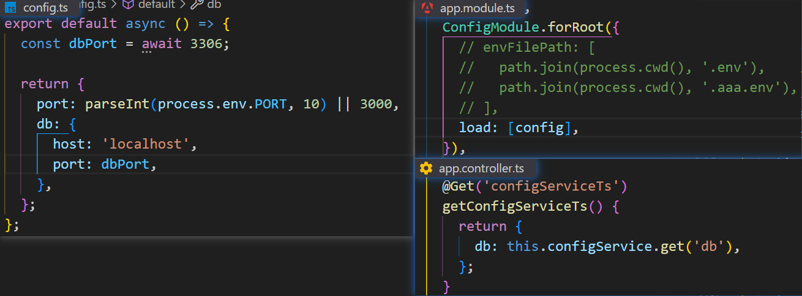  

通过读取 yaml 文件实现yaml 文件加载

```ts
// config.ts
import { readFile } from 'fs/promises';
import * as yaml from 'js-yaml';
import { join } from 'path';

export default async () => {
    const configFilePath = join(process.cwd(), 'aaa.yaml');

    const config = await readFile(configFilePath, {
        encoding: 'utf-8'
    });

    return yaml.load(config);
};
```

forFeature 方法来返回动态模块（在某一模块中进行局部注册配置）

> 如果要在其他模块访问 configService，需要在AppModule 中注册时添加 isGlobal： true

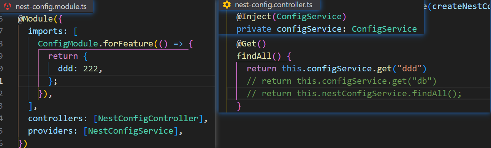  


## Redis
### 基础使用
1. 安装：docker里搜索 redis - run 填入数据
2. docker 里使用 `redis-cli`命令进行交互
3. 命令：
   - set、get：设置和取值（不适用于 list）
   - incr：递增，如 `incr key1`，每调用一次值就会增一
   - keys：查询所有 key：`keys "*"` `keys "key*"`
   - lpush：从左添加 list 数据：`lpush list1 111`
   - rpush：同上
   - lpop、rpop：删除
   - lrange：查看list数据，`lrange list1 0 -1`表示查看第0个到最后一个
   - sadd：添加 set 数据，类似列表，但是数据无序且不重复
   - sismember：判断是否为 set 中的数据，`sismember set1 111`
   - zadd：添加 zset 数据，`zadd zset1 5 guang ` 每个元素有一个分数，按照次数来进行排序 
   - zrange：获取 zset 数据，`zrange zset1 0 2`：获取前三个
   - hset：设置 hash 数据，类似 map，`hset hash1 key1 1`，存储格式类似于list，会有key和value
   - hget：取 hash 数据，`hget hash1 key1`
   - geoadd：添加经纬度数据，`geoadd loc 13.361389 38.115556 "guangguang" 15.087269 37.502669 "dongdong" `
   - geodist：计算两坐标点距离，`geodist loc guangguang dogndong`
   - georadius：搜索某个半径内其他点，`georadius loc 15 37 100 km`
   - expire：设置数据过期时间，`expire dogn1 30`
   - ttl：查询剩余时间，`ttl list1`


### Nest 里使用

1. 安装 Redis 包：`npm install redis`

2. AppModule 添加自定义 provider：

   ```typescript
   {
     provide: 'REDIS_CLIENT',
     async useFactory() {
       const client = createClient({
           socket: {
               host: 'localhost',
               port: 6379
           }
       });
       await client.connect();
       return client;
     }
   }
   ```

3. service 里进行注入：

   ```typescript
   import { Inject, Injectable } from '@nestjs/common';
   import { RedisClientType } from 'redis';
   
   @Injectable()
   export class AppService {
   
     @Inject('REDIS_CLIENT')
     private redisClient: RedisClientType;
   
     async getHello() {
       const value = await this.redisClient.keys('*');
       console.log(value);
   
       return 'Hello World!';
     }
   }
   ```

   注意：这里使用了 async/await 在 controller 里面也需要添加

> 这里不推荐使用官方推荐的 cache-manage 操作 Redis


## 登录及权限控制


### JWT 和 session

#### 服务器存储 session + cookie 

> session + cookie 的给 http 添加状态的方案是服务端保存 session 数据，然后把 id 放入 cookie 返回，cookie 是自动携带的，每个请求可以通过 cookie 里的 id 查找到对应的 session，从而实现请求的标识。

问题：

- CSRF：当前登录的网站请求别的网站时也会携带cookie，造成危险。可以通过 服务器生成并验证唯一的Token、验证Referer解决

- 分布式 session：不同服务器之间进行同步问题，可以通过 各台服务器之间自动复制 session、将session 保存在一台服务器中的redis 中解决，通产使用这种方式

- 跨域：跨域请求不会携带cookie，虽然可以设置为顶级域名，顶级域名不同时仍不会携带cookie

#### 客户端存储的 token

> token 的方案常用 json 格式来保存，叫做 json web token，简称 JWT，由 header、payload、verify signature 三部分组成

- header 部分保存当前的加密算法
- payload 部分是具体存储的数据
- verify signature 部分是把 header 和 payload 还有 salt 做一次加密之后生成的


### Nest 实现 Session 和 JWT

- **Session + Cookie 方式**

  1. 安装 express-session 和 ts 类型定义：`npm install express-session @types/express-session`

  2. 入口模块启用

     ```typescript
     import { NestFactory } from '@nestjs/core';
     import { AppModule } from './app.module';
     import * as session from 'express-session';
     
     async function bootstrap() {
       const app = await NestFactory.create(AppModule);
     
       app.use(session({
         secret: 'guang',
         resave: false,
         saveUninitialized: false
       }));
       await app.listen(3000);
     }
     bootstrap();
     ```

     - **secret** 加密密钥
     - **resave** 为 true 是每次访问都会更新 session，不管有没有修改 session 的内容，而 false 是只有 session 内容变了才会去更新 session。
     - **saveUninitalized** 设置为 true 是不管是否设置 session，都会初始化一个空的 session 对象。比如你没有登录的时候，也会初始化一个 session 对象，这个设置为 false 就好。

  3. controller 里注入 session

     ```typescript
     @Get('sss')
     sss(@Session() session) {
         console.log(session)
         session.count = session.count ? session.count + 1 : 1;
         return session.count;
     }
     ```

     - 这里在 session 里放置了 count 变量，每次请求都会将此变量加一

- **JWT 方式**

  1. 引入 jwt 包：`npm install @nestjs/jwt`

  2. 在 AppModel 里引入 JwtModel

     ```typescript
     import { Module } from '@nestjs/common';
     import { JwtModule } from '@nestjs/jwt';
     import { AppController } from './app.controller';
     import { AppService } from './app.service';
     
     @Module({
       imports: [
         JwtModule.register({
           secret: 'guang',
           signOptions: {
             expiresIn: '7d'
           }
         })
       ],
       controllers: [AppController],
       providers: [AppService],
     })
     export class AppModule {}
     ```

     注意：这里也可以使用 useFactory 异步传入配置，详细方式见**动态模块**部分

     - secret：JWT 的密钥
     - expiresIn：Token 过期时间

  3. controller 里面注入

  4. 使用

     ```typescript
     @Get('ttt')
     ttt(@Headers('authorization') authorization: string, @Res({ passthrough: true}) response: Response) {
         if(authorization) {
           try {
             const token = authorization.split(' ')[1];
             const data = this.jwtService.verify(token);
     
             const newToken = this.jwtService.sign({
               count: data.count + 1
             });
             response.setHeader('token', newToken);
             return data.count + 1
           } catch(e) {
             console.log(e);
             throw new UnauthorizedException();
           }
         } else {
           const newToken = this.jwtService.sign({
             count: 1
           });
     
           response.setHeader('token', newToken);
           return 1;
         }
     }
     ```

     **注意：**Authorization放在header里面，一般用 Bearer XXX的格式，注意中间的空格，所以取值的时候如上
     
     **`重要：`**
     
     - Session + cookie 方式将用户状态（角色、权限等）保存在服务端，判断用户状态需要在服务端进行，所以对分布式不友好
     
     - JWT 通过将用户信息注入Token中，只需要登录时候保存用户信息状态到 Token 中，每次请求都可以从中拿到用户状态进行鉴权操作，所以天然对分布式you'hao


### 登陆注册（案例练习）

[小册](https://juejin.cn/book/7226988578700525605/section/7243417086767136828?enter_from=course_center&utm_source=course_center)

通过 JWT 实现登录，同时 validationPipe 做参数校验，guard 做接口权限校验

TypeORM + SQL 做数据存储，密码存储通过 crypto 进行加密处理


###  基于 ACL 实现权限控制（练习）

记录每个用户有什么权限的方式，叫做访问控制表（Access Control List）

用户和权限是多对多关系，存储这种关系需要用户表、角色表、用户-角色的中间表

这里可以结合 Redis 把查询到的权限进行缓存并设置ttl，下次再进行查找时就不用查询数据库了


### 基于 RBAC 实现权限控制（练习）

- 登录接口控制的两种思路：
  1. 通过设置全局 Guard 对所有接口拦截，但后通过 setMetaData 设置可以通过的标志，在Guard里进行获取判断
  2. 通过对需要拦截的 calss 设置 Guard，而不需要全局设置 

- 注意：设置全局 Guard、pipe 等有两种方式：
  1. 通过 `app.useGlobalXXX(new XXX())` 方式设置，此方式无法使用 useFactory 等方法
  2. 通过在 appModule 里面 providers 设置，注意参数中 provide 字段使用nest提供的对应字段

总结：

通过 jwt 实现了登录，把用户和角色信息放到 token 里返回。

添加了 LoginGuard 来做登录状态的检查。

然后添加了 PermissionGuard 来做权限的检查。

LoginGuard 里从 jwt 取出 user 信息放入 request，PermissionGuard 从数据库取出角色对应的权限，检查目标 handler 和 controller 上声明的所需权限是否满足。

LoginGuard 和 PermissionGuard 需要注入一些 provider，所以通过在 AppModule 里声明 APP_GUARD 为 token 的 provider 来注册的全局 Gard。

然后在 controller 和 handler 上添加 metadata 来声明是否需要登录，需要什么权限，之后在 Guard 里取出来做检查。

这种方案查询数据库也比较频繁，也应该加一层 redis 来做缓存。

当然，这是 RBAC0 的方案，更复杂一点的权限模型，可能会用 RBAC1、RBAC2 等，那个就是多角色继承、用户组、角色之间互斥之类的概念，会了 RBAC0，那些也就是做一些变形的事情。

绝大多数系统，用 RBAC0 就足够了。


### 基于 access_token 和 refresh_token 无感刷新

- 登陆的时候将 access_token 和 refresh_token 都返回，当 access_token 过期的时候调用 refresh 接口进行刷新
- access_token 要带上 用户名 和 id，用户名用于数据库查找及账号对应密码验证
- refresh_token 只用带上 id 即可，直接在数据库中通过查找，再返回新的 access_token 和 refresh_token 


### 单 token 实现无感刷新

原理：登录后返回 jwt，每次请求接口带上这个 jwt，然后**每次访问接口返回新的 jwt，然后前端更新下本地的 jwt token**。

注意：

- 默认情况前端能访问的header 是有限的，如果想在代码访问别的 header，需要在后端支持下，在 Access-Controll-Expose-Headers 里加上这个 header

  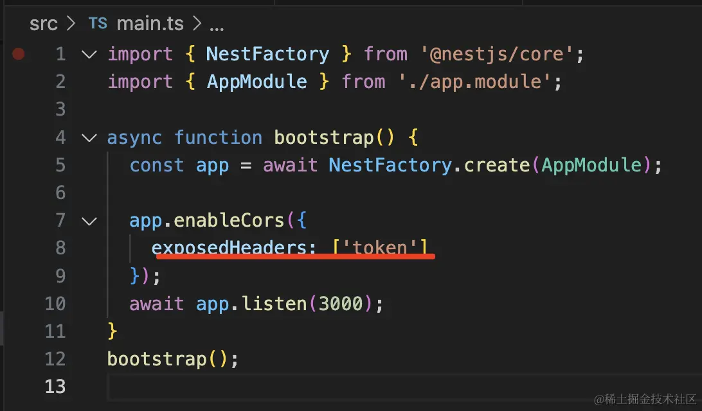  


### passport 身份认证


1. 安装三方库：`npm install --save @nestjs/passport passport`

2. 用户名密码的认证:
   - 安装三方库：`npm install --save passport-local npm install --save-dev **@types**/passport-local`
   - 创建 local.strategy.ts ，实现 PassportStrategy 其中 **Strategy 从 request 取出一些东西，交给 validate 方法验证，validate 方法返回 user 信息，自动放到 request.user 上**，这里 validata 校验用户名密码是使用 authService 里面实现，如果抛出错误会被捕获，否则返回 user
   - 使用时与Guard一样：`@UseGuards(AuthGuard('local'))`
   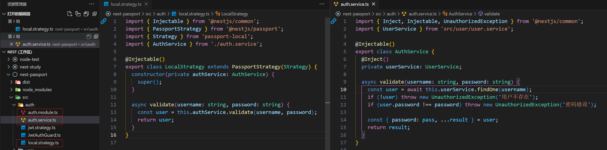  

3. JWT认证
   - 安装三方库：`@nestjs/jwt`，正常注入
   
   - 安装三方库：`npm install --save passport-jwt`、`npm install --save-dev @types/passport-jwt`
   
   - 使用 strategy 自动校验，指定从 request 的 header 里提取 token，然后取出 payload 之后会传入 validate 方法做验证，返回的值同样会设置到 request.user。
   
     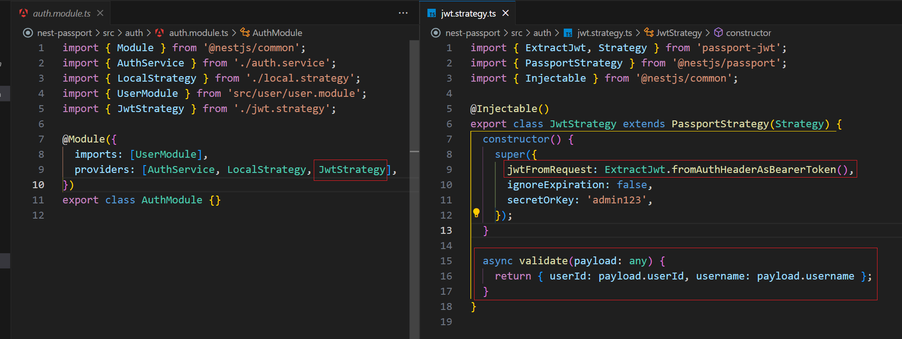  
   
   - **对 Guard 做拓展**
   
     这里使用 SetMetadata 在 handler 设置自定义标识，并在 Guard 中取到，判断之后是否使用 passport 进行校验
   
     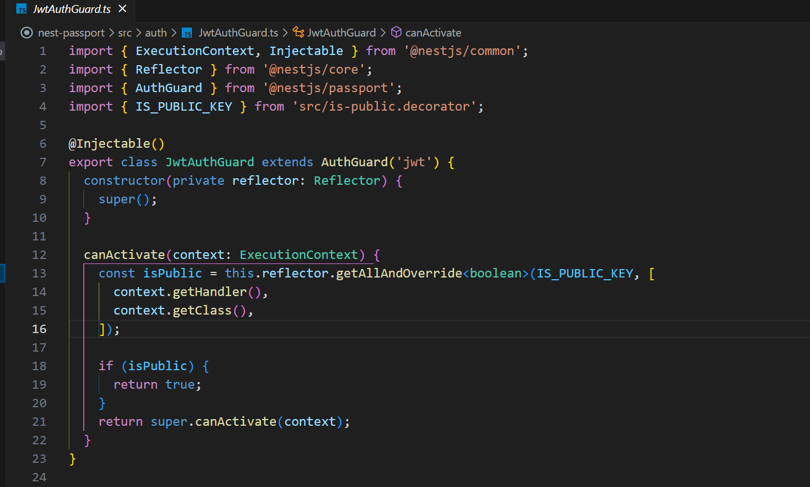  

> [官网 passport 相关资料](https://docs.nestjs.com/recipes/passport#passport-authentication)


### passport 实现 GitHub 登录

Client ID：Ov23lio75TqliTycucCv

Client secrets：4203d10911279edd49ae2c3a0b53deacc828eb74

> [参考小册](https://juejin.cn/book/7226988578700525605/section/7374065442215854134?enter_from=course_center&utm_source=course_center)


### passport 实现 Google 登录

Client ID：xxx.apps.googleusercontent.com

Client secrets：GOCSPX-xxx

> [参考小册](https://juejin.cn/book/7226988578700525605/section/7376480527337193482?enter_from=course_center&utm_source=course_center)


## Docker Compose

### 使用

```yaml
services:
  nest-app:
    build:
      context: ./
      dockerfile: ./Dockerfile
    depends_on:
      - mysql-container
      - redis-container
    ports:
      - '3000:3000'
  mysql-container:
    image: mysql
    ports:
      - '3306:3306'
    volumes:
      - /Users/guang/mysql-data:/var/lib/mysql
  redis-container:
    image: redis
    ports:
      - '6379:6379'
    volumes:
      - /Users/guang/aaa:/data
```

- 每个 services 都是一个 Docker 容器，名字可以自定义
- depends_on 用于设置其他依赖的 services，会先启动这里设置的
- 其他命令参考 Docker 章节

- docker-compose xxx：运行，会把所有容器的日志合并输出。**新版本改为 docker compose xxx**

只需要定义 docker-compose.yaml 来声明容器的顺序和启动方式，之后执行 docker-compose up 一条命令就能按照顺序启动所有的容器。


### 桥接网络

> 由于Docker 通过 Namespace 的机制实现了容器的隔离，其中就包括 Network Namespace。所以不能直接通过端口访问其他容器的服务。
>
> 上面通过将 docker 内的端口映射到宿主机，从而实现容器间的通信
>
> 这里可以通过创建一个 Network Namespace，设置多个 Docker 容器实现通信，即桥接网络

- 使用 docker-compose 配置桥接网络

  ```yaml
  version: '3.8'
  services:
    nest-app:
      build:
        context: ./
        dockerfile: ./Dockerfile
      depends_on:
        - mysql-container
        - redis-container
      ports:
        - '3000:3000'
      networks:
        - common-network
    mysql-container:
      image: mysql
      volumes:
        - /Users/guang/mysql-data:/var/lib/mysql
      networks:
        - common-network
    redis-container:
      image: redis
      volumes:
        - /Users/guang/aaa:/data
      networks:
        - common-network
  networks:
    common-network:
      driver: bridge # 网络驱动程序指定 bridge
  ```

  - version 是指定 docker-compose.yml 的版本，因为不同版本配置不同。
  - mysql-container、redis-container 的 ports 映射去掉，指定桥接网络为 common-network。
  - 网络驱动程序指定bridge的含义是容器的网络和宿主机网络是隔离开的，但是可以做端口映射。比如 -p 3000:3000、-p 3306:3306 这样。
  - `docker-compose down --rmi all` 删除所有容器和镜像
  - `docker-compose up` 启动
  - **注意**：这里不手动指定 networks 时，会创建默认的 network，同样可以使用桥接网络

- 手动创建桥接网络并启动各个容器

  - 通过 `docker network create xxx` 创建一个桥接网络，
  
  - 然后 docker run 的时候指定 --network为创建的桥接网络，不需要指定和宿主机的端口映射：
  
    `docker run -d --network common-network -v C:\Users\Anony\Documents\MySQL\mysql-1:/var/lib/mysql --name mysql-container mysql  `
  
    `docker run -d --network common-network -v C:\Users\Anony\Documents\Redis\redis-1:/data --name redis-container redis:latest`
  
    `docker run -d --network common-network -p 3000:3000 --name nest-container imagename` 这里端口映射到宿主机进行网页访问


### 重启策略

- Docker：使用 --restart XXX，Docker Compose里也支持 restart 配置，重启策略有四种

  - no: 容器退出不自动重启（默认值）
  - always：容器退出总是自动重启，除非 docker stop（即使是Docker Deamon 重启）。
  - on-failure：容器非正常退出才自动重启，还可以指定重启次数，如 on-failure:5
  - unless-stopped：容器退出总是自动重启，除非 docker stop（Docker Deamon 重启之后不会启动）

- PM2：使用 `pm2-runtime`

  ```dockerfile
  FROM node:18-alpine3.14
  
  WORKDIR /app
  
  COPY ./index.js .
  
  RUN npm install -g pm2
  
  CMD ["pm2-runtime", "/app/index.js"]
  ```

- docker compose 重启

  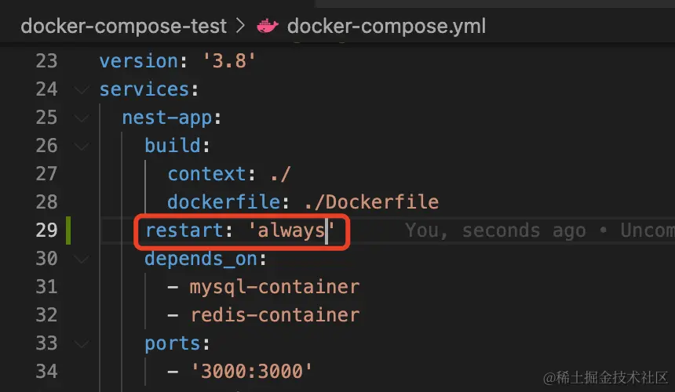  

  


## Nginx基础

> nginxconfig.io NGINX 配置网站

- 4个 location 语法

  - `location = /aaa` 是精确匹配 /aaa 的路由。

  - `location /bbb` 是前缀匹配 /bbb 的路由。

  - `location ~ /ccc.*.html` 是正则匹配。可以再加个 * 表示不区分大小写 location ~* /ccc.*.html

  - `location ^~ /ddd` 是前缀匹配，但是优先级更高。`^~` 提高前缀匹配优先级

    ```nginx
    location = /111/ {
        default_type text/plain;
        return 200 "111 success";
    }
    
    # $uri 表示当前路径
    location /222 {
        default_type text/plain;
        return 200 $uri;
    }
    
    location ~ ^/333/bbb.*\.html$ {
        default_type text/plain;
        return 200 $uri;
    }
    
    location ~* ^/444/AAA.*\.html$ {
        default_type text/plain;
        return 200 $uri;
    }
    ```

  - 优先级：**精确匹配（=） > 高优先级前缀匹配（^~） > 正则匹配（～ ~\*） > 普通前缀匹配**

  - nginx.conf 为主配置文件，一般放全局配置 如：错误日志的目录等

  - 具体的路由配置一般放在 conf.d 里面

- root 和 alias 区别：**拼接路径时是否包含匹配条件的路径**，root 会进行拼接，alias 则不会

  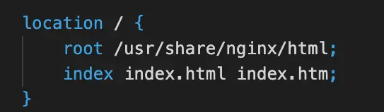  

- 默认文件位置

  - 主配置文件：`/etc/nginx/nginx.conf`
  - 子配置文件：`/etc/nginx/conf.d`
  - 默认 html 路径：`/usr/share/nginx/html`

- 正向代理 & 反向代理

  - 修改 header ： `proxy_set_header name zhangsan`
  - 反向代理：`proxy_pass http://192.168.1.66:3000;`

- 负载均衡

  - 在 upstream 里配置它代理的目标服务器的所有实例，**默认为轮询**

    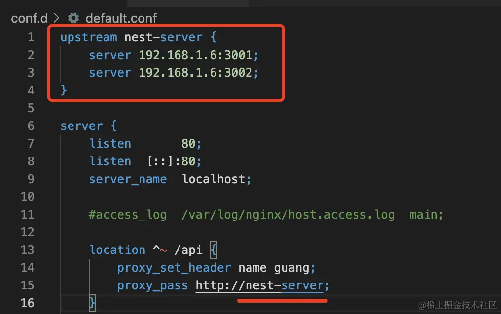  
    
  - 4种负载均衡策略
  
    - 轮询：默认方式。
  
    - weight：在轮询基础上增加权重，也就是轮询到的几率不同。
  
      ```nginx
      # 这样相当于两个服务器轮询到的几率为 2:1
      upstream nest-server {
      	server 192.168.2.1:3001;
      	server 192.168.2.1:3002 weight=2; # 默认为 1	
      }
      ```
  
    - ip_hash：按照 ip 的 hash 分配，保证每个访客的请求固定访问一个服务器，解决 session 问题。
  
      ```nginx
      upstream nest-server {
          ip_hash;
      	server 192.168.2.1:3001;
      	server 192.168.2.1:3002;	
      }
      ```
  
    - fair：按照响应时间来分配，这个需要安装 nginx-upstream-fair 插件。


## Nginx 实现灰度

1. 设置多组 upstream 

   ```nginx
   upstream version1.0_server {
       server 192.168.1.6:3000;
   }
    
   upstream version2.0_server {
       server 192.168.1.6:3001;
   }
   
   upstream default {
       server 192.168.1.6:3000;
   }
   ```

2. 根据 cookie 设置转发到哪个 

   如果包含 version=1.0 的 cookie，那就走 version1.0_server 的服务，有 version=2.0 的 cookie 就走 version2.0_server 的服务，否则，走默认的

   ```nginx
   set $group "default";
   if ($http_cookie ~* "version=1.0"){
       set $group version1.0_server;
   }
   
   if ($http_cookie ~* "version=2.0"){
       set $group version2.0_server;
   }
   
   location ^~ /api {
       rewrite ^/api/(.*)$ /$1 break;
       proxy_pass http://$group;
   }
   ```

3. 流量染色

   比如随机数载 0 到 0.2 之间，就设置 version=2.0 的 cookie，否则，设置 version=1.0 的 cookie。

   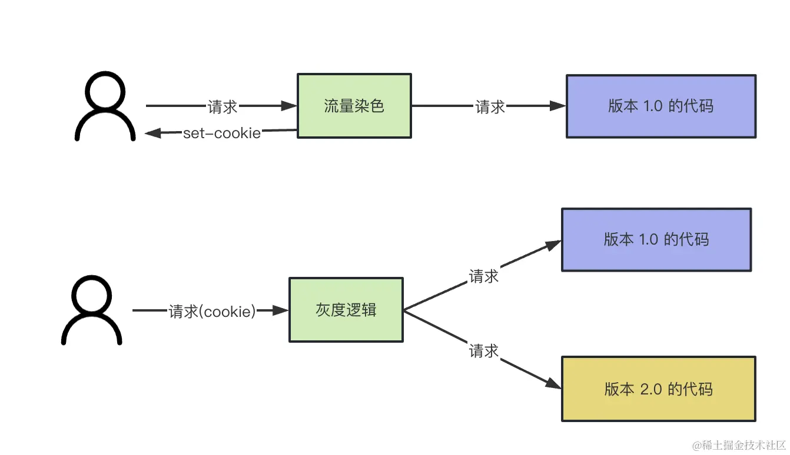  

   其中，后端代码会根据 cookie 标识来请求不同的服务（或者同一个服务走不同的 if else），前端代码可以根据 cookie 判断走哪段逻辑。


## 基于 Redis 实现分布式 session  

> 实现代码：redis-session-test

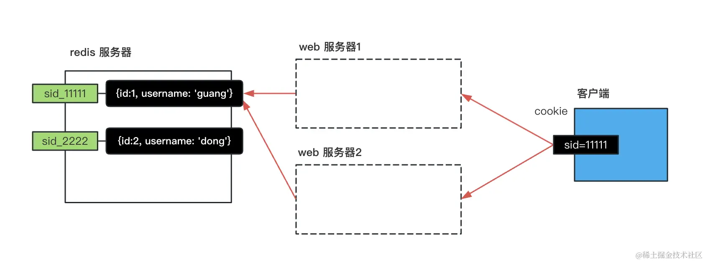  

- 思路：将用户数据保存在同一个 Redis 里面，当通过不同的服务器进行登陆时，都使用这一个 Redis 进行数据查询

**redis 的 hash 方法：**

- `HSET key field value`： 设置指定哈希表 key 中字段 field 的值为 value。
- `HGET key field`：获取指定哈希表 key 中字段 field 的值。
- `HMSET key field1 value1 field2 value2 ...`：同时设置多个字段的值到哈希表 key 中。
- `HMGET key field1 field2 ...`：同时获取多个字段的值从哈希表 key 中。
- `HGETALL key`：获取哈希表 key 中所有字段和值。
- `HDEL key field1 field2 ...`：删除哈希表 key 中一个或多个字段。
- `HEXISTS key field`：检查哈希表 key 中是否存在字段 field。
- `HKEYS key`：获取哈希表 key 中的所有字段。
- `HVALUES key`：获取哈希表 key 中所有的值。 -`HLEN key`：获取哈希表 key 中字段的数量。
- `HINCRBY key field increment`：将哈希表 key 中字段 field 的值增加 increment。
- `HSETNX key field value`：只在字段 field 不存在时，设置其值为 value。


## 基于 Redis GEO 数据实现附近查找功能

> [掘金小册](https://juejin.cn/book/7226988578700525605/section/7284426518866952232?enter_from=course_center&utm_source=course_center)
>
> 代码地址：Projects -> nearby-search


## Swagger 自动生成 API 文档

> [掘金小册](https://juejin.cn/book/7226988578700525605/section/7236527474316673085?enter_from=course_center&utm_source=course_center)

1. 安装Swagger 包 `npm install --save @nestjs/swagger`

2. 在 main.ts 里用 DocumentBuilder + SwaggerModule.createDocuemnt 创建 swagger 文档配置

   ```js
   import { NestFactory } from '@nestjs/core';
   import { AppModule } from './app.module';
   import { DocumentBuilder, SwaggerModule } from '@nestjs/swagger';
   
   async function bootstrap() {
     const app = await NestFactory.create(AppModule);
   
     const config = new DocumentBuilder()
       .setTitle('NestJS Test')
       .setDescription('NestJS API')
       .setVersion('1.0')
       .addTag('Test')
       .build();
   
     const document = SwaggerModule.createDocument(app, config);
     SwaggerModule.setup('doc', app, document);
   
     await app.listen(process.env.PORT ?? 3000);
   }
   bootstrap();
   ```

   配置对应关系

   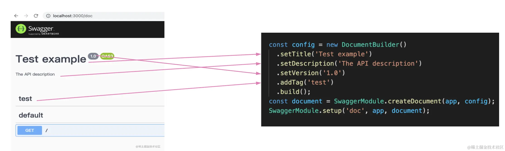  

还需要手动加一些装饰器来标注：

- ApiOperation：声明接口信息

- ApiResponse：声明响应信息，一个接口可以多种响应

- ApiQuery：声明 query 参数信息

  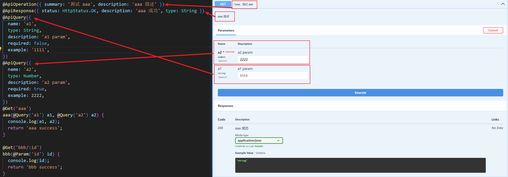  

- ApiParam：声明 param 参数信息

- ApiBody：声明 body 参数信息，可以省略

- ApiProperty：声明 dto、vo 的属性信息

  ```ts
  import { ApiProperty, ApiPropertyOptional } from "@nestjs/swagger";
  
  export class CccDto {
      @ApiProperty({ name: 'aaa', enum: ['a1', 'a2', 'a3'], maxLength: 30, minLength: 2, required: true})
      aaa: string;
  
      @ApiPropertyOptional({ name: 'bbb', maximum: 60, minimum: 40, default: 50, example: 55})
      bbb: number;
  
      @ApiProperty({ name: 'ccc' })
      ccc: Array<string>;
  }
  ```

- ApiPropertyOptional：声明 dto、vo 的属性信息，相当于 required: false 的 ApiProperty

- ApiTags：对接口进行分组

- ApiBearerAuth：通过 jwt 的方式认证，也就是 Authorization: Bearer xxx

- ApiCookieAuth：通过 cookie 的方式认证

- ApiBasicAuth：通过用户名、密码认证，在 header 添加 Authorization: Basic xxx

swagger 是 openapi 标准的实现，可以在 url 后加个 -json 拿到对应的 json，然后导入别的接口文档平台来用。


## 灵活创建 DTO

使用 @nestjs/mapped-types 的 PartialType、PickType、OmitType、IntersectionType 来避免重复。

- **PickType** 是从已有 dto 类型中取某个字段。

- **OmitType** 是从已有 dto 类型中去掉某个字段。

- **PartialType** 是把 dto 类型变为可选。

- **IntersectionType** 是组合多个 dto 类型。

组合使用

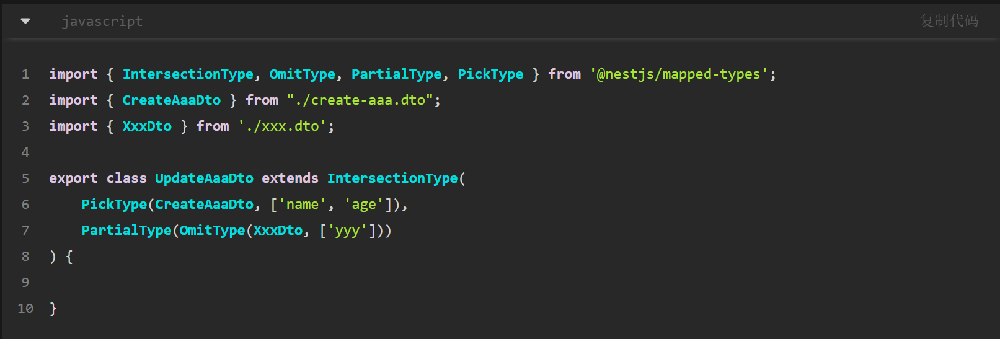    


## class-validator 内置装饰器及自定义装饰器

### 内置校验规则

> [class-validator文档](https://www.npmjs.com/package/class-validator#validation-decorators)

- **@IsEmail**：邮箱
- **@IsOptional**：可选
- **@IsIn**：限制只能是某些值：`@IsIn(['aaa@aa.com', 'bbb@bb.com'])`
- **@IsNotIn**：限制不能是某些值

数组：

- **@IsArray** ：限制属性是 array
- **@ArrayContains**：指定数组里必须包含的值：`@ArrayContains(['1', '2', '3'], { message: 'aaa 必须包含 1 2 3' })`
- **@ArrayNotContains**：必须不包含的值
- **@ArrayMinSize** 和 **@ArrayMaxSize** 限制数组的长度
- **@ArrayUnique**： 限制数组元素必须唯一

空值：

- **@IsNotEmpty**：不能为空

- **@IsNotEmpty**： 检查值是不是 ''、undefined、null
- **@IsDefined**：检查值是不是 undefined、null

数字：

- **@IsPositive**：必须是正数
- **@IsNegative**：必须是负数
- **@Min**、**@Max**：限制范围
- **@IsDivisibleBy**：必须被某个数整除

字符串：

- **@IsString**：字符串
- **@IsAlpha**：检查是否只有字母
- **@IsAlphanumeric**：检查是否只有字母和数字
- **@Contains**：是否包含某个值
- **@MinLength**、**@MaxLength** / **@Length**：限制长度

颜色：

- **@IsHexColor**、**@IsHSL**、**@IsRgbColor**

其他：

- **@IsDateString**：ISO 标准的日期字符串

  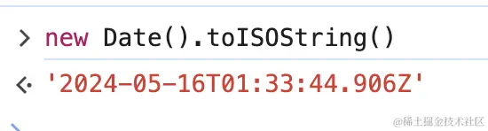  

- **@IsIP**：校验 IP 的格式

- **@IsPort**：校验端口

- **@IsJSON**：校验 JSON 格式

- 如果某个属性是否校验要根据别的属性的值

  ```ts
  @IsBoolean()
  hhh: boolean;
  
  @ValidateIf(o => o.hhh === true) // 如果 hhh 传了 true，那就需要对 iii 做校验，否则不需要。
  @IsNotEmpty()
  @IsHexColor()
  iii: string;
  ```


### 自定义校验规则

1. 创建：

   - 用 @ValidatorConstraint 声明 class 为校验规则，然后实现 ValidatorConstraintInterface 接口。

   - 如果这个校验是异步的返回 promise 就行了

   ```ts
   import { ValidationArguments, ValidatorConstraint, ValidatorConstraintInterface } from "class-validator";
   
   @ValidatorConstraint()
   export class MyValidator implements ValidatorConstraintInterface {
       validate(text: string, validationArguments: ValidationArguments) {
           console.log(text, validationArguments)
           return true;
       }
   }
   ```

2. 使用：第一个参数传入的字段值，第二个参数包含更多信息，比如 @Validate 指定的参数在 constraints 数组里。

   这样，我们只要用这些做下校验然后返回 true、false 就好了。

   ```ts
   @Validate(MyValidator, [11, 22], {
       message: 'jjj 校验失败',
   })
   jjj: string;
   ```

3. 使用自定义装饰器包装一下

   ```ts
   import { applyDecorators } from '@nestjs/common';
   import { Validate, ValidationOptions } from 'class-validator';
   import { MyValidator } from './my-validator';
   
   export function MyContains(content: string, options?: ValidationOptions) {
     return applyDecorators(
        Validate(MyValidator, [content], options)
     )
   }
   ```

   - 用 applyDecorators 组合装饰器生成新的装饰器

   - 使用

     ```ts
     @MyContains('111', {
         message: 'jjj 必须包含 111'
     })
     jjj: string;
     ```


## 序列化 Entity

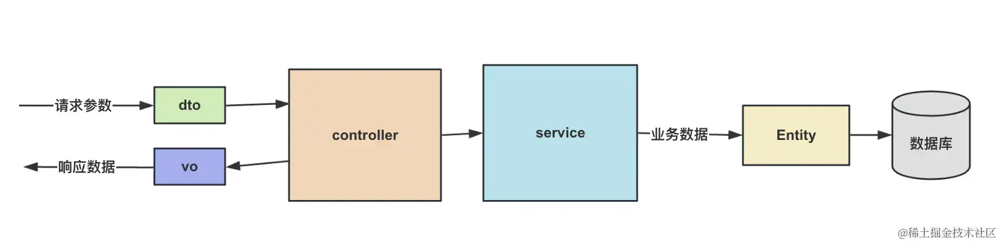

### 使用 vo 对象

1. 创建 vo/user.vo.ts：

   ```ts
   export class UserVo {
       id: number;
   
       username: string;
   
       email: string;
   
       constructor(partial: Partial<UserVo>) {
           Object.assign(this, partial);
       }
   }
   ```

2. 然后把数据封装成 vo 返回

   ```ts
   findAll() {
       return database.map(item => {
         return new UserVo({
           id: item.id,
           username: item.username,
           email: item.email
         });
       });
   }
   
   findOne(id: number) {
       return database.filter(item =>  item.id === id).map(item => {
         return new UserVo({
           id: item.id,
           username: item.username,
           email: item.email
         });
       }).at(0);
   }
   ```

   

### 复用 Dto

1. 安装用到的包：`npm install --save class-transformer`

2. 在 entity 上添加装饰器，然后在 Controller 的查询方法上加上 ClassSerializerInterceptor 就好了

   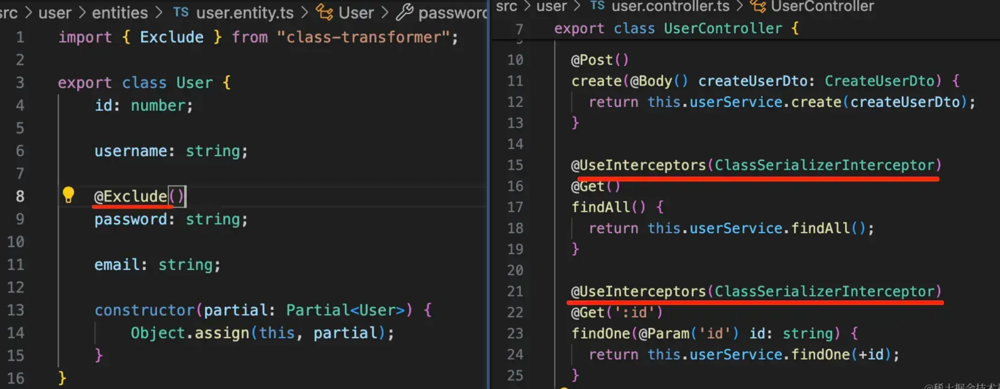

   此时接口返回值即可排除 password 字段
   
   - **@Expose** 是添加一个导出的字段，这个字段是只读的。
   - **@Transform** 是对返回的字段值做一些转换。
   - 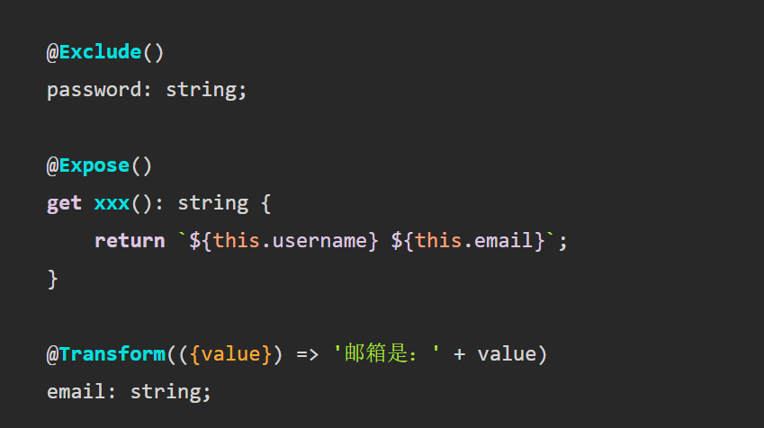  

3. 此外，可以通过 @SerializeOptions 装饰器加一些序列化参数：

   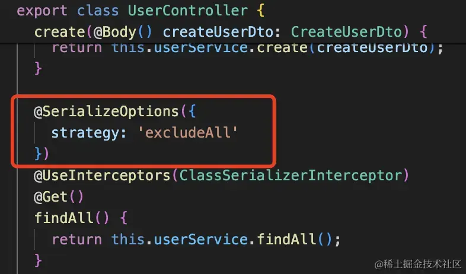  

   - strategy 默认值是 exposeAll，全部导出，除了有 @Exclude 装饰器的

   - 设置为 excludeAl 就是全部排除，除了有 @Expose 装饰器的

   - ClassSerializerInterceptor 和 SerializeOptions 也可以加到 class 上

### 结合 swagger 使用

1. swagger 使用见上

2. @apiResponse 里就可以直接指定 User 的 entity

   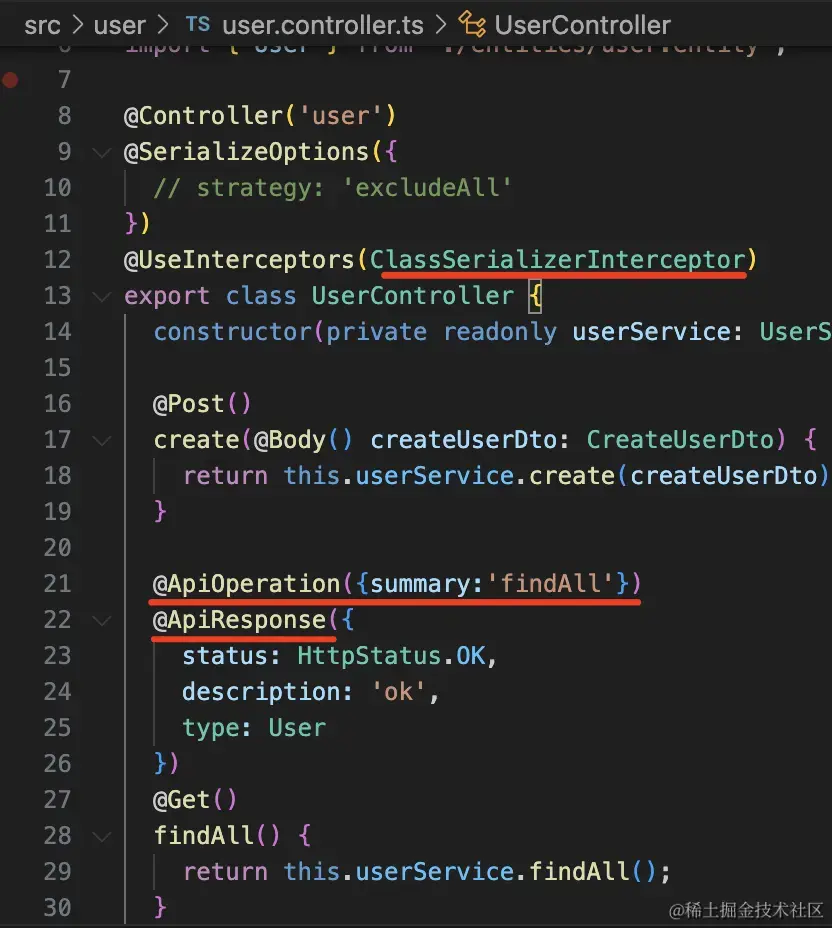  

3. 在 User 里加一下 swagger 的装饰器：（使用 ApiHide）

   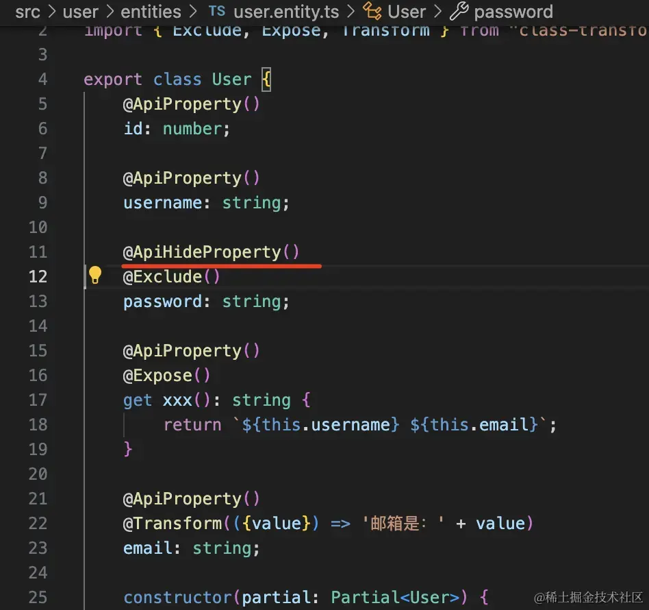  


## 使用 compodoc  生成文档

> 当项目复杂之后，模块之间的关系错综复杂，使用 compodoc  生成文档，把依赖关系可视化

1. 安装：`npm install --save-dev @compodoc/compodoc`

2. 生成文档：`npx @compodoc/compodoc -p tsconfig.json -s -o`

   - -p 是指定 tsconfig 文件

   - -s 是启动静态服务器

   - -o 是打开浏览器
   -  [compodoc 文档](https://link.juejin.cn/?target=https%3A%2F%2Fcompodoc.app%2Fguides%2Foptions.html)

3. 配置文件 .compodoc.json

   ```json
   {
       "port": 8888,
       "theme": "postmark"
   }
   ```

   运行：`npx @compodoc/compodoc -p tsconfig.json -s -o -c .compodoc.json`


## Node发送邮件

- 发邮件用 SMTP 协议。收邮件用 POP3 协议、或者 IMAP 协议。

- 发送邮件

  ```js
  import * as nodemailer from 'nodemailer';
  import * as fs from 'fs';
  
  const transporter = nodemailer.createTransport({
      host: "smtp.163.com",
      port: 25,
      secure: false,
      auth: {
          user: 'test@163.com',
          pass: 'xxxxxxx'
      },
  });
  
  async function main() {
    const info = await transporter.sendMail({
      from: '"Anony" test@163.com',
      to: "test@qq.com",
      subject: "测试邮件", 
      html: fs.readFileSync('./bird.html')
    });
  
    console.log("邮件发送成功：", info.messageId);
  }
  
  main().catch(console.error);
  ```

- 接收邮件

  ```js
  import Imap from 'imap';
  import { MailParser } from 'mailparser';
  import path from 'path';
  import * as fs from 'fs';
  
  const imap = new Imap({
    user: 'test@163.com',
    password: 'xxxxxxxx',
    host: 'imap.163.com',
    port: 993,
    tls: true
  });
  
  imap.once('ready', () => {
    // 发送客户端身份信息
    imap.id({ name: 'my-client', version: '1.0.0', vendor: 'my-company', "support-email": "test@163.com" }, (err) => {
      if (err) {
        console.error('Failed to send ID:', err);
        return;
      }
  
      // 打开邮箱
      imap.openBox('INBOX', true, (err, box) => {
        if (err) {
          console.error('Failed to open mailbox:', err);
          return;
        }
  
        // 搜索邮件
        imap.search([['SEEN'], ['SINCE', new Date('2022-12-19 19:00:00').toLocaleString()]], (err, results) => {
          if (err) {
            console.error('Search error:', err);
            return;
          }
  
          console.log('Search results:', results);
  
          // 处理邮件
          results.forEach((uid) => {
            const fetch = imap.fetch(uid, { bodies: '' });
  
            fetch.on('message', (msg) => {
              const mailParser = new MailParser();
  
              msg.on('body', (stream) => {
                stream.pipe(mailParser);
              });
  
              mailParser.on('data', (data) => {
                if (data.type === 'text') {
                  console.log('Text body:', data.text);
                } else if (data.type === 'attachment') {
                  const filePath = path.join(__dirname, data.filename);
                  data.content.pipe(fs.createWriteStream(filePath));
                  data.release();
                }
              });
  
              mailParser.on('end', () => {
                console.log('Finished processing email');
              });
            });
  
            fetch.on('error', (err) => {
              console.error('Fetch error:', err);
            });
          });
        });
      });
    });
  });
  
  imap.once('error', (err) => {
    console.error('IMAP error:', err);
  });
  
  imap.once('end', () => {
    console.log('Connection ended');
  });
  
  imap.connect();
  ```

  注意 163 邮箱需要发送客户端身份信息，邮箱设置打开 收取全部邮件 才能查找到历史邮件


## Nest 定时任务

### @nestjs/schedule

1. 安装：`npm i @nestjs/schedule`

2. 引用

   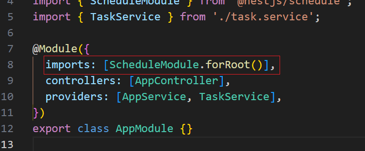  

3. 使用

   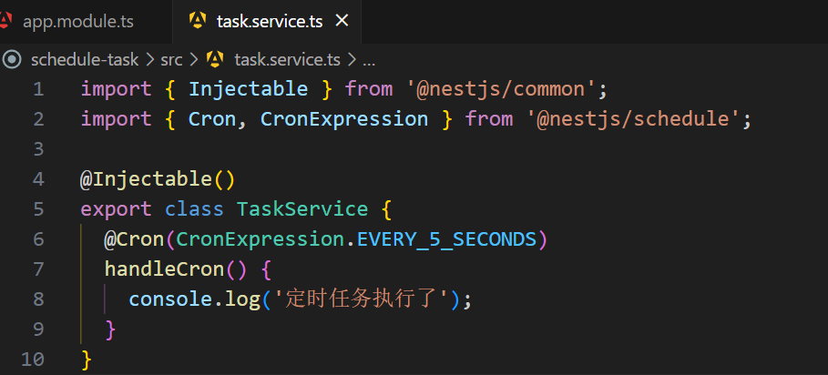  

注意：Nodejs 版本 >= 20

- **@Cron**：

  - 指定定时任务的名字，还有时区

    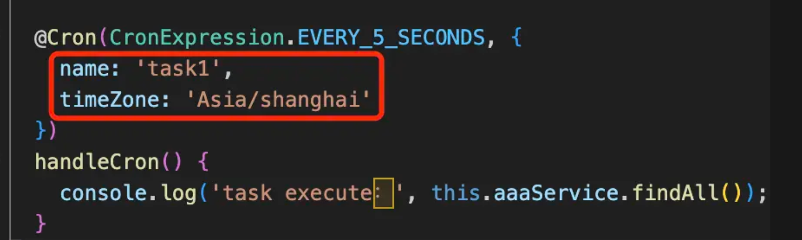

    时区的名字可以在[这里](https://link.juejin.cn/?target=https%3A%2F%2Fmomentjs.com%2Ftimezone%2F)查

- **@Interval**：指定任务的执行间隔，参数是毫秒值
  
  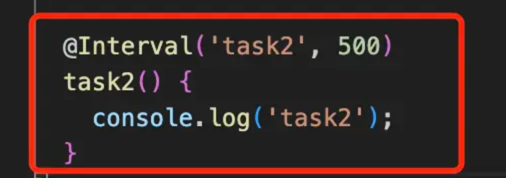  
  
- **@Timeout**：指定多长时间后执行一次
  
  ```js
  @Timeout('task3', 3000)
  task3() {
      console.log('task3');
  }
  ```
  
- **Cron 使用**：

​		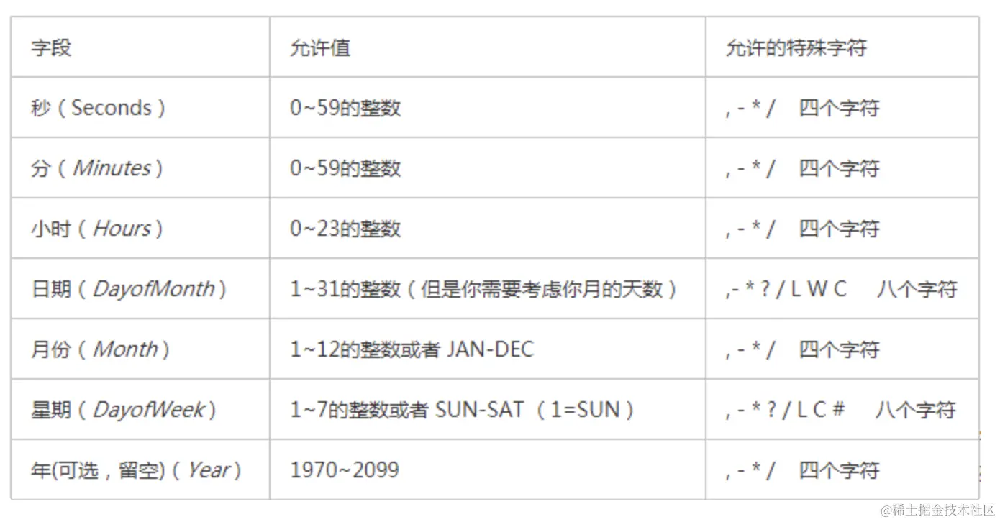  

[其他用法](https://juejin.cn/book/7226988578700525605/section/7271574633512435747?enter_from=course_center&utm_source=course_center)


### 管理定时任务

1. 在 AppModule 里注入 SchedulerRegistry，然后在 onApplicationBootstrap 的声明周期里拿到所有的 cronJobs

   ```js
   @Module({
     imports: [ScheduleModule.forRoot()],
     controllers: [AppController],
     providers: [AppService, TaskService],
   })
   export class AppModule implements OnApplicationBootstrap { // 这里实现 OnApplicationBootstrap 拿到生命周期
     @Inject(SchedulerRegistry)
     private schedulerRegistry: SchedulerRegistry;
   
     onApplicationBootstrap() {
       const jods = this.schedulerRegistry.getCronJobs();
       console.log(jods);
     }
   }
   ```

2. 拿到所有的定时任务及具体的定时任务

   ```js
   // interval 定时任务
   this.schedulerRegistry.getIntervals()
   this.schedulerRegistry.getInterval('task2')
   
   // timeout 定时任务
   this.schedulerRegistry.getTimeouts();
   this.schedulerRegistry.getTimeout('task3')
   
   // cron 定时任务
   this.schedulerRegistry.getTimeouts();
   this.schedulerRegistry.getTimeout('task3')
   ```

3. 增加 / 删除定时任务

   ```js
   onApplicationBootstrap() {
       const crons = this.schedulerRegistry.getCronJobs();
       crons.forEach((item, key) => {
         item.stop(); // 注意这里停止 cron 任务 和 timeout 任务的方式是不一样的
         this.schedulerRegistry.deleteCronJob(key);
       });
   
       const intervals = this.schedulerRegistry.getIntervals();
       intervals.forEach((item) => {
         const interval = this.schedulerRegistry.getInterval(item);
         clearInterval(interval);
   
         this.schedulerRegistry.deleteInterval(item);
       });
   
       const timeouts = this.schedulerRegistry.getTimeouts();
       timeouts.forEach((item) => {
         const timeout = this.schedulerRegistry.getTimeout(item);
         clearTimeout(timeout);
   
         this.schedulerRegistry.deleteTimeout(item);
       });
   
       console.log(this.schedulerRegistry.getCronJobs());
       console.log(this.schedulerRegistry.getIntervals());
       console.log(this.schedulerRegistry.getTimeouts());
   
       // 这里需要安装 cron 并 import { CronJob } from 'cron';
       const job = new CronJob(`0/5 * * * * *`, () => {
         console.log('cron job');
       });
       
       this.schedulerRegistry.addCronJob('job1', job);
       job.start();
       
       const interval = setInterval(() => {
         console.log('interval job')
       }, 3000);
       this.schedulerRegistry.addInterval('job2', interval);
       
       const timeout = setTimeout(() => {
         console.log('timeout job');
       }, 5000);
       this.schedulerRegistry.addTimeout('job3', timeout);
     }
   ```


## Nest 事件通信

> 多个业务模块之间可能会有互相调用的关系，但是也不方便直接注入别的业务模块的 Service 进来。
>
> 这种就可以通过 EventEmitter 来实现。
>
> 在一个 service 里 emit 事件和 data，另一个 service 里 @OnEvent 监听这个事件就可以了。

1. 安装：`npm i --save @nestjs/event-emitter`

2. AppModule 引入下 EventEmitterModule

   ```ts
   @Module({
     imports: [
       EventEmitterModule.forRoot(),
     ],
     controllers: [AppController],
     providers: [AppService],
   })
   export class AppModule {}
   ```

3. 在一个模块中使用emit发送一个事件，另一个模块中监听事件

   AaaService 中调用 findAll 时会自动触发 BbbService 中的方法

   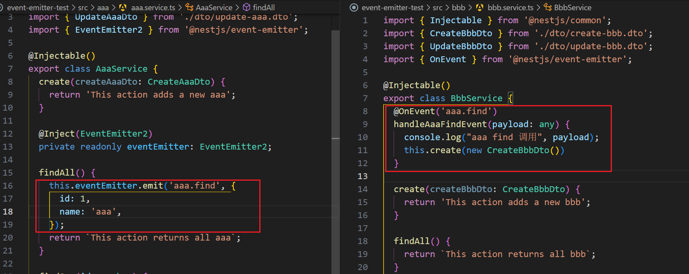

   另外支持一些配置，可以同时发送多个事件

   - **wildcard** 是允许通配符 *

   - **delimiter** 是 namespace 和事件名的分隔符	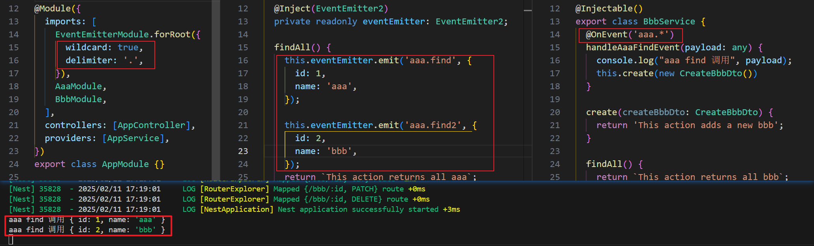  
