# 其他

- `npx tsc -w` ：自动检测文件改变并编译，默认输出位置为 `dist`
- 下载进度工具包：`cli-progress`


# 组件库

#### 控制光标、颜色等

- 使用 node 内置的 readline：`import readline from 'node:readline'`
- 使用工具包：ansi-escapes
- 控制颜色：[颜色代码查询](https://zh.wikipedia.org/wiki/ANSI%E8%BD%AC%E4%B9%89%E5%BA%8F%E5%88%97#%E9%A2%9C%E8%89%B2)，三方库： [chalk](https://www.npmjs.com/package/chalk)、[ansi-colors](https://link.juejin.cn/?target=https%3A%2F%2Fwww.npmjs.com%2Fpackage%2Fansi-colors)、


#### blessed

List、Form、File Manger、Table、ProcessBar


#### blessed-contrib

它扩展了柱状图、地图、折线图等图表组件，可以用来绘制仪表盘。


#### systeminformation

获取有关系统、CPU、底板、电池、内存、磁盘/文件系统、网络、Docker、软件、服务和进程的详细
信息


# CreateVite

- 包 minimist：用于命令行解析的，因为 create-vite 只有一个 --template 参数，比较简单，没必要用 commander
- 包 prompts：用于用户输入和选择的
- 包 chalk：于显示颜色
- 命令 process.cwd()：是执行命令的目录


# fs模块

#### fs 多种策略

- fs支持同步和异步两种模式 增加了`Sync` fs 就会采用同步的方式运行代码，会阻塞下面的代码，不加Sync就是异步的模式不会阻塞。

  ```js
  import fs from 'fs';
  
  let txt = fs.readFileSync("index.txt").toString();
  console.log(txt);
  ```

  常规使用要传入回调函数

  ```js
  import fs from 'fs';
  import path from 'path';
  
  fs.readFile(path.join(process.cwd(), "index.txt"), (_err, res) => { //注意这里第一个参数为err
  	console.log(res.toString());
  })
  ```

  

- fs新增了promise版本，只需要在引入包后面增加/promise即可，fs便可支持promise回调。

  ```js
  import fs from 'fs/promises';
  
  fs.readFile("index.txt").then(res => {
  	console.log(res.toString());
  })
  ```

  或者使用 `fs.promess`

  ```js
  import fs from 'fs';
  import path from 'path';
  
  fs.promises.readFile(path.join(process.cwd(), "index.txt")).then(res => {
  	console.log(res.toString());
  })
  ```

- fs返回的是一个buffer二进制数据 每两个十六进制数字表示一个字节

​	  

#### 常用API

> 参考：[掘金](https://juejin.cn/post/7305331479041916979)

- **readFile / writeFile**：第一个参数为路径，第二个为配置项

  ```js
  import fs2 from 'node:fs/promises'
  
  fs2.readFile('./index.txt',{
      encoding:"utf8",
      flag:"",
  }).then(result => {
      console.log(result.toString())
  })
  ```

  - `'a'`: 打开文件进行追加。 如果文件不存在，则创建该文件。

  - `'ax'`: 类似于 `'a'` 但如果路径存在则失败。

  - `'a+'`: 打开文件进行读取和追加。 如果文件不存在，则创建该文件。

  - `'ax+'`: 类似于 `'a+'` 但如果路径存在则失败。

  - `'as'`: 以同步模式打开文件进行追加。 如果文件不存在，则创建该文件。

  - `'as+'`: 以同步模式打开文件进行读取和追加。 如果文件不存在，则创建该文件。

  - `'r'`: 打开文件进行读取。 如果文件不存在，则会发生异常。

  - `'r+'`: 打开文件进行读写。 如果文件不存在，则会发生异常。

  - `'rs+'`: 以同步模式打开文件进行读写。 指示操作系统绕过本地文件系统缓存。

    这主要用于在 NFS 挂载上打开文件，因为它允许跳过可能过时的本地缓存。 它对 I/O 性能有非常实际的影响，因此除非需要，否则不建议使用此标志。

    这不会将 `fs.open()` 或 `fsPromises.open()` 变成同步阻塞调用。 如果需要同步操作，应该使用类似 `fs.openSync()` 的东西。

    `'w'`: 打开文件进行写入。 创建（如果它不存在）或截断（如果它存在）该文件。

  - `'wx'`: 类似于 `'w'` 但如果路径存在则失败。

  - `'w+'`: 打开文件进行读写。 创建（如果它不存在）或截断（如果它存在）该文件。

  - `'wx+'`: 类似于 `'w+'` 但如果路径存在则失败。

- **createReadStream**：使用可读流读取，适合大文件

  ```js
  const readStream = fs.createReadStream('./index.txt',{
      encoding:"utf8"
  })
  
  readStream.on('data',(chunk)=>{
      console.log(chunk)
  })
  
  readStream.on('end',()=>{
      console.log('close')
  })
  ```

- **mkdir**：创建文件夹，`recursive`递归创建多个文件夹

  ```js
  fs.mkdir('path/test/ccc', { recursive: true },(err)=>{
  })
  ```

- **rm**：删除文件夹，`recursive` 递归删除全部文件夹

  ```js
  fs.rm('path', { recursive: true },(err)=>{
  })
  ```
  
- **renameSync**：重命名文件
  
  ```js
  fs.renameSync('./test.txt','./test2.txt')
  ```
  
- **watch**：监听文件的变化 返回监听的事件如`change`,和监听的内容`filename`
  
  ```js
  fs.watch('./test2.txt',(event,filename)=>{  
      console.log(event,filename)
  })
  ```
  
- **createWriteStream**： 创建一个可写流 打开一个通道，可以一直写入数据，用于处理大量的数据写入，写入完成之后调用end 关闭可写流，监听finish 事件 写入完成

  ```js
  const fs = require('node:fs')
  
  let verse = [
  	'待到秋来九月八',
  	'我花开后百花杀',
  	'冲天香阵透长安',
  	'满城尽带黄金甲'
  ]
  
  let writeStream = fs.createWriteStream('index.txt')
  
  for await (const element of verse) {
  	writeStream.write(element + '\n')
  	await new Promise(resolve => setTimeout(resolve, 1000))
  }
  
  writeStream.end()
  
  writeStream.on('finish', () => {
  	console.log('写入完成');
  })
  ```

  

# VSCode Node Debugger

- **attach（附加）**：通过端口连接到调试

- **attach by process id（附加到进程）**：通过进程id连接到调试

  - 默认配置运行后会打开选择进程窗口
  - 指定PID
    - 通过端口查找对应的进程id：`netstat -aon | findstr "端口号"`
    - 通过PID查看对应进程名称：`tasklist | findstr "PID"`
    - 结束相应进程：`taskkill /pid PID -t -f`
  
- **launch（启动程序）**：指定 node 程序的地址

  - program：项目入口文件

  - args：添加命令行参数

    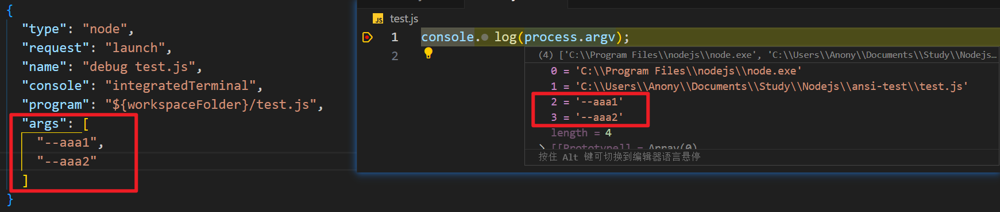  

  - runtimeExecutable：默认 node（VScode会自动选择）

  - runtimeArgs：启动传参

    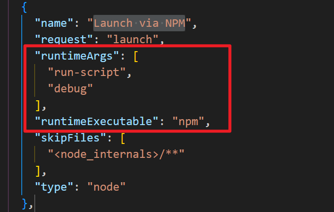  

- skipFiles：默认为 `<node_internal>/**`跳过 node 内部文件

- stopOnEntry：首行断住，和 `node --inspect-brk` 的效果一样

- console：默认 debug 模式下，打印的日志是在 console 的，而不是 terminal。而 console 里是不支持彩色的

  可以配置以下三种
  
  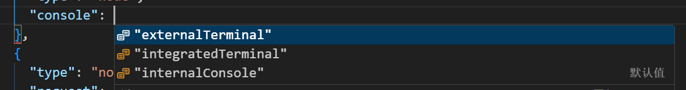 
  
  internalConsole 就是内置的 debug console 面板，默认是这个
  
  internalTerminal 是内置的 terminal 面板，切换成这个就是彩色了 
  
  externalTerminal 会打开系统的 terminal 来展示日志信息
  
- autoAttachChildProcesses：[参考](https://juejin.cn/book/7408937821752262665/section/7430824551933886473?enter_from=course_center&utm_source=course_center#heading-8)

- cwd：指定 runtime 在哪个目录运行，默认是项目根目录 workspaceFolder

- env：指定环境变量

  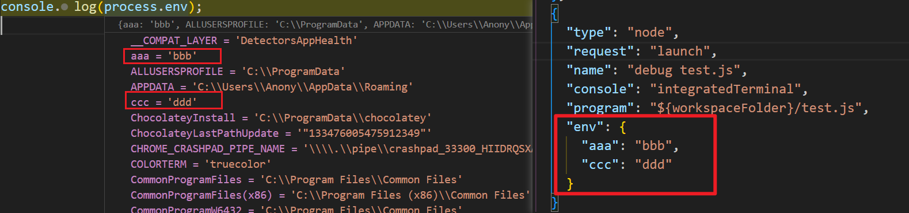  
  
- envFile：通过文件的方式指定环境变量

  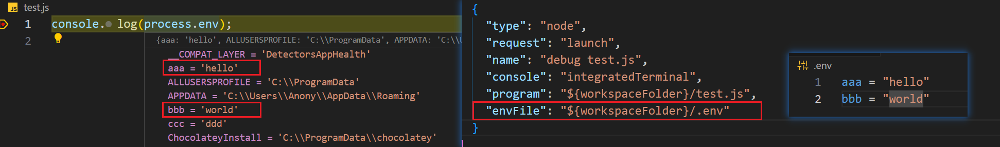  
  
- presentation：对调试进行分组、

  注意：其中 order 参数为同一组中的顺序

  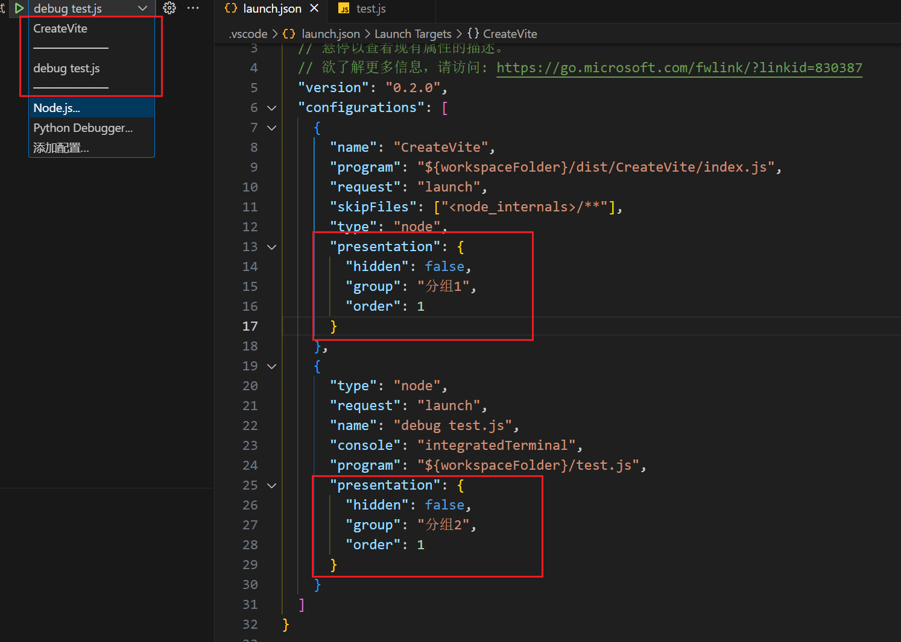  


# sourcemap

- 直接在源码里打断点进行调试：

  tsconfig.json 文件添加 `"sourceMap": true`选项，`npx tsc -w` 之后编译生成的文件即包含 .map 文件，此文件相当于映射编译后的文件的行列号的源码的那个文件的行列号

- 错误堆栈里展示源码位置：

  即使编译后的代码运行报错，也能通过 .map 文件找到 源码 中报错的位置

  > 在 node 12 之后，用 node --enable-source-maps 跑就行。
  >
  > 在 node 12 之前，一般都是用 source-map-support 这个包来做。
  >
  > 用 node -r source-map-support/register 来跑。
  >
  > -r 是在代码执行前预先执行的一些逻辑，用来做一些初始化之类的事情。
  >
  > source-map-support 的实现原理就是重写了 Error.prepareStackTrace 来处理调用栈，通过正则拿到文件的 sourcemap 文件，解析 sourcemap，拿到源码位置，替换调用栈。
  >
  > 参考：[小册 - sourcemap 在 Node.js 里的两大作用](https://juejin.cn/book/7408937821752262665/section/7430824551892434953?enter_from=course_center&utm_source=course_center)

  https://juejin.cn/book/7408937821752262665/section/7430824551892434953?enter_from=course_center&utm_source=course_center
  
- [手写 source-map-support：](https://juejin.cn/book/7408937821752262665/section/7431052509369925683?enter_from=course_center&utm_source=course_center)


# 命令行参数解析

#### 命令行参数规范

- 参数的位置并不固定，可以放在选项中间、选项之前

  

  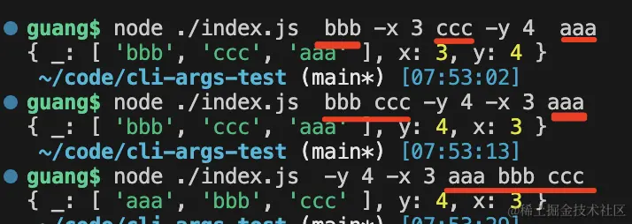    

- 布尔类型的短选项可以合并

  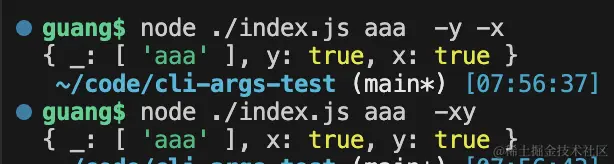  

- 长选项不会合并，一般一个选项会提供短选项和长选项

    

- 选项和选项值之间可以用等号也可以用空格隔开

    

- 如果有的选项你想作为参数，可以加上 --，-- 之后的所有内容都会作为参数

  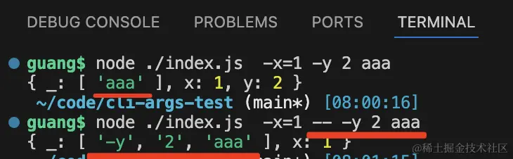  

#### minimist：解析命令行参数

- 支持传入 options 

  ```js
  const minimist = require('minimist');
  
  const argv = minimist(process.argv.slice(2), {
      // 指定类型
      boolean: ['x'],
      string: ['y'],
      // 指定哪些解析哪些不解析
      unknown(arg) {
      	return arg === "-u";
    	},
      // 指定默认值 只有不传才会使用默认值
      default: { y: 2333 },
      // 指定别名
      alias: { p: 'port', t: 'template' },
  });
  console.log(argv);
  ```

#### commander


# NPM LINK

- 创建软连接

  ```bash
  # Linux 中
  ln -s ../aaa-lib ./aaa-lib
  # Windows CMD
  mklink /D aaa-lib ..\aaa-lib
  # Windows PowerShell
  cmd /c mklink /D aaa-lib ..\aaa-lib
  # 或者使用 PowerShell 原生命令
  New-Item -ItemType SymbolicLink -Path "aaa-lib" -Target "..\aaa-lib"
  ```

- npm 查找全局仓库位置：`npm get prefix`

- `npm link`

  - 往 npm get prefix 下的 lib/node_modules（windows 为 node_modules） 安装了这个包（用 ln -s 创建的软链）
  - 往 npm get prefix 下的 bin（windows 为 根目录） 里放了这个包里注册的命令（用 ln -s 创建的软链）

- `npm link` 原理

  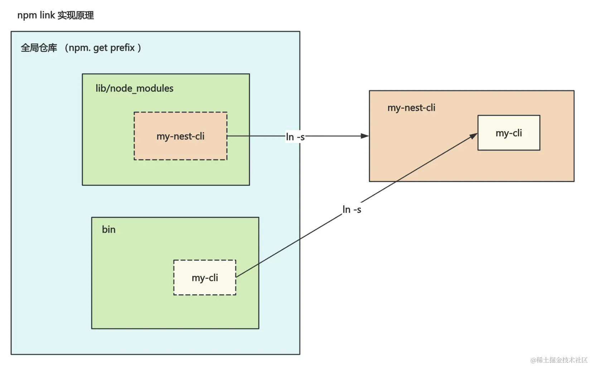  

- `npm link xxx` 原理

  如果全局没有此包，则会先全局安装，然后当前项目再 link 到全局

  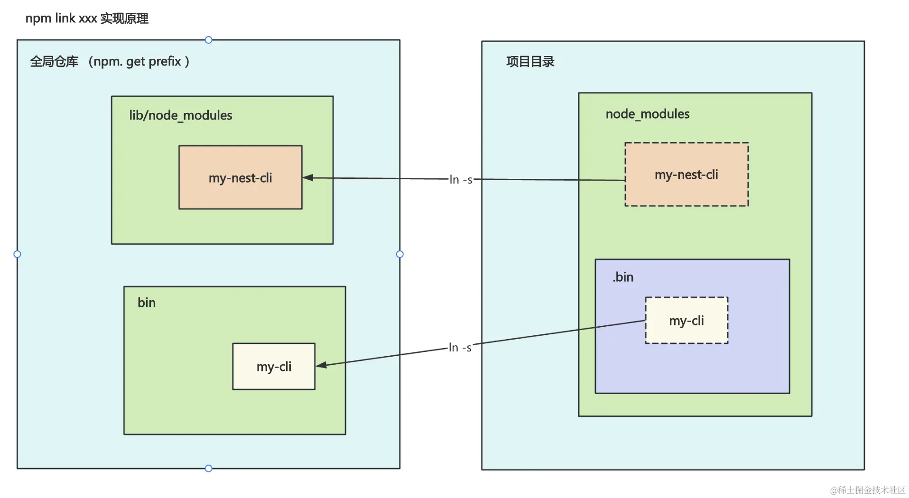  


# Monorepo

- monorepo 的核心问题：

    

- pnpm 实现原理

  - **npm 2.x** 版本，每个包都会将依赖放在自己的 node_modules 文件夹里

      

    缺点：同样的依赖会复制很多次，并且 window 文件路径最长 260 字符，会超过长度限制

  - **yarn**：将多有依赖铺平来解决依赖重复及嵌套文件路径过长的问题，当遇到相同包不同版本才进行嵌套。npm 升级到3之后采用相同方式

    缺点：<u>幽灵依赖</u> 因为包都铺平了，所以有些没有声明在 dependencies 中的包也能导入（这里主要是依赖的依赖被铺平出来了），可能会出现某天找不到包的情况。依赖包有多个版本只会提升一个，还是会出现浪费磁盘空间的问题

  - **pnpm**：所有的依赖都是从全局 store 硬连接到了 node_modules/.pnpm 下，然后之间通过软链接来相互依赖。

      


## yarn workspace + changeset 实现

### 使用命令：

- 安装本地的其他包为依赖：`yarn workspace cli add core@1.0.0`
- 在某个 workspace 下安装依赖：`yarn workspace cli add chalk`
- 在根目录安装依赖：`yarn add typescript -W --dev`
- 在某个 worksapce 下执行 npm scripts：`yarn workspace @guang-yarn/core run build`
- 在全部 workspace 执行 npm scripts：`yarn workspaces run build`
- 查看本地 workspace 的依赖树：`yarn workspaces info`

### changset

- 用 @changesets/cli 来管理版本变更和发布：

  - 初始化：`npx changeset init`
  - 创建一次变更：`npm changeset add`
  - 改动版本号并生成 CHANGELOG.md：`npx changeset version`
  - 发布到 npm 仓库并自动打 tag：`npx changeset publish`

- 当然，如果包比较少，你也可以不用 changeset，直接自己管理版本和发布：

  ```shell
  npm adduser
  
  npm publish
  
  git tag v1.0
  ```

## pnpm workspace + changeset 实现

- package.json 添加 `"private": true,`，不发布这个package.json 的包到 npm 仓库

- 在根目录 `pnpm-workspace.yaml` 配置 packages

### 使用命令

- 安装本地其他包为依赖：`pnpm --filter cli add core --workspace`

  - `--workspce`：指定从本地查找包
  - `--filter`：指定执行命令的包（这里包名为 packages 中 packages.json name名字）

- 在某些包下安装依赖：`pnpm --filter cli add chalk`

  - 这里与yarn 不同，pnpm会安装到包下的 node_modules 中，yarn 则会安装到项目根目录的 node_modules 中

    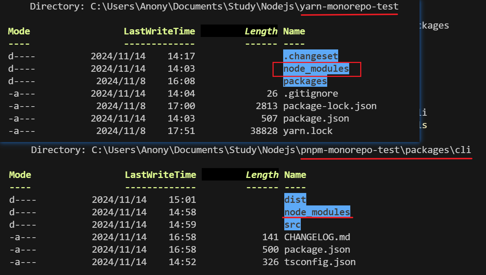  

- 在根目录安装依赖：`pnpm add typescript -w --save-dev`

  - `-w --save-workspace` 安装到工作区的根目录的 node_modules 中

- 在某些包下执行命令：`pnpm --filter cli exec npx tsc --init`

  - `exec` ：允许在指定的包活工作区中执行任意命令

- 在全部包下执行命令：`pnpm -r exec npx tsc`

- 此外还可以通过 `--sort` 指定拓扑顺序执行命令，这个是 yarn workspace 不支持的

### changesets

使用同上


## npm workspace + changeset 实现

- 在某个 workspace 下安装依赖：`npm install core --workspace cli`
- 在某些包下执行命令：`npm exec --workspace @guang-npm/cli -- npx tsc --init`
- 在全部包下执行命令：`npm exec --workspaces -- npx tsc --init`
- `changesets` 使用同上

> 注意：npm 官网创建 Organizations 时需要对应包的scope（类似：@anony0s-npm），上传时只能发布到对应的组织中


# git submodule 、git subtree

> 当你想一个项目加入到另一个项目里来复用，并且还有保持这个项目可以作为独立 git 仓库管理的时候，就可以用 git submodule 或者 git subtree 了

