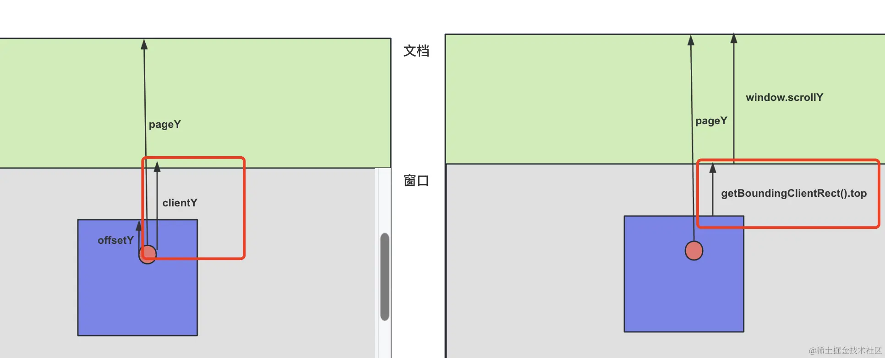

## React.Children

直接用数组方法操作 children 有 3 个问题：

- 用数组的方法需要声明 children 为 ReactNode[] 类型，这样就必须传入多个元素才行，而 React.Children 不用
- 用数组的方法不会对 children 做拍平，而 React.Children 会
- 用数组的方法不能做排序，因为 children 的元素是只读的，而用 React.Children.toArray 转成数组就可以了

只要操作 children，就用 **React.Children** 的 api 就行了


代替`props.children`的两种方式：

- 把对 children 的修改封装成一个组件，使用者用它来手动包装

- 声明一个 props 来接受数据，内部基于它来渲染，而且还可以传入 render props 让使用者定制渲染逻辑

  ```react
  import React, { PropsWithChildren, ReactNode } from "react";
  
  interface Item {
    id: number;
    content: ReactNode;
  }
  
  interface RowListProps extends PropsWithChildren {
    items: Array<Item>;
    renderItem: (item: Item) => ReactNode;
  }
  
  const RowList: React.FC<RowListProps> = (props) => {
    const { items, renderItem } = props;
    return (
      <div className="row-list">
        {items.map((item) => {
          return renderItem(item);
        })}
      </div>
    );
  };
  
  function App() {
    return (
      <RowList
        items={[
          { id: 1, content: <div>111</div> },
          { id: 2, content: <div>222</div> },
          { id: 3, content: <div>333</div> },
        ]}
        renderItem={(item) => {
          return (
            <div className="row" key={item.id}>
              <div className="box">{item.content}</div>
            </div>
          );
        }}
      ></RowList>
    );
  }
  
  export default App;
  ```

  

## 浏览器的五种 `Observer`

### IntersectionObserver

```js
const intersectionObserver = new IntersectionObserver(
    function (entries) {
        console.log('info:');
        entries.forEach(item => {
            console.log(item.target, item.intersectionRatio)
        })
    }, {
    threshold: [0.5, 1]
});

intersectionObserver.observe( document.querySelector('#box1'));
intersectionObserver.observe( document.querySelector('#box2'));
```

创建一个 IntersectionObserver 对象，监听 box1 和 box2 两个元素，当可见比例达到 0.5 和 1 的时候触发回调。


###  MutationObserver

```js
const mutationObserver = new MutationObserver((mutationsList) => {
    console.log(mutationsList)
});

mutationObserver.observe(box, {
    attributes: true,
    childList: true
});
```

创建一个 MutationObserver 对象，监听这个盒子的属性和子节点的变化。


### ResizeObserver

当 width、height 被修改时会触发回调，除了元素的大小、可见性、属性子节点等变化的监听外，还支持对 performance 录制行为的监听

```js
const resizeObserver = new ResizeObserver(entries => {
    console.log('当前大小', entries)
});
resizeObserver.observe(box);
```


### PerformanceObserver

浏览器提供了 performance 的 api 用于记录一些时间点、某个时间段、资源加载的耗时等。

PerformanceObserver 用于监听记录 performance 数据的行为，一旦记录了就会触发回调，这样我们就可以在回调里把这些数据上报。


### ReportingObserver

ReportingObserver 可以监听过时的 api、浏览器干预等报告等的打印，在回调里上报，这些是错误监听无法监听到但对了解网页运行情况很有用的数据。


## 浏览器各种距离



- e.pageY：鼠标距离文档顶部的距离
- e.clientY：鼠标距离可视区域顶部的距离
- e.offsetY：鼠标距离触发事件元素顶部的距离
- e.screenY：鼠标距离屏幕顶部的距离
- winwodw.scrollY：页面滚动的距离，也叫 window.pageYOffset，等同于 document.documentElement.scrollTop
- element.scrollTop：元素滚动的距离
- element.clientTop：上边框高度
- element.offsetTop：相对有 position 的父元素的内容顶部的距离，可以递归累加，加上 clientTop，算出到文档顶部的距离
- clientHeight：内容高度，不包括边框
- offsetHeight：包含边框的高度
- scrollHeight：滚动区域的高度，不包括边框
- window.innerHeight：窗口的高度
- element.getBoundingClientRect：拿到 width、height、top、left 属性，其中 top、left 是元素距离可视区域的距离，width、height 绝大多数情况下等同 offsetHeight、offsetWidth，但旋转之后就不一样了，拿到的是包围盒的宽高

> 其中，还要注意 react 的合成事件没有 offsetY 属性，可以自己算，react-use 的 useMouse 的 hook 就是自己算的，也可以用 e.nativeEvent.offsetY 来拿到。


## react-spring 动画

> [官网](https://www.react-spring.dev/)

- config 参数
  - mass 质量：决定回弹惯性，mass 越大，回弹的距离和次数越多。
  - tension 张力：弹簧松紧程度，弹簧越紧，回弹速度越快。
  - friction：摩擦力： 可以抵消质量和张力的效果
- API
  - useSpringValue：指定单个属性的变化。
  - useSpring：指定多个属性的变化
  - useSprings：指定多个元素的多个属性的变化，动画并行执行
  - useTrial：指定多个元素的多个属性的变化，动画依次执行
  - useSpringRef：用来拿到每个动画的 ref，可以用来控制动画的开始、暂停等
  - useChain：串行执行多个动画，每个动画可以指定不同的开始时间


## react-transition-group 动画

- 进入的时候会触发 enter、enter-active、enter-done 的 className 切换
- 离开的时候是 exit、exit-active、exit-done 的切换
- 如果设置了 appear 参数，刚出现的时候，还会有 appear、appear-active、appear-done 的切换。

它有 Transition、CSSTransition、TransitionGroup、SwitchTransition 这 4 个组件。


## tailwindCSS 不生效

使用 `npx tailwindcss init -p` 初始化，会自动生成 `postcss.config.js` 文件


## CSS Modules 

> 安装 ` css modules` 插件进行 CSS modules 提示

### 常用BEM命名规范

BEM 是 block、element、modifier 这三部分：

- 块（Block）：块是一个独立的实体，代表一个可重用的组件或模块。

块的类名应该使用单词或短语，并使用连字符（-）作为分隔符。例如：.header、.left-menu。

- 元素（Element）：元素是块的组成部分，不能独立存在。

元素的类名应该使用双下划线作为分隔符，连接到块的类名后面。例如：.left-menuitem、.header__logo。

- 修饰符（Modifier）：修饰符用于描述块或元素的不同状态或变体，用来更改外观或行为。

修饰符的类名应该使用双连字符（--）作为分隔符，连接到块或元素的类名后面。例如： `.left-menu__item--active、.header__logo--small`。

### 使用

- 修改生成 className 的格式：

  - 字符串格式
  
    ```js
    import { defineConfig } from 'vite'
    import react from '@vitejs/plugin-react'
    
    // https://vitejs.dev/config/
    export default defineConfig({
      plugins: [react()],
      css: {
        modules: {
          generateScopedName: "guang_[name]__[local]___[hash:base64:5]"
        }
      }
    })
    ```
  
  - 函数形式
  
    ```js
     generateScopedName: function (name, filename, css) {
        console.log(name, filename, css
        return "xxx"
     }
    
    // 通过 getJSON 拿到编译后的 className
    modules: {
      getJSON: function (cssFileName, json, outputFileName) {
        console.log(cssFileName, json, outputFileName)
      },
    }
    ```
  
- 使用 `:global(css类名)` 开启全局样式，类似 vue 中的 `:deep()` ，同时使用时应换为普通使用方式；或者使用 `exportGlobals: true` 保证导出

  ```json
  modules: {
    getJSON: function (cssFileName, json, outputFileName) {
      console.log(cssFileName, json, outputFileName)
    },
    exportGlobals: true
  }
  ```
  
- 模块化 className 为 `:local()` ，默认为 local， 通过配置 `scopeBehaviour: 'global'`，开启全局导出

- 通过正则表达式来匹配哪些 css 文件是默认全局

  ```json
   modules: {
    getJSON: function (cssFileName, json, outputFileName) {
      console.log(cssFileName, json, outputFileName)
    },
    exportGlobals: true,
    globalModulePaths: [/Button1/]
  }
  ```
  
- localsConvention： 导出的对象的 key 的格式
  
  - camelCaseOnly：驼峰形式
  
  - dashes： 破折号形式
  
- 其他: 可以通过给内层单独包裹 `:global()` 保证类名不被编译
  
  ```json
  .btn {
      :global {
          .xxx {
              background: blue;
          }
      }
  }
  ```
  
- 总结: 
  - scopeBehaviour： 默认 local 或者 global
  - getJSON：可以拿到 css 模块导出的对象
  - exportGlobals： 全局的 className 也导出到对象
  - globalModulePaths：哪些文件路径默认是全局 className
  - generateScopedName：定制 local className 的格式
  - localsConvention： 导出的对象的 key 的格式
  

## floating-ui

> 它是专门用来创建 tooltip、popover、dropdown 这类浮动的元素的：[官网](https://floating-ui.com)


## 快速定位组件源码

> click-to-react-component

- Alt + 左键：在IDE中打开组件源码  
- Alt + 右键：查看父组件列表  

**原理：**

- dom 元素有 `_reactFiber$` 属性可以拿到对应 fiber 节点，然后 `_debugOwner` 拿到父节点 fiber。`_debugSource` 拿到源码文件路径和行列号。
- 通过 `vscode://file/文件绝对路径:行号:列号` 的方式直接 vscode 打开对应文件行列号


## 其他

- Array.from()：
