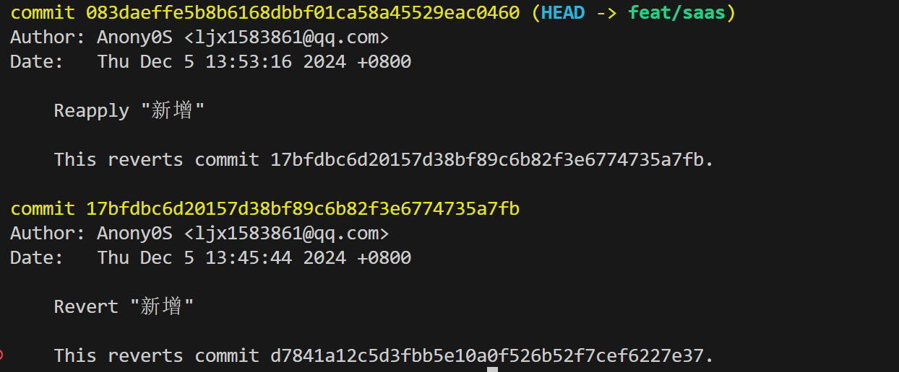

- [复杂表格](https://github.com/x-extends/vxe-table)

- [数字滚动](https://github.com/inorganik/countUp.js)
- 禁止爬虫

- vite 开启 https 后项目启动没反应：切换node版本为 18.13.0

- [让SVG动起来](https://juejin.cn/post/7230012114600591397)


Nest 启动端口报错：`net stop winnat` `net start winnat`


## git相关

### 忽略文件修改

如果你想要在已经存在的文件中忽略修改，可以使用以下命令：

```shell
bashCopy code# 假设你要忽略文件 example.txt 的修改
git update-index --assume-unchanged example.txt
```

要停止忽略修改，可以使用以下命令：

```shell
bashCopy code
git update-index --no-assume-unchanged example.txt
```

请注意，使用`--assume-unchanged`选项时，Git会假设文件没有被修改，因此在后续的提交中将不会包含这些文件的更改。这对于本地配置文件等情况非常有用，但要小心不要误用此选项。


### git 修改最近一次commit信息

1. 修改需要修改的代码

2. git commit --amend

3. 进入vim操作界面之后, 点击字母键 i 然后进入INSERT模式，然后对 commit 信息进行修改，然后ESC 然后 :wq 保存退出- [复杂表格](https://github.com/x-extends/vxe-table)


Nest 启动端口报错：`net stop winnat` `net start winnat`


### git 提交规范

Header 部分由三个字段组成：type（必需）、scope（可选）、subject（必需）

- Type `type` 必须是下面的其中之一：
  - feat: 增加新功能
  - fix: 修复 bug
  - docs: 只改动了文档相关的内容
  - style: 不影响代码含义的改动，例如去掉空格、改变缩进、增删分号
  - refactor: 代码重构时使用，既不是新增功能也不是代码的bud修复
  - perf: 提高性能的修改
  - test: 添加或修改测试代码
  - build: 构建工具或者外部依赖包的修改，比如更新依赖包的版本
  - ci: 持续集成的配置文件或者脚本的修改
  - chore: 杂项，其他不需要修改源代码或不需要修改测试代码的修改
  - revert: 撤销某次提交
- scope

用于说明本次提交的影响范围。`scope` 依据项目而定，例如在业务项目中可以依据菜单或者功能模块划分，如果是组件库开发，则可以依据组件划分。

- subject

主题包含对更改的简洁描述：

注意三点：

1. 使用祈使语气，现在时，比如使用 "change" 而不是 "changed" 或者 ”changes“
2. 第一个字母不要大写
3. 末尾不要以.结尾

- Body

主要包含对主题的进一步描述，同样的，应该使用祈使语气，包含本次修改的动机并将其与之前的行为进行对比。

- Footer

包含此次提交有关重大更改的信息，引用此次提交关闭的issue地址，如果代码的提交是不兼容变更或关闭缺陷，则Footer必需，否则可以省略。


###  git revert

撤销某一次提交记录，会生成新的提交记录，不会影响之前的

若想撤销某次撤销，直接使用 `git revert xxx`  

  

如果想撤销多次提交，则需要按照重新到旧的顺序以免发生冲突
